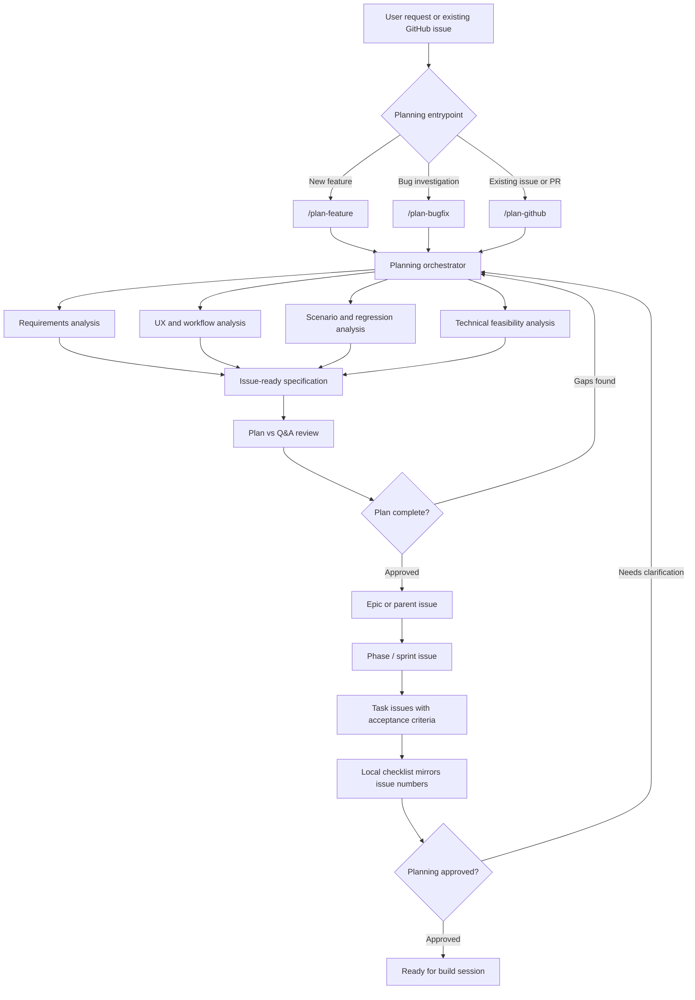
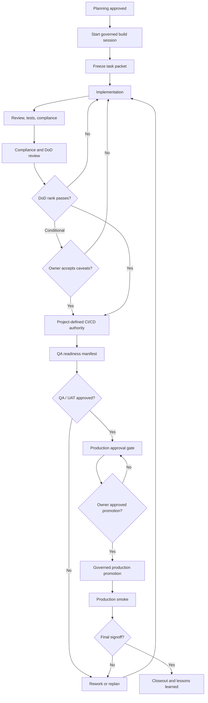

# Designs

Reusable project-design templates, agent workflow commands, project-local skills, and delivery operating model guidance.

This repository is documentation-first. The README is the GitHub index. The detailed workflow meta and stage-gate guidance lives in the HTML guide under `docs/workflow-guide/`.

## Start Here

| Destination | Purpose |
| --- | --- |
| [Rendered Pages site](https://holovkat.github.io/designs/) | GitHub Pages entrypoint that redirects to the rendered workflow guide. |
| [Workflow guide](https://holovkat.github.io/designs/workflow-guide/) | Canonical detailed operating model for planning, approvals, CI/CD, QA, production approval, and closeout. |
| [Install and harness setup](https://holovkat.github.io/designs/workflow-guide/install.html) | Instructions and common prompt for installing commands and skills globally or into a project. |
| [Command pack](templates/instructional-documents/commands/) | Slash-command templates such as `/plan-feature`, `/plan-bugfix`, `/plan-github`, `/plan-review`, `/compliance-review`, `/uat`, and closeout flows. |
| [Project skills](templates/instructional-documents/skills/) | Project-local skills for worktree/session lifecycle support. |
| [Workflow installer](templates/instructional-documents/install-session-workflows.sh) | Installer for refreshing commands, hooks, scripts, skills, and worktree guidance into another project. |
| [Functional design templates](templates/functional-design/) | Planning and implementation checklist templates. |
| [Instructional documents](templates/instructional-documents/) | GitHub, deployment, architecture, auth, payment, and workflow references. |
| [UI/UX guidelines](templates/ui-ux-guidelines/) | Design-token and interface-pattern references. |

## Planning Decomposition



## Delivery Lifecycle



## Workflow Detail

See the [rendered workflow guide](https://holovkat.github.io/designs/workflow-guide/) for the full guidance covering planning, plan review, Definition of Done ranking, approvals, CI/CD authority, QA/UAT, production approval, closeout, installation, and project-specific overlays.

## Repository Structure

```text
docs/workflow-guide/               Persistent HTML operating guide
templates/                         Reusable planning and instructional library
templates/instructional-documents/  Commands, skills, hooks, scripts, and workflow references
templates/functional-design/        Planning and implementation checklist templates
templates/ui-ux-guidelines/         UI/UX and design-system references
project snapshots/                  Project-specific design snapshots or folders
*.zip                               Archived exports and handoff bundles
```

## Validation

There is no build pipeline in this repo. Useful checks before committing documentation changes:

```bash
git diff --check
```

Review changed Markdown links and open `docs/workflow-guide/index.html` locally when the HTML guide changes.
