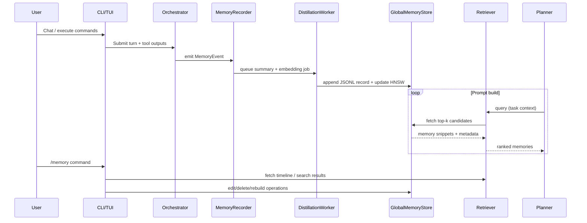

# LightMem-Inspired Memory Architecture Overview

## 1. System Layers
- **Capture Layer** gathers conversational turns, tool outputs, and file diffs from existing orchestrators.
- **Distillation Layer** summarises raw events and generates embeddings via `fastembed`.
- **Persistence Layer** writes append-only JSONL records and maintains a dedicated HNSW graph in `~/.codex/memory/`.
- **Retrieval Layer** scores memories with hybrid relevance (semantic + recency) and exposes APIs to prompt builders.
- **Experience Layer** surfaces controls through CLI/TUI, including the new `/memory` manager.

```mermaid
graph TD
    subgraph Orchestrators
        A[Conversation Orchestrator] --> B[Memory Recorder]
        A --> C[Tool Event Stream]
    end
    B --> D[Distillation Task]
    C --> D
    D --> E[JSONL Manifest Writer]
    D --> F[HNSW Graph Updater]
    subgraph Persistence
        E
        F
    end
    Persistence --> G[Memory Retriever]
    G --> H[Prompt Planner]
    G --> I[/memory TUI Manager]
    H --> J[LLM Invocation]
```

## 2. Data Flow & Lifecycle


## 3. Storage Layout (`~/.codex/memory/`)
- `manifest.jsonl` — append-only metadata records (id, timestamps, tags, summary, source path).
- `embeddings.hnsw` — vector graph storing embeddings indexed by record id.
- `snapshots/` — optional directory for periodic compaction outputs.
- `lock` — advisory file preventing concurrent destructive operations.
- `models/` — cached MiniCPM weights downloaded on demand for summarisation.

## 4. `/memory` Manager Mockups
- Reverse-chronological list renders newest memories first, with inline edit/delete controls and confirmation dialogs for destructive actions.
- Semantic query bar filters results using the same embedding scorer applied during prompt construction.
- Metrics bar shows retrieval hits versus misses to confirm the store’s effectiveness.
- Minimum confidence slider filters displayed entries and persists to global memory settings.
- Control row exposes create/delete/rebuild vector-store operations (all gated by confirmations) and access to preview-mode toggles.

### 4.1 Full-Screen Layout (ASCII Wireframe)
````text
┌───────────────────────────────── Memory Manager ─────────────────────────────────┐
│ Query: [▇▇▇▇▇▇▇▇▇▇▇▇▇▇▇▇▇▇▇▇▇▇▇▇▇▇▇▇▇▇▇▇▇▇▇▇▇▇▇▇▇▇▇▇▇▇▇▇▇▇▇▇▇▇▇▇▇▇▇] (semantic) │
├──────┬───────────────┬───────────────────────────────────────────────────────────┤
│ Time │ Tags          │ Summary (latest first)                                     │
├──────┼───────────────┼───────────────────────────────────────────────────────────┤
│ 16:42│ project:app   │ Discussed new memory store layout; agreed on JSONL + HNSW. │
│      │ persona:dev   │ [Edit] [Delete]                                            │
├──────┼───────────────┼───────────────────────────────────────────────────────────┤
│ 16:10│ tooling:index │ Added `/memory` slash command requirements.                │
│      │               │ [Edit] [Delete]                                            │
├──────┼───────────────┼───────────────────────────────────────────────────────────┤
│ ...  │ ...           │ ...                                                        │
└──────┴───────────────┴───────────────────────────────────────────────────────────┘
│ Preview Mode: [Enabled]  Min CF%: [0.75]  Hits: 12  Misses: 5                     │
│ [Create Memory] [Rebuild Vector Store] [Delete Vector Store] [Close]              │
└──────────────────────────────────────────────────────────────────────────────────┘
````

### 4.2 Edit Flow Modal
````text
┌────────────────────── Edit Memory mem-2025-10-23-1642 ───────────────────────┐
│ Summary:                                                                     │
│ ┌──────────────────────────────────────────────────────────────────────────┐ │
│ │                                                                          │ │
│ └──────────────────────────────────────────────────────────────────────────┘ │
│ Tags (comma separated): [project:app, persona:dev]                          │
│ Controls: [Save] [Discard] [Delete]                                         │
└──────────────────────────────────────────────────────────────────────────────┘
````

## 5. Workflow Tree with Code Locations
- `codex-core/src/memory/mod.rs`
  - `recorder.rs` — hooks into conversation/tool orchestrators to emit `MemoryEvent`.
  - `distill.rs` — async worker for summaries + embeddings.
  - `model_manager.rs` — manages MiniCPM downloads in `~/.codex/memory/models` and ensures availability.
  - `store/global.rs` — file-backed JSONL writer and HNSW maintenance.
  - `retriever.rs` — hybrid scoring, semantic filtering, pagination.
- `codex-core/src/planning/session.rs`
  - Integrate `MemoryRetriever` results into prompt assembly.
- `codex-core/src/tasks/background.rs`
  - Schedule compaction, rebuild, and retention jobs via Tokio tasks.
- `common/src/memory.rs`
  - Shared structs/enums for memory payloads, slash command RPCs.
- `cli/src/commands/memory.rs`
  - Headless commands for admin tasks, bootstrap, and automation.
- `tui/src/app/commands/memory.rs`
  - Slash command registration and routing to manager UI.
- `tui/src/screens/memory.rs`
  - Full-screen view model, semantic search integration, list rendering.
- `tui/src/components/memory_editor.rs`
  - Modal editor for inline edits/deletions.
- `tui/src/services/memory_client.rs`
  - Async client invoking core APIs (using channels or async tasks).

## 6. Interaction Highlights
- `/memory` search leverages the same retriever pipeline, ensuring consistent ranking between UI and prompt usage.
- Administrative actions (create/delete/rebuild) delegate to `store/global.rs`, keeping gatekeeping logic server-side.
- Semantic filter queries run embeddings locally; fall back to keyword search if model unavailable.
- Vector store rebuild runs in a background task, with progress surfaced via TUI notifications.
- Retrieval metrics (hits/misses) update after each planner query and populate the manager view.
- Minimum confidence threshold stored in global settings applies across UI and planner flows.
- Preview mode setting controls whether users must accept/skip suggested memories during chat; when disabled, planner auto-selects the highest-scoring memory above the threshold.
- MiniCPM download progress UX remains on the backlog; the distillation worker blocks until weights are present and logs retry/diagnostic state.

## 7. Implementation Notes (October 27, 2025)
- MiniCPM inference uses `llama_cpp` with checksum-verified downloads, retries, and fallback summarisation to guarantee output.
- `GlobalMemoryStore` persists metrics (hits, misses, preview accept/skip) alongside manifest/HNSW data and guards destructive actions with advisory locks.
- `MemoryRetriever` unit tests cover auto-selection and metrics accounting, ensuring preview modes behave as specified.
- `/memory` manager UI is snapshot-tested (VT100) for list/edit/confirmation views; the preview overlay instructions line is similarly covered.
- `codex memory` CLI integration test exercises create → list → edit → search → delete using a stub MiniCPM cache for offline determinism.

## 8. Recorded Decisions
- No edit-history versioning for MVP.
- Destructive actions require confirmation dialogs; no additional config flags.
- Manager presents retrieval hits vs. misses and a persistent minimum confidence slider.
- Chat workflow previews candidate memories when preview mode is enabled; otherwise auto-selects the top-scoring memory meeting the threshold.
