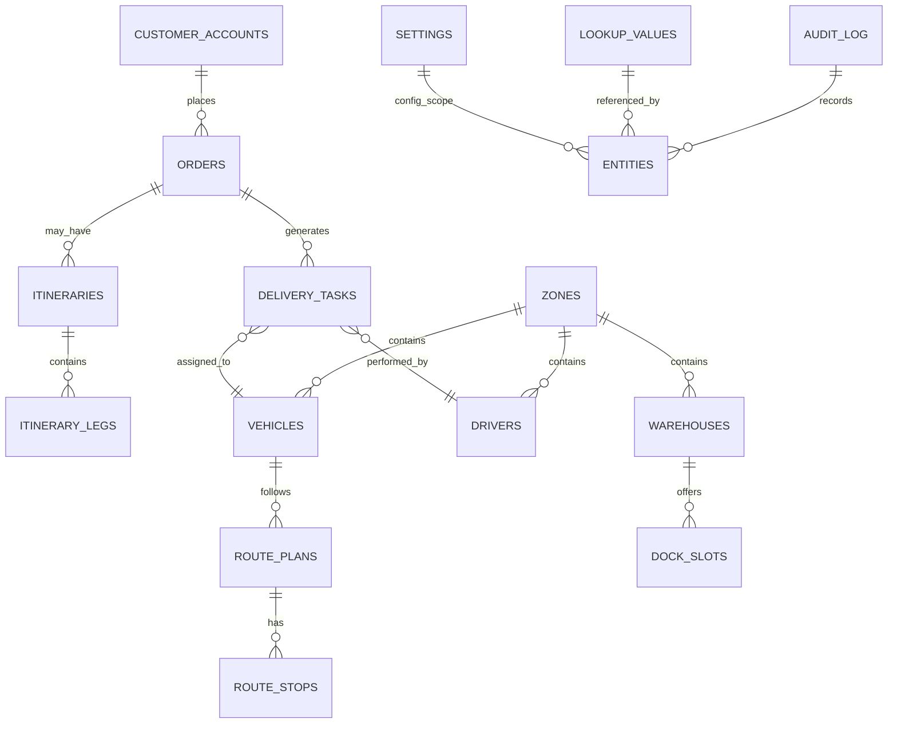
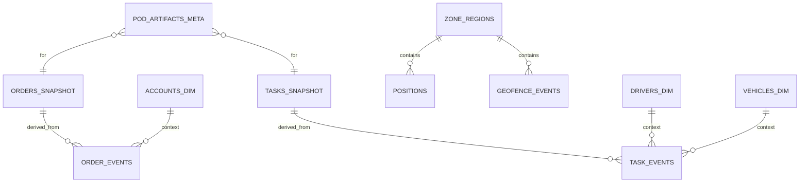
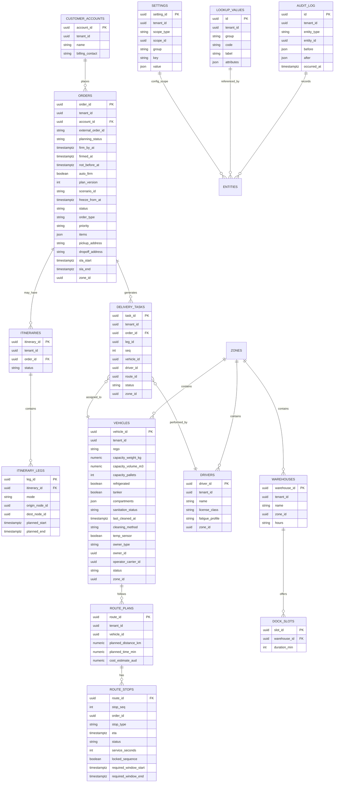
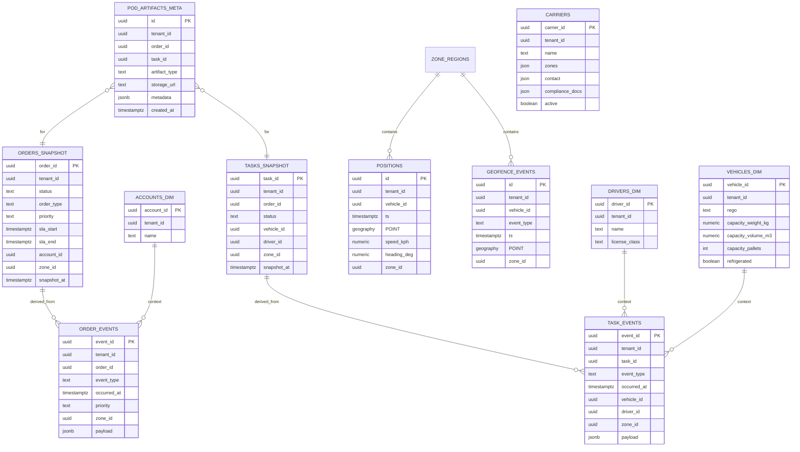

# FMS ERDs (Mermaid "whisper" format)

This document collects the core Entity–Relationship Diagrams in Mermaid code blocks for easy preview.

## Operational ERD (Convex domain)

## Reporting ERD (Postgres + PostGIS)

Notes
- Operational ERD represents live domain entities stored in Convex.
- Reporting ERD represents historical, geospatial, and analytical entities in Postgres.
- Field‑level ERDs are embedded below in this Markdown (Mermaid "whisper" blocks). No external `.mmd` files are required.

## Operational ERD — Field-Level (Embedded)

## Reporting ERD — Field-Level (Embedded)

