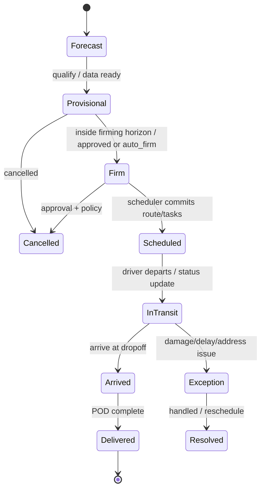

# Orders & Lifecycle Spec (v1)

Purpose
- Define the end-to-end lifecycle for orders across planning horizons, intermodal handoffs, scheduling, execution, POD, and exceptions.
- Tie behavior to tenant-scoped settings (with Mode/Zone overrides) and integration contracts.

## Scope
- Supports splitable, multi-stop orders; returns/reattempts with reason codes.
- Modes at launch: road, rail (domestic); sea (plan/visibility as external-handled); future: air.
- Tenancy: pooled multi-tenant; settings precedence Tenant → Mode → Zone → Mode+Zone.

## Core Fields (subset)
- Identity: `order_id`, `external_order_id`, `account_id`, `tenant_id`.
- Planning: `planning_status [forecast|provisional|firm]`, `auto_firm`, `firm_by_at`, `firmed_at`, `not_before_at`, `freeze_from_at`, `plan_version`, `scenario_id`.
- Logistics: `pickup`, `dropoff`, `items[] {line_id, gtin|sku, qty, weight_kg, volume_m3}`; constraints `{dg_class, UN_number, packing_group, temp_min, temp_max}`.
- Priority/Type: `priority [High|Medium|Low]`, `order_type` (Standard, High-Value, DG, Temperature-Controlled, Oversized, Express, Return).
- Zone/Mode: `zone_id`; itinerary legs carry `mode` and sea/DG metadata.

## State Machine (Orders)

## Planning Horizons & Freeze
- Settings: docs/settings/schemas/planning-settings.schema.json
  - `firming_horizon_days` (defaults: road=14, rail=21)
  - `freeze_window_hours` (default 48)
  - `on_horizon_breach`: auto_firm_if_complete | always_raise
  - `default_auto_firm`, `allow_order_override_auto_firm`
- Behavior
  - Outside horizon → Provisional; inside → must be Firm or flagged firming_due.
  - Inside freeze → logistics-impacting changes require approval; else queue with 6h SLA (configurable).

## Sea → AU Handoff (Intermodal)
- Mode `sea` is external-handled; events arrive via N8N.
- Tenant setting `planning.sea_handoff` controls:
  - `auto_create_au_leg`, `auto_firm_au_leg` (defaults true)
  - `match_strategy` (booking_ref | external_order_id | container_id)
  - `required_fields` (defaults include: container_ids, dg_class, UN_number, packing_group, discharge_port, customs_cleared, biosecurity_cleared, duties_and_taxes_settled, port_charges_settled)
- Flow
  1) On `gate_out` (or configured), match AU Provisional.
  2) Validate required fields; if missing → raise `order.firming_due (GATING_FAILED)` with list.
  3) Else create AU leg if absent, firm if outside freeze; emit `order.firmed`.

## Scheduling & Assignment
- Objective: Cost-first (AUD) by default; priority increases time weight to favor earlier delivery.
- Cost model (configurable defaults): $1.20/km, $0.50/min; per-km + per-minute only at launch.
- Capacity: enforce vehicle weight_kg, volume_m3; optional pallets; refrigerated flag.
- Compliance: drivers under Australian Standard Hours (default rule set); site `site_requirements` (credentials/PPE/permits/escort) enforced at assignment.
 - Compliance: drivers under Australian Standard Hours (default rule set; see compliance/au-standards.md); site `site_requirements` (credentials/PPE/permits/escort) enforced at assignment.
- Carriers: tasks and routes may carry `carrier_id`; RBAC limits carrier users to assigned work.
- Non-FMS stops: `break|other` stop types modeled; counts toward ETA and audit.

## POD & Scanning
- Mandatory scans at pickup AND drop-off.
- Standards: GS1-128 (AIs) + GS1 Digital Link QR.
- Photos/signature: rule-driven (by order type, account/customer, value threshold). Default: require photo+signature when order_value ≥ AUD 10,000; configurable.
- Granularity: default case/carton-level; per-order rules may require item or pallet level.
- GTIN fallback: auto-assign internal GTIN-14 from tenant GS1 prefix when line has no GTIN.

## Returns & Reattempts
- Supported at launch with reason codes (configurable starter set): Delayed_Traffic, Delayed_Breakdown, Address_Issue, Customer_Unavailable, Damaged_Goods, Partial_Delivery, Compliance_Hold, Rail_Carrier_Delay, Weather.
- Reattempt creates a new task linked to the order; metrics separate exception from on-time.

## Integrations (N8N) Summary
- Inbound ERP → N8N: batched JSON; HMAC; server-managed dedupe (external_order_id + canonical fingerprint with configurable TTL; include notes=true, metadata=false by default).
- Outbound to ERP: events — `order.created|updated|cancelled`, `task.scheduled|rescheduled`, `vehicle.departed_for_route`, `arrived.at_pickup|departed.from_pickup|arrived.at_dropoff|delivered`, `exception.raised|resolved`, `pod.received`, `order.planning_updated|firming_due|firmed`.
- Rail handoffs: hybrid ingestion (webhook, CSV/SFTP, email, manual) with partial acceptance.
- Notifications: ClickSend SMS/Email; configurable triggers (task.scheduled, eta_notice, arrived.at_dropoff, delivered, exception.raised).

## Approval Policy (post-schedule ERP updates)
- Logistics-impacting changes after scheduling → Approval Queue (default SLA 6 hours).
- Non-logistics fields (recipient contact, notes, external refs) auto-apply.
- Audit and reason required on approval/decline; emit planning/status events.

## APIs (selected)
- `POST /api/v1/orders` — create/ingest
- `POST /api/v1/orders/{orderId}/firm` — Provisional→Firm
- `POST /api/v1/orders/{orderId}/defirm` — Firm→Provisional (policy + freeze)
- `GET /api/v1/planning/firming-queue?mode=&zoneId=` — approaching/breaching horizon
- `GET /api/v1/route-templates?zoneId=`; `POST /api/v1/route-templates/{templateId}/instantiate?week=YYYY-WW`

## Acceptance Criteria (selected)
- Ingestion
  - 200 OK with per-item results; duplicates by fingerprint return prior result; invalid items reported.
- Firming
  - Provisional inside horizon appears in firming queue; auto-firm if policies satisfied; else raise `order.firming_due`.
- Freeze
  - Logistics-impacting changes inside freeze require approval; queue displays impact deltas; approval applies in ≤ 1 minute.
- Scheduling
  - P95 ingestion→schedule commit ≤ 5 minutes; reschedule of affected tasks completes ≤ 30 seconds on triggers (matches warehouse-delivery.md 2.4.2 AC5).
- POD
  - Mandatory scans at pickup & drop-off; rule-driven photo/signature collected where required; POD artifacts stored with metadata; `pod.received` emitted.

## Compliance & Retention
- Retention defaults: 7 years across orders, events, POD artifacts; telemetry retention configurable (default 7 years) with option to tier later.
- Privacy & security: HMAC for webhooks; RBAC per tenant/zone/carrier; RLS in Postgres; secrets externalized.

## Open Items (future)
- Hazmat routing provider integration; Carrier portal; tiered telemetry retention; full DMS for document validation; Air mode flows.
