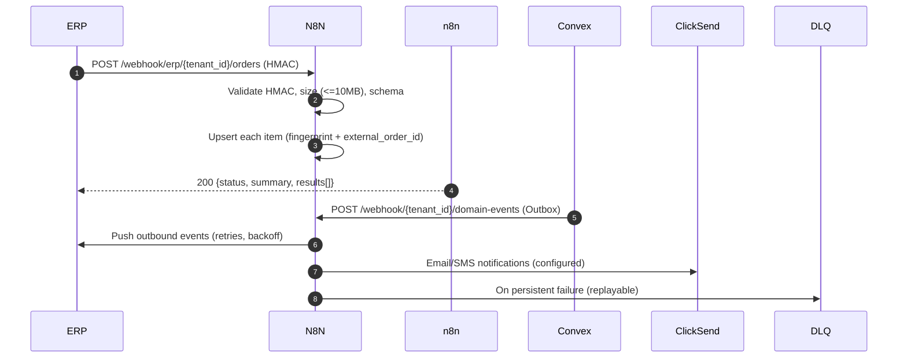

# Integration Hub Spec (N8N)

This spec defines how external systems (ERP/WMS, rail carriers, notification providers) integrate with the FMS via N8N. It standardizes authentication, schemas, batching, idempotency, retries, and observability.

## Goals
- Primary inbound: ERP pushes orders to an N8N webhook (HMAC‑signed). Fallback: SFTP CSV/JSON with the same schema.
- Primary outbound: FMS emits domain events to ERP/webhooks reliably using an Outbox → N8N delivery pipeline with idempotency and retries.
- Customer notifications: Email/SMS via ClickSend, driven by configurable triggers.

## Architecture
- Outbox pattern: Convex emits durable events to `events_outbox`. A worker posts to N8N’s `domain-events` webhook.
- N8N orchestrates: validation, dedupe, partial acceptance, mapping, partner calls, DLQ/replay.
- Cells: one N8N per infra cell. Webhook paths include the tenant context.



## Security & Auth
- HMAC SHA‑256 with per‑tenant shared secret.
  - Headers:
    - `X-Timestamp`: UNIX epoch seconds
    - `X-Signature`: `sha256=` + hex(HMAC_SHA256(secret, `${timestamp}.${rawBody}`))
  - Clock skew: ±5 minutes.
  - Reject if timestamp skewed or signature mismatch.
- Tenant context: path parameter `{tenant_id}`. Optionally also require `X-Tenant-Id` header.
- TLS (HTTPS) required.

<a id="inbound-erp-webhook"></a>
## Inbound ERP → n8n: Order Ingestion (Batched)
- Endpoint: `POST /webhook/erp/{tenant_id}/orders`
- Content‑Type: `application/json`
- Max payload: 10 MB; partial acceptance; respond 200 always when request is valid and processed (even if some items failed).
- Schema: see `docs/integrations/schemas/order-ingest.schema.json:1` (batch object with `orders: []`). Include an optional planning block per item.
- Idempotency (server‑managed; no key required from ERP):
  - Upsert identity is the pair `(tenant_id, external_order_id)`.
  - For duplicate suppression on network retries, n8n computes a canonical JSON fingerprint per item over business fields (ignoring non‑mutating fields) and stores it with a TTL (configurable; default 24h).
  - Same `(external_order_id, fingerprint)` within TTL → treated as duplicate; returns prior result.
  - Different fingerprint for same `external_order_id` → treated as an update (subject to your approval rules if already scheduled).
  - Optional headers `X-Request-Id` or partner `message_id` in the item will be honored if provided, but are not required.
- Response (200): `status` ∈ {`ok`,`partial`}, `summary`, and `results[]` — see `docs/integrations/schemas/order-ingest-response.schema.json:1`.
- Common failures per item: `VALIDATION_ERROR`, `DUPLICATE`, `CONFLICT`, `RATE_LIMITED`, `INTERNAL_ERROR`.

<a id="planning-semantics"></a>
### Planning semantics
- Tenant settings (see `docs/settings/README.md` and `docs/settings/schemas/planning-settings.schema.json`):
  - `planning_system_mode` ∈ [`none`,`tps_driven`]
  - `firming_horizon_days` per mode (defaults: road=14, rail=21)
  - `freeze_window_hours` (default 48)
  - `on_horizon_breach` ∈ [`auto_firm_if_complete`,`always_raise`]
  - `default_auto_firm` (bool), `allow_order_override_auto_firm` (bool)
- If `planning_status` is supplied, honor it (`forecast|provisional|firm`).
- If omitted:
  - mode=`none` → treat as `firm` if within horizon and data complete.
  - mode=`tps_driven` → treat as `provisional`.
- Optional fields: `auto_firm`, `firm_by_at`, `not_before_at`, `scenario_id`, `plan_version`.
- Fingerprint includes: `planning_status`, `firm_by_at`, `not_before_at` so material planning changes trigger updates; excludes `scenario_id` and `plan_version` (frequent TPS churn).
  - Scoping: settings can be overridden by Mode and Zone, with precedence Tenant → Mode → Zone → Mode+Zone.
  - Note: Inbound may send `planning_status: "forecast"` regardless of UI feature flags; forecasts are stored for planning/visibility and never scheduled until converted to Provisional/Firm.

<a id="horizon-breach"></a>
### Horizon breach behavior
- Evaluate in this order:
  1) If `order.auto_firm` is true AND settings.allow_order_override_auto_firm is true AND order is outside the freeze window and data is complete → auto‑firm.
  2) Else, apply tenant setting `on_horizon_breach`:
     - `auto_firm_if_complete`: auto‑firm when complete and outside freeze; otherwise raise `order.firming_due`.
     - `always_raise`: always raise `order.firming_due` for dispatcher action.

### Example Request (truncated)
```json
{
  "batch_id": "BATCH-2025-11-10-001",
  "orders": [
    {
      "external_order_id": "ERP-9001",
      "account": { "code": "ACME" },
      "order_type": "Standard",
      "priority": "High",
      "order_value_aud": 12500,
      "pickup": {
        "address": {"line1":"1 Wharf St","city":"Brisbane","state":"QLD","postcode":"4000","country":"AU"},
        "window_start": "2025-11-11T08:00:00+10:00",
        "window_end": "2025-11-11T10:00:00+10:00"
      },
      "dropoff": {
        "address": {"line1":"99 Creek Rd","city":"Murarrie","state":"QLD","postcode":"4172","country":"AU"},
        "window_start": "2025-11-11T12:00:00+10:00",
        "window_end": "2025-11-11T14:00:00+10:00"
      },
      "items": [
        {"line_id":"L1","gtin":"09312345000012","qty":10,"weight_kg":80,"volume_m3":0.8}
      ],
      "constraints": {"dg_class": null, "temp_min": null, "temp_max": null},
      "notes": "Leave at dock 3"
    }
  ]
}
```

### Example 200 Response
```json
{
  "status": "partial",
  "summary": { "total": 2, "accepted": 1, "failed": 1 },
  "results": [
    {"external_order_id":"ERP-9001","status":"accepted","order_id":"O-42","version":1},
    {"external_order_id":"ERP-9002","status":"failed","error":{"code":"VALIDATION_ERROR","message":"missing address"}}
  ]
}
```

<a id="fallback-ingestion"></a>
## Fallback Ingestion: SFTP CSV/JSON
- Location: per‑tenant SFTP folder structure `/inbound/orders/{YYYY}/{MM}/{DD}/`.
- Formats: CSV or ndjson with the same fields as the JSON schema; one row/object per order.
- Acknowledgement: n8n writes a results file next to the source with `-result.json` suffix using the same response shape (`status/summary/results`).
- Deduplication: same idempotency rules apply.

<a id="outbound-events"></a>
## Outbound: FMS → ERP Events
- Event list (all enabled at launch):
  - `order.created`, `order.updated`, `order.cancelled`
  - `task.scheduled`, `task.rescheduled`
  - `vehicle.departed_for_route`
  - `arrived.at_pickup`, `departed.from_pickup`, `arrived.at_dropoff`, `delivered`
  - `exception.raised`, `exception.resolved`, `pod.received`
  - Planning: `order.planning_updated`, `order.firming_due`, `order.firmed`
- Envelope: see `docs/integrations/schemas/outbound-event.schema.json:1`.
- Idempotency: `id` is a UUID; receivers must treat events as idempotent by `id`.
- Delivery: 2xx = success; otherwise retries with exponential backoff (e.g., 30s, 2m, 10m, 1h, capped). DLQ after N attempts with replay UI.
- Security: HMAC headers identical to inbound; per‑tenant secrets.

<a id="sea-handoff"></a>
### Sea → AU Handoff (configurable)
- Purpose: When a sea leg completes (e.g., `gate_out` at AU port), optionally auto‑create and/or auto‑firm the first AU domestic leg if a matching Provisional exists and gating fields are satisfied.
- Settings: `planning.sea_handoff` (see docs/settings/schemas/planning-settings.schema.json) per Tenant/Mode/Zone.
  - `auto_create_au_leg` (default true)
  - `auto_firm_au_leg` (default true)
  - `match_strategy`: `by_booking_ref` | `by_external_order_id` | `by_container_id` (default booking_ref)
  - `required_fields`: defaults include container_ids, dg_class, UN_number, packing_group, discharge_port, customs_cleared, biosecurity_cleared, duties_and_taxes_settled, port_charges_settled
- Behavior:
  1) On sea event `gate_out` (or configured trigger), find matching Provisional AU leg by strategy.
  2) Validate required_fields; if any missing/false → raise `order.firming_due` with reason `GATING_FAILED` and list missing fields.
  3) If all satisfied → create AU leg if needed, then firm (subject to freeze window rules), emit `order.firmed`.

## Notifications: ClickSend (Email/SMS)
- Triggers: configurable per tenant; recommended initial set — `task.scheduled`, `eta_notice`, `arrived.at_dropoff`, `delivered`, `exception.raised`.
- Templating tokens: `{order_id}`, `{task_id}`, `{eta}`, `{vehicle}`, `{tracking_link}`, `{exception_reason}`.
- Compliance: opt‑out and sender IDs per account settings.

## Observability & DLQ/Replay
- Correlation IDs: propagate `correlation_id` end‑to‑end (batch_id, external msg ids).
- Metrics: requests, validates, accepts, failures by code; p95/p99 processing time; retry counts; DLQ size; per‑tenant volumes.
- Replay: n8n flow to reprocess DLQ items by `id`/time window; ensure idempotency on re‑delivery.

## Limits & Policies
- Size: inbound 10 MB; soft item cap 100 orders per request (enforced by size).
- Rate limits: configurable per tenant; recommended 600 req/min burst 60.
- Timeouts: 15s request timeout; background processing allowed; large batches may stream responses late.

## Appendix A — HMAC Pseudocode
```python
# Signature inputs
#   ts: string = str(int(time.time()))
#   body: raw request body bytes
#   secret: bytes
# Header values
#   X-Timestamp: ts
#   X-Signature: 'sha256=' + hmac_sha256_hex(secret, f"{ts}.{body.decode('utf-8')}")
```

## Appendix B — JSON Schemas
- Inbound batch: `docs/integrations/schemas/order-ingest.schema.json:1`
- Inbound response: `docs/integrations/schemas/order-ingest-response.schema.json:1`
- Outbound event: `docs/integrations/schemas/outbound-event.schema.json:1`

## Appendix D — Telematics CSV Ingestion (Launch)
- Source: SFTP file drop with canonical CSV (see docs/integrations/mappings/telematics-csv.md).
- Flow: SFTP watch → validate → normalize → upsert `telematics_events` → rules engine → Alerts & Maintenance UI updates.
- Idempotency: reuse `(tenant_id, vehicle_id, ts, metric)` as identity; late duplicates ignored.

<a id="reconciliation"></a>
## Reconciliation & Diff Reports (n8n)
- Nightly job compares ERP orders vs FMS orders/tasks for the prior N days; emits discrepancies with categories (missing, mismatched totals, status drift).
- Outputs a summary (CSV/PDF) and raises Alerts for critical mismatches; links to retry/replay flows where supported.
- Related: Reports API (alerts.csv) and Delivery Performance report include reconciliation indicators.

## Appendix C — Canonical Fingerprint (server‑managed)
- Normalize JSON by:
  - Remove non‑mutating fields (nulls, empty strings) and fields excluded by settings.
  - Sort object keys lexicographically; sort `items` by `line_id`.
  - Normalize numbers (strip trailing zeros), uppercase enums, trim whitespace.
- Compute `fingerprint = sha256(canonical_json)` and store alongside `(tenant_id, external_order_id)` with `expires_at = now() + ttl`.
- On new item, if fingerprint exists → duplicate; return prior result. Otherwise process and store.

Inclusion of `notes` and `metadata`
- Controlled by settings (see `docs/settings/schemas/ingestion-settings.schema.json`) and scoped per Tenant/Mode/Zone.
- Defaults: include `notes` (true), include `metadata` (false).
