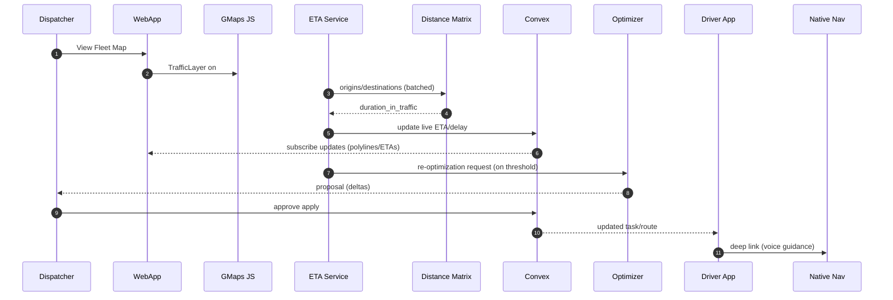

# Traffic Overlays, Live ETA, Re-Optimization, and Voice Guidance (Launch Plan)

Purpose
- Define how the web dashboard overlays traffic, how we compute live ETAs and re-optimization triggers, and how the Driver app provides turn‑by‑turn voice guidance at launch.
- Uses Google Maps Platform as standardized earlier; sea/rail extras remain post‑launch. See also compliance/au-standards.md for AU load‑restraint/fatigue context that influences planning inputs.

## Stack & Data Sources
- Maps/Traffic (web): Google Maps JavaScript API (TrafficLayer) on the web dashboard with a Map ID and vector map style.
- Routing/ETAs (services): Google Directions API + Distance Matrix API with `departure_time=now` and `traffic_model=best_guess`.
- Driver navigation (mobile): Deep‑link to native navigation (Google Maps / Apple Maps) from React Native; in‑app step list as fallback.

## Visual Routing & Mapping — Implementation
- Base map and layers
  - Initialise Google Maps with a Map ID; reduce visual clutter (POIs) for dispatcher focus.
  - Layers: Vehicles (status‑colored markers with clustering), Routes (polylines colored by congestion), Geofences (GeoJSON polygons), and TrafficLayer.
- Live updates
  - Subscribe to Convex (`positions`, `route_plans`, `route_stops`) and diff‑apply updates to markers/polylines to keep interactions ≤ 100 ms.
  - Use step‑level speeds from Directions to color segments by congestion; show a legend.
- Accessibility
  - Keyboard toggles for layers; ARIA labels on controls; high‑contrast themes respected.

<a id="traffic-overlay"></a>
## Web Dashboard — Traffic Overlay
- Base map: Google Maps JS; enable TrafficLayer on the Fleet Map.
- Route polylines: draw current planned route geometry; color segments by congestion using step‑level speeds (see Live ETA pipeline below).
- Refresh cadence: UI subscribes to live route state via Convex; polylines and badges update in near‑real time; TrafficLayer renders provider data without extra calls.

<a id="live-eta"></a>
## Live ETA Pipeline (Service)
- Service purpose: keep ETAs and delay predictions current for active routes and stops.
- Loop (every 60s, configurable):
  1) Collect active legs (vehicle_id, current position, next stop lat/lon, departure_time=now).
  2) Query Distance Matrix in batches (keyed by `(origin_cell, dest_cell, hour_bucket)` with 60–120s TTL cache) to get `duration_in_traffic`.
  3) Compare predicted arrival with planned ETA; compute `delay_minutes`.
  4) Persist live ETA/delay to Convex (route leg state); emit updates to dashboards and optional SMS/Email ETA notices.
- Cost controls:
  - Batch requests; reuse cached results across vehicles on similar corridors.
  - Only query when a leg is active or within N minutes of starting.
  - Clamp refresh for low‑movement vehicles (e.g., idle/parked).
- Reliability: backoff on provider errors; fall back to historical speeds (no‑traffic model) when unavailable.

## Re‑Optimization — Triggers & Flow (detail)
- Trigger when `delay_minutes > 10` or an incident is posted; compute a new sequence for the affected segment using fresh matrix data.
- Present KPI deltas; on approval, apply changes and emit events; SLA ≤ 30 seconds end‑to‑end.

<a id="reopt-flow"></a>
## Re‑Optimization Triggers and Flow
- Triggers:
  - Predicted `delay_minutes > threshold` (doc AC: 10m) from Live ETA Pipeline.
  - Disruption events (road closures/manual alerts).
- Flow:
  1) Build a stop subset (affected route segment) and compute a fresh Directions matrix.
  2) Call Optimizer (OR‑Tools or heuristic) to propose a revised sequence honoring windows/capacity.
  3) Present proposal to Dispatcher (UI) with KPI deltas; on approve, apply schedule and notify Driver.
- SLAs: reschedule of affected tasks completes ≤ 30 seconds (per warehouse‑delivery.md 2.4.2 AC5).

<a id="traffic-apis"></a>
## API Usage & Key Management
- Distance Matrix (live ETA):
  - `POST https://maps.googleapis.com/maps/api/distancematrix/json`
  - Params: `origins=lat,lon`, `destinations=lat,lon`, `departure_time=now`, `traffic_model=best_guess`, `key=...`
- Directions (route polyline + alternatives):
  - `POST https://maps.googleapis.com/maps/api/directions/json`
  - Params: `origin=...`, `destination=...`, `waypoints=optimize:true|...`, `alternatives=true`, `departure_time=now`, `traffic_model=best_guess`, `key=...`
- Caching: store responses for 60–120s keyed by origin/dest grid + time bucket; do not persist raw provider tiles per ToS.
- Security: keep API keys server‑side; mobile uses deep links (no client key). Restrict keys by IP/referrer; rotate via secret manager. Track quota budgets and add alerts.

### Example (TypeScript pseudo)
```ts
// live-eta.ts
const res = await fetch(
  `https://maps.googleapis.com/maps/api/distancematrix/json?origins=${o}&destinations=${d}&departure_time=now&traffic_model=best_guess&key=${K}`
);
const dm = await res.json();
const durationInTrafficSec = dm.rows[0].elements[0].duration_in_traffic.value;
```

<a id="voice-guidance"></a>
## Voice Guidance (Driver App)
- Approach: deep‑link to native navigation for spoken guidance while the app remains system‑of‑record.
- Android: `google.navigation:q=lat,lon&mode=d` preferred; HTTPS `dir/?api=1` fallback.
- iOS: `comgooglemaps://?daddr=lat,lon&directionsmode=driving` preferred; `maps://?daddr=lat,lon` fallback to Apple Maps.
- Multi‑stop: generate a link for the next stop only; open on Depart; on Arrive return to the app for scans; on re‑opt prompt and regenerate the link.
- Fallbacks/offline: show in‑app step list and polyline; prompt drivers to download offline packs for their zones; do not cache tiles.
- Telemetry: record `nav_opened_at`/`nav_returned_at`; handle notification nudge if the app stays backgrounded too long.

## Alerts & UX
- Predictive delay prompt: show reason (e.g., “Congestion +15m”) with Accept/Ignore; log rationale for audit.
- Traffic legend: show low/med/high congestion colors; toggle overlay per user.
- Accessibility: ensure map controls are keyboard reachable and color contrast meets WCAG AA.

## Observability & Cost Guardrails
- Metrics: ETA refresh latency, provider call counts, cache hit rate, re‑opt SLA, failures.
- Budgets: cap Directions/Distance Matrix QPS; backoff and degrade gracefully (e.g., step‑level ETA without traffic). Correlate logs with `traceId`, `route_id`, and `vehicle_id`.

## Risks & Mitigations
- Provider ToS on caching and offline: use short‑lived cache, avoid tile storage, rely on native offline features.
- Quotas/costs: batching and TTL cache; only query active legs; consider usage‑based alerts.
- Accuracy: rural roads may have sparse traffic data; fall back to historical speeds.



## Launch Checklist Tie‑In
- 2.6.x Dashboard targets: met (traffic overlay, KPIs, alerts).
- 2.3.1 Routing alternatives: Directions `alternatives=true` + UI selector.
- 2.4.2 Re‑optimization in <30s: enforced in service design and SLAs.
- 2.3.2 Voice guidance: delivered via native deep links; offline packs via native app.
