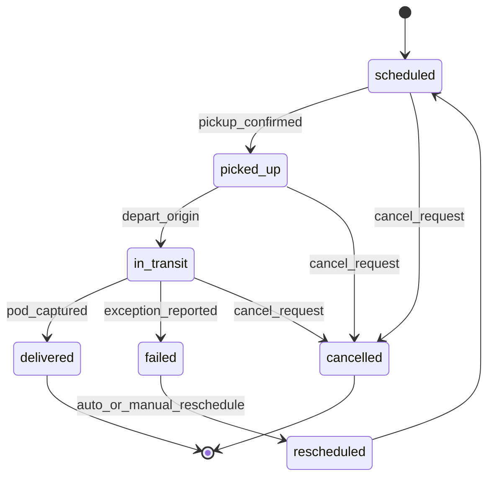
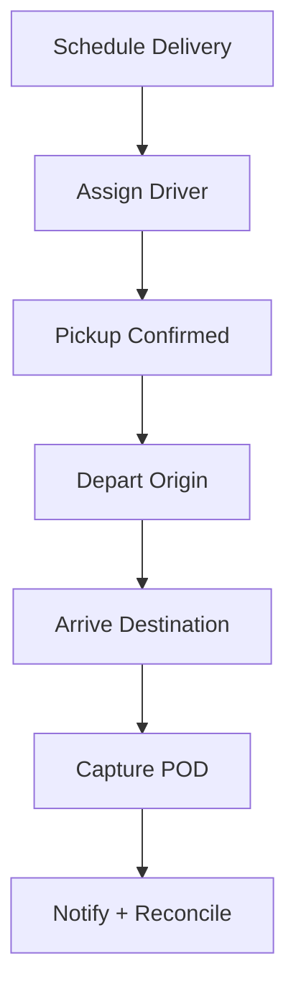

## Summary
End‑to‑end delivery flow from scheduling to Proof of Delivery (POD). Captures normal and exception paths with reschedule/cancel behaviors.

## Actors
- Dispatcher
- Driver
- Customer
- System (Scheduler/Optimizer, Notification Service)

## Triggers
- New delivery scheduled
- Driver assignment confirmed
- Status updates via driver app or telematics

## State Machine

## Happy Path (Flow)

## Events
- Consumes: `delivery.scheduled`, `driver.assigned`, `delivery.pickup_confirmed`, `delivery.pod_captured`, `delivery.exception`.
- Emits: `delivery.status.changed`, `delivery.pod.available`, `delivery.rescheduled`, `delivery.cancelled`.

## Exceptions & Compensation
- Missed pickup → mark `failed`, attempt `rescheduled` with notification.
- Customer cancellation → transition to `cancelled`, notify stakeholders.
- Partial delivery → remain `in_transit` until resolved or fail and reschedule.

## Notes
- Mirrors state models used in `planning/glm/data-model.md` for consistency.

