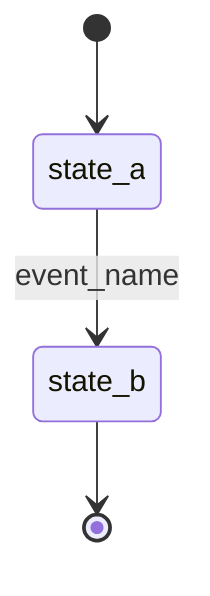
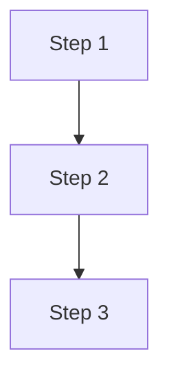

## Summary
One or two sentences describing the workflow’s goal and scope.

## Actors
- Primary human/system actors.

## Triggers
- Events or conditions that start the workflow.

## State Machine

## Main Flow

## Events
- Consumes: event.one, event.two
- Emits: event.three, event.four

## Exceptions & Compensation
- Describe failure modes and how the system compensates.

