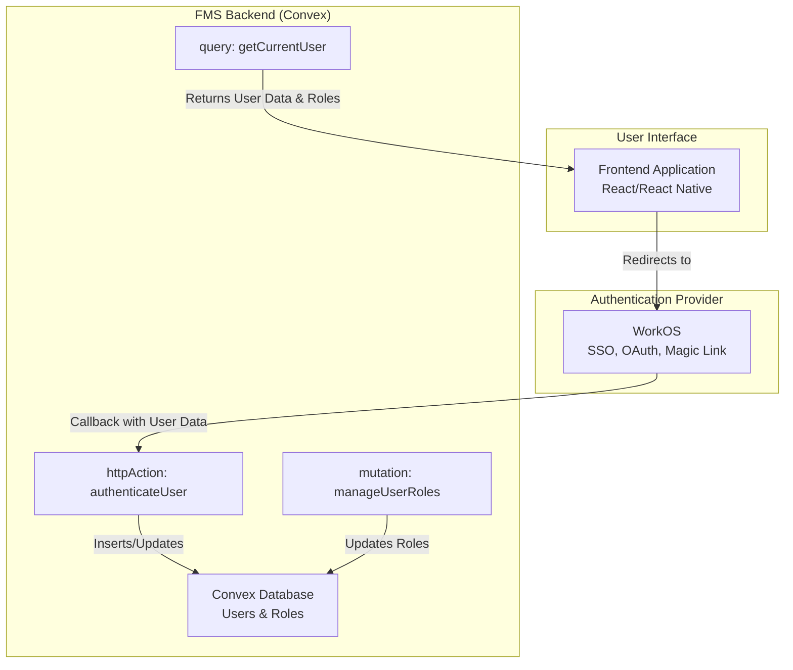

# 11 - Functional Design: User Account Management

## 1. Introduction

This document outlines the functional and technical design for the User Account Management component of the Fleet Management System (FMS). The primary goal is to ensure secure and efficient user account creation, authentication, role assignment, and session management using **WorkOS** as the authentication provider, built upon the **Convex** real-time data platform.

## 2. Related Requirements

-   **Requirement 2.6.2:** As a Dispatcher, I want role-based access control (RBAC) so that users can only access authorized features.
-   **Requirement 2.6.4:** As a Warehouse Operator, I want role-based dashboard views with operational summaries so that I can access relevant information without full fleet access.

## 3. High-Level Design

The User Account Management component leverages WorkOS for authentication and integrates with Convex for role management and user data storage.

1.  **User Authentication (via WorkOS):** WorkOS handles the authentication flow (SSO, OAuth, Magic Link) and returns user information to the FMS.
2.  **Role Assignment & Management (via Convex):** The FMS stores user roles and permissions in Convex, allowing for dynamic role-based access control.
3.  **Session Management:** Secure session handling ensures that authenticated users maintain their access throughout their session.



## 4. Detailed Functional Breakdown

### 4.1. User Authentication & Account Creation (Req. 2.6.2, 2.6.4)

-   **Frontend Authentication Flow:**
    -   Users initiate login via a "Sign In" button that redirects them to the WorkOS authentication page.
    -   After successful authentication, WorkOS redirects back to the FMS with an authorization code.
    -   The frontend exchanges this code for user information and begins the session.
-   **Account Creation:**
    -   When a new user authenticates via WorkOS for the first time, if they don't exist in the FMS database, a new user account is automatically created.
    -   The system captures user details from WorkOS (email, name, ID) and stores them in the Convex database.
    -   Initial role assignment is handled through WorkOS organization settings or via a default role assignment.

### 4.2. Role Assignment & Management (Req. 2.6.2, 2.6.4)

-   **Role-Based Access Control:**
    -   The system supports role-based permissions for different user types: Fleet Managers, Dispatchers, Drivers, and Warehouse Operators.
    -   Roles and permissions are stored and managed in the Convex database.
    -   The UI dynamically renders components based on the user's assigned roles.
-   **Role Assignment Process:**
    -   New users receive an initial role based on organizational configuration in WorkOS or through an admin assignment process.
    -   Administrators can modify user roles via the FMS admin interface.
    -   Role changes are instantly reflected in the UI through Convex's real-time subscriptions.

## 5. Acceptance Criteria Checklist

| Requirement | AC# | Description                                                              | Status    |
| :---------- | :-- | :----------------------------------------------------------------------- | :-------- |
| **2.6.2**   | 2   | Role-based access control prevents unauthorized views.                   | `Pending` |
|             | 3   | Users can only access features appropriate to their role.                | `Pending` |
| **2.6.4**   | 2   | Role-based dashboard views enforced via RBAC.                            | `Pending` |
|             | 3   | Shared elements across roles while hiding sensitive data based on role.  | `Pending` |

## 6. Open Questions & Considerations

1.  **Default Role Assignment:** Determine the default role for new users when they first authenticate. This could be based on email domain, organization in WorkOS, or assigned via admin intervention.
2.  **Role Hierarchy:** Define the specific permissions for each role type and ensure clear separation of duties.
3.  **Session Security:** Implement secure session handling with appropriate timeouts and token validation to prevent unauthorized access.

## 7. Technical Implementation Details (Convex)

### 7.1. Convex Schema

-   **File:** `convex/schema.ts`
-   **Table Definition (`users`):**
    ```typescript
    // convex/schema.ts
    import { defineSchema, defineTable } from "convex/server";
    import { v } from "convex/values";

    export default defineSchema({
      users: defineTable({
        workosUserId: v.string(), // The WorkOS user ID
        email: v.string(),
        name: v.optional(v.string()),
        role: v.union(
          v.literal("fleet_manager"),
          v.literal("dispatcher"),
          v.literal("driver"),
          v.literal("warehouse_operator")
        ),
        isActive: v.boolean(),
        createdAt: v.number(), // Timestamp
        lastLoginAt: v.optional(v.number()), // Timestamp
      }).index("by_workos_user_id", ["workosUserId"])
       .index("by_email", ["email"])
       .index("by_role", ["role"]),

      // ... other tables
    });
    ```

### 7.2. Convex Functions

-   **HTTP Action (for WorkOS Callback):** `convex/users.ts`
    ```typescript
    // convex/users.ts
    import { httpAction } from "./_generated/server";
    import { v } from "convex/values";

    export const authenticateUser = httpAction(async (ctx, request) => {
      // 1. Exchange authorization code for user info with WorkOS
      // 2. Check if user exists in database based on workosUserId
      // 3. If not exists, create a new user with default role
      // 4. Update lastLoginAt timestamp
      // 5. Return session token and user information
      const { code } = await request.json();
      
      // Verify with WorkOS API
      // const workosUser = await workos.userManagement.authenticateWithCode({...});
      
      // Find or create user in Convex
      // const existingUser = await ctx.db.query("users").withIndex("by_workos_user_id", q => q.eq("workosUserId", workosUser.id)).first();
      
      // if (!existingUser) {
      //   await ctx.db.insert("users", {
      //     workosUserId: workosUser.id,
      //     email: workosUser.email,
      //     name: workosUser.firstName + " " + workosUser.lastName,
      //     role: "warehouse_operator", // default role
      //     isActive: true,
      //     createdAt: Date.now(),
      //     lastLoginAt: Date.now()
      //   });
      // } else {
      //   await ctx.db.patch(existingUser._id, {
      //     lastLoginAt: Date.now()
      //   });
      // }
      
      return new Response(JSON.stringify({ success: true, userId: workosUser.id }), {
        status: 200,
        headers: { "Content-Type": "application/json" }
      });
    });
    ```

-   **Mutation (for Role Management):** `convex/users.ts`
    ```typescript
    // convex/users.ts
    import { mutation } from "./_generated/server";
    import { v } from "convex/values";

    export const updateUserRole = mutation({
      args: {
        userId: v.id("users"),
        newRole: v.union(
          v.literal("fleet_manager"),
          v.literal("dispatcher"),
          v.literal("driver"),
          v.literal("warehouse_operator")
        )
      },
      handler: async (ctx, args) => {
        // Verify user has admin privileges to change roles
        const identity = await ctx.auth.getUserIdentity();
        if (!identity) { throw new Error("Not authenticated"); }
        
        // Update user role in database
        await ctx.db.patch(args.userId, {
          role: args.newRole
        });
        
        return { success: true };
      },
    });

    export const createAccount = mutation({
      args: {
        workosUserId: v.string(),
        email: v.string(),
        name: v.optional(v.string()),
        role: v.union(
          v.literal("fleet_manager"),
          v.literal("dispatcher"),
          v.literal("driver"),
          v.literal("warehouse_operator")
        )
      },
      handler: async (ctx, args) => {
        // Create a new user account in the database
        const userId = await ctx.db.insert("users", {
          workosUserId: args.workosUserId,
          email: args.email,
          name: args.name,
          role: args.role,
          isActive: true,
          createdAt: Date.now(),
          lastLoginAt: Date.now()
        });

        return userId;
      },
    });
    ```

-   **Query (for Current User):** `convex/users.ts`
    ```typescript
    // convex/users.ts
    import { query } from "./_generated/server";
    import { v } from "convex/values";

    export const getCurrentUser = query({
      args: {
        userId: v.string() // WorkOS user ID
      },
      handler: async (ctx, args) => {
        // Retrieve user information based on WorkOS user ID
        const user = await ctx.db.query("users")
          .withIndex("by_workos_user_id", q => q.eq("workosUserId", args.userId))
          .first();
        
        if (!user) {
          throw new Error("User not found");
        }

        // Return user data without sensitive information
        return {
          _id: user._id,
          email: user.email,
          name: user.name,
          role: user.role,
          isActive: user.isActive
        };
      },
    });
    ```

### 7.3. Frontend Implementation (React)

-   **`Authentication` Component:**
    -   **Login Flow:**
    ```javascript
    // src/components/Auth/Login.tsx
    import { useMutation } from "convex/react";
    import { api } from "../../convex/_generated/api";

    function Login() {
      const authenticateUser = useMutation(api.users.authenticateUser);

      const handleLogin = async () => {
        // Redirect to WorkOS login page
        window.location.href = '/auth/login'; // Backend endpoint that redirects to WorkOS
      };

      return (
        <button onClick={handleLogin}>
          Sign in with SSO
        </button>
      );
    }
    ```

-   **Role-Based Access Components:**
    ```javascript
    // src/components/ProtectedRoute.tsx
    import { useQuery } from "convex/react";
    import { api } from "../convex/_generated/api";

    function ProtectedRoute({ requiredRole, children }) {
      const user = useQuery(api.users.getCurrentUser, {
        userId: /* Get from session/local storage */
      });

      if (!user || user.role !== requiredRole) {
        return <div>Access denied</div>;
      }

      return children;
    }
    ```

### 7.4. Backend Authentication Implementation (Express)

-   **Authentication Routes:**
    ```javascript
    // backend/auth.js
    const { WorkOS } = require('@workos-inc/node');
    const workos = new WorkOS(process.env.WORKOS_API_KEY);
    const clientId = process.env.WORKOS_CLIENT_ID;

    app.get('/auth/login', (req, res) => {
      const authorizationUrl = workos.userManagement.getAuthorizationUrl({
        provider: 'authkit', // or 'GoogleOAuth', 'MicrosoftOAuth', etc.
        clientId: clientId,
        redirectUri: process.env.WORKOS_REDIRECT_URI,
        state: '', // Optional: custom state parameter
      });

      res.redirect(authorizationUrl);
    });

    app.get('/callback', async (req, res) => {
      const { code } = req.query;

      try {
        // Exchange authorization code for user profile
        const { user, accessToken, refreshToken } =
          await workos.userManagement.authenticateWithCode({
            clientId: clientId,
            code: code,
          });

        // Store user session (using your preferred session management)
        req.session.userId = user.id;
        req.session.accessToken = accessToken;

        // Optionally, create/update user account in Convex
        // await convexClient.mutation(api.users.createAccount, {
        //   workosUserId: user.id,
        //   email: user.email,
        //   name: user.firstName + " " + user.lastName,
        //   role: "warehouse_operator" // default role
        // });

        // Redirect to your app
        res.redirect('/dashboard');
      } catch (error) {
        console.error('Authentication error:', error);
        res.redirect('/login?error=auth_failed');
      }
    });

    app.post('/auth/logout', (req, res) => {
      req.session.destroy();
      res.redirect('/');
    });
    ```