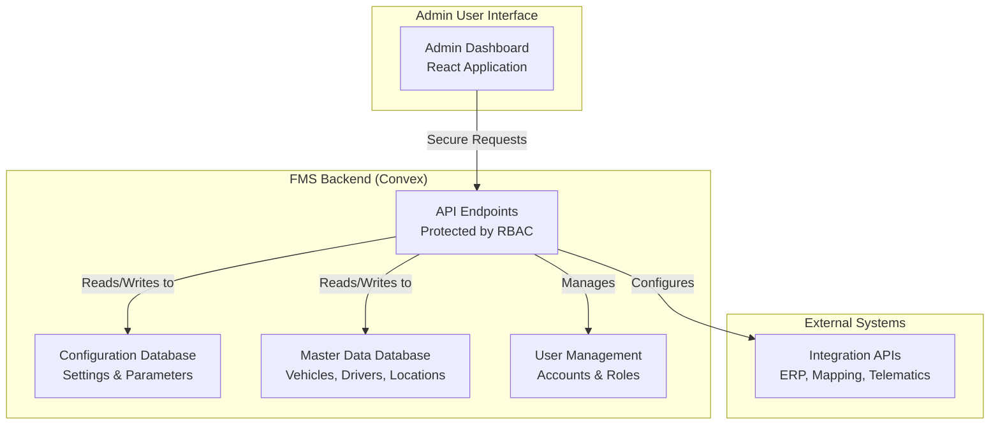

# 12 - Functional Design: Admin Area & System Configuration

## 1. Introduction

This document outlines the functional and technical design for the Administrative Area and System Configuration component of the Fleet Management System (FMS). The primary goal is to provide a centralized interface for super users to manage master data, user accounts, system settings, and configuration parameters necessary for the proper operation of the FMS. This area will have role-based access control with enhanced privileges for super users and restricted access for admin users.

## 2. Related Requirements

-   **Requirement 2.6.2:** As a Fleet Manager, I want customizable KPI widgets so that I can monitor key performance indicators specific to my role.
-   **Requirement 2.6.3:** As a Fleet Manager, I want an alerts and notifications panel for proactive issue resolution.
-   **Requirement 3.1:** Performance - System response time <2 seconds for 95% of API calls under peak load.
-   **Requirement 3.2:** Availability - 99.9% uptime; failover to secondary region in <5 minutes.

## 3. High-Level Design

The Admin Area component provides a comprehensive management interface with multiple sections:

1.  **Master Data Management:** Centralized control over core system data (vehicles, drivers, locations, etc.).
2.  **Account Management:** User management, role assignments, and access control.
3.  **System Settings & Configuration:** Configuration parameters for system behavior, performance, and integration settings.
4.  **Super User Access Control:** Enhanced visibility and capabilities for super users with restricted access for admin users.



## 4. Detailed Functional Breakdown

### 4.1. Master Data Management

-   **Vehicles Management:**
    -   Add, edit, and deactivate vehicles with details: ID, type, capacity, status, maintenance schedule.
    -   Bulk import/export functionality for fleet data.
    -   Real-time status visibility (active, maintenance, retired).
-   **Drivers Management:**
    -   Create, update, and deactivate driver profiles with details: name, license, certifications, availability.
    -   Link drivers to vehicles and shifts.
    -   Performance tracking and history.
-   **Locations & Routes Management:**
    -   Define and maintain warehouse locations, customer addresses, and delivery zones.
    -   Configure geofences and delivery constraints.
    -   Maintain a database of frequently used locations for quick reference.

### 4.2. Account Management

-   **User Administration:**
    -   View, create, edit, and deactivate user accounts.
    -   Assign roles and permissions to users (Fleet Manager, Dispatcher, Driver, Warehouse Operator).
    -   Manage user authentication settings and reset credentials.
-   **Role-Based Access Control:**
    -   Configure permissions for different roles.
    -   Define which system features are accessible to each role.
    -   Audit trail of role changes and user access modifications.

### 4.3. System Settings & Configuration

-   **Performance Parameters:**
    -   Configure scheduling algorithm parameters (e.g., optimization criteria, time windows).
    -   Set API polling intervals and retry mechanisms.
    -   Define data retention policies for logs and historical data.
-   **Integration Settings:**
    -   Configure connection parameters for external systems (ERP, mapping APIs, telematics).
    -   Manage API keys and authentication tokens for integrations.
    -   Set up webhooks and event handlers for external systems.
-   **Notification & Alerts:**
    -   Configure alert thresholds (e.g., delivery delays, maintenance needs).
    -   Set up notification channels (email, SMS, push) for different alert types.
    -   Define escalation rules for unacknowledged alerts.

### 4.4. Super User vs Admin User Access Control

-   **Super User Capabilities:**
    -   Full access to all admin area functions.
    -   System-level configuration and performance tuning.
    -   Access to detailed system metrics and diagnostic information.
    -   Ability to override role restrictions in emergency situations.
-   **Admin User Capabilities:**
    -   Limited access to critical system settings.
    -   Focus on user management and master data maintenance.
    -   Restricted access to system-level configurations.
    -   No ability to modify core system parameters without super user approval.

## 5. Acceptance Criteria Checklist

| Requirement | AC# | Description                                                              | Status    |
| :---------- | :-- | :----------------------------------------------------------------------- | :-------- |
| **2.6.2**   | 4   | System allows customization of KPI widgets for different roles.          | `Pending` |
| **2.6.3**   | 2   | Configurable rules for alert generation.                                 | `Pending` |
|             | 3   | One-click actions from alerts.                                           | `Pending` |
| **3.1**     | -   | Admin area maintains <2s response times under load.                      | `Pending` |
| **3.2**     | -   | System configuration supports 99.9% uptime requirements.                 | `Pending` |

## 6. Open Questions & Considerations

1.  **Audit Trail:** Implement comprehensive logging for all admin actions to track changes and ensure accountability.
2.  **User Training:** Consider the complexity of the admin interface and plan for user training materials.
3.  **Security:** Ensure admin area endpoints are properly secured and monitored for suspicious activity.
4.  **Backup & Recovery:** Define procedures for backing up system configurations and master data.

## 7. Technical Implementation Details (Convex)

### 7.1. Convex Schema

-   **File:** `convex/schema.ts`
-   **Additional Table Definitions:**
    ```typescript
    // convex/schema.ts
    import { defineSchema, defineTable } from "convex/server";
    import { v } from "convex/values";

    export default defineSchema({
      // ... existing tables ...

      // Master data tables
      vehicles: defineTable({
        vehicleId: v.string(),
        type: v.string(),
        capacity: v.number(),
        status: v.union(v.literal("active"), v.literal("maintenance"), v.literal("retired")),
        licensePlate: v.string(),
        lastMaintenanceDate: v.optional(v.number()), // Unix timestamp
        nextMaintenanceDate: v.optional(v.number()), // Unix timestamp
        createdAt: v.number(), // Unix timestamp
        updatedAt: v.number(), // Unix timestamp
      }).index("by_vehicle_id", ["vehicleId"])
       .index("by_status", ["status"]),

      drivers: defineTable({
        workosUserId: v.string(), // Reference to WorkOS user ID
        licenseNumber: v.string(),
        licenseExpiry: v.number(), // Unix timestamp
        certifications: v.array(v.string()),
        availability: v.union(v.literal("available"), v.literal("unavailable"), v.literal("on_duty")),
        currentVehicleId: v.optional(v.id("vehicles")),
        createdAt: v.number(), // Unix timestamp
        updatedAt: v.number(), // Unix timestamp
      }).index("by_workos_user_id", ["workosUserId"]),

      locations: defineTable({
        name: v.string(),
        address: v.string(),
        latitude: v.number(),
        longitude: v.number(),
        locationType: v.union(v.literal("warehouse"), v.literal("customer"), v.literal("depot")),
        geofenceRadius: v.optional(v.number()), // in meters
        createdAt: v.number(), // Unix timestamp
        updatedAt: v.number(), // Unix timestamp
      }).index("by_location_type", ["locationType"]),

      // System configuration table
      systemConfig: defineTable({
        key: v.string(), // e.g., "scheduling.algorithm", "api.polling.interval"
        value: v.string(), // JSON string for complex values
        description: v.optional(v.string()),
        valueType: v.union(v.literal("string"), v.literal("number"), v.literal("boolean"), v.literal("json")),
        isProtected: v.boolean(), // Indicates if requires super user access
        lastModifiedBy: v.id("users"),
        lastModifiedAt: v.number(), // Unix timestamp
      }).index("by_key", ["key"]),

      // Admin activity logs
      adminLogs: defineTable({
        userId: v.id("users"), // Admin who performed the action
        action: v.string(), // e.g., "update_vehicle", "change_role"
        entityType: v.optional(v.string()), // e.g., "vehicle", "user", "config"
        entityId: v.optional(v.union(v.string(), v.id("vehicles"), v.id("users"))),
        oldValue: v.optional(v.string()), // Previous state as JSON string
        newValue: v.optional(v.string()), // New state as JSON string
        timestamp: v.number(), // Unix timestamp
        ipAddress: v.optional(v.string()),
      }).index("by_user_id", ["userId"])
       .index("by_action", ["action"])
       .index("by_timestamp", ["timestamp"]),
    });
    ```

### 7.2. Application-Level Access Control

**Critical Implementation Detail:** It's important to understand that database access is managed through application-level accounts, not database-native user accounts. The database itself uses service accounts with appropriate permissions for the application to connect. User authentication and authorization are handled entirely at the application level:

- **Authentication:** Handled through WorkOS for user verification
- **Authorization:** Implemented in Convex functions using role-based access control
- **Database Access:** The application uses a service account to connect to the database
- **User Permissions:** Enforced through application logic based on user roles stored in the system, not database-level permissions

### 7.2. Convex Functions

-   **Admin Queries:** `convex/admin.ts`
    ```typescript
    // convex/admin.ts
    import { query } from "./_generated/server";
    import { v } from "convex/values";

    // Query for master data management
    export const getVehicles = query({
      args: {
        status: v.optional(v.union(v.literal("active"), v.literal("maintenance"), v.literal("retired"))),
        limit: v.optional(v.number()),
        offset: v.optional(v.number()),
      },
      handler: async (ctx, args) => {
        let queryBuilder = ctx.db.query("vehicles");
        
        if (args.status) {
          queryBuilder = queryBuilder.withIndex("by_status", q => q.eq("status", args.status));
        }
        
        if (args.limit) {
          queryBuilder = queryBuilder.limit(args.limit);
        }
        
        return await queryBuilder.collect();
      },
    });

    // Query for system configuration
    export const getSystemConfig = query({
      args: {},
      handler: async (ctx) => {
        // Only return non-protected configurations to non-super users
        const identity = await ctx.auth.getUserIdentity();
        if (!identity) { throw new Error("Not authenticated"); }

        // Check if user has super admin role
        const user = await ctx.db.query("users")
          .withIndex("by_workos_user_id", q => q.eq("workosUserId", identity.subject))
          .first();

        if (user && user.role === "super_admin") {
          // Return all configurations including protected ones
          return await ctx.db.query("systemConfig").collect();
        } else {
          // Return only non-protected configurations
          return await ctx.db.query("systemConfig")
            .filter(q => q.eq("isProtected", false))
            .collect();
        }
      },
    });
    ```

-   **Admin Mutations:** `convex/admin.ts`
    ```typescript
    // convex/admin.ts
    import { mutation } from "./_generated/server";
    import { v } from "convex/values";

    // Mutation for vehicle management
    export const updateVehicle = mutation({
      args: {
        vehicleId: v.id("vehicles"),
        updates: v.object({
          type: v.optional(v.string()),
          capacity: v.optional(v.number()),
          status: v.optional(v.union(v.literal("active"), v.literal("maintenance"), v.literal("retired"))),
          licensePlate: v.optional(v.string()),
          lastMaintenanceDate: v.optional(v.number()),
          nextMaintenanceDate: v.optional(v.number()),
        }),
      },
      handler: async (ctx, args) => {
        const identity = await ctx.auth.getUserIdentity();
        if (!identity) { throw new Error("Not authenticated"); }

        // Verify user has admin privileges
        const user = await ctx.db.query("users")
          .withIndex("by_workos_user_id", q => q.eq("workosUserId", identity.subject))
          .first();
        
        if (!user || (user.role !== "admin" && user.role !== "super_admin")) {
          throw new Error("Insufficient permissions");
        }

        // Get current vehicle data for audit log
        const currentVehicle = await ctx.db.get(args.vehicleId);
        
        // Update the vehicle
        await ctx.db.patch(args.vehicleId, {
          ...args.updates,
          updatedAt: Date.now()
        });

        // Log the admin action
        await ctx.db.insert("adminLogs", {
          userId: user._id,
          action: "update_vehicle",
          entityType: "vehicle",
          entityId: args.vehicleId,
          oldValue: JSON.stringify(currentVehicle),
          newValue: JSON.stringify({...currentVehicle, ...args.updates}),
          timestamp: Date.now(),
          ipAddress: identity.email // Simplified - in reality, you'd get this from request headers
        });

        return { success: true };
      },
    });

    // Mutation for system configuration
    export const updateSystemConfig = mutation({
      args: {
        key: v.string(),
        value: v.string(),
      },
      handler: async (ctx, args) => {
        const identity = await ctx.auth.getUserIdentity();
        if (!identity) { throw new Error("Not authenticated"); }

        // Super admin check for protected configurations
        const config = await ctx.db.query("systemConfig")
          .withIndex("by_key", q => q.eq("key", args.key))
          .first();

        if (config && config.isProtected) {
          const user = await ctx.db.query("users")
            .withIndex("by_workos_user_id", q => q.eq("workosUserId", identity.subject))
            .first();
          
          if (!user || user.role !== "super_admin") {
            throw new Error("Protected configuration requires super admin access");
          }
        }

        // Update or create the configuration
        if (config) {
          await ctx.db.patch(config._id, {
            value: args.value,
            lastModifiedBy: user._id,
            lastModifiedAt: Date.now()
          });
        } else {
          await ctx.db.insert("systemConfig", {
            key: args.key,
            value: args.value,
            valueType: "string", // Simplified - in practice, determine type
            isProtected: false,
            lastModifiedBy: user._id,
            lastModifiedAt: Date.now()
          });
        }

        return { success: true };
      },
    });

    // Mutation for updating user roles
    export const updateUserRole = mutation({
      args: {
        userId: v.id("users"),
        newRole: v.union(
          v.literal("fleet_manager"),
          v.literal("dispatcher"),
          v.literal("driver"),
          v.literal("warehouse_operator"),
          v.literal("admin"),
          v.literal("super_admin")
        )
      },
      handler: async (ctx, args) => {
        const identity = await ctx.auth.getUserIdentity();
        if (!identity) { throw new Error("Not authenticated"); }

        // Verify user has admin privileges to change roles
        const currentUser = await ctx.db.query("users")
          .withIndex("by_workos_user_id", q => q.eq("workosUserId", identity.subject))
          .first();
        
        if (!currentUser || (currentUser.role !== "admin" && currentUser.role !== "super_admin")) {
          throw new Error("Insufficient permissions to change user roles");
        }

        // Prevent non-super users from changing roles to/from super_admin
        const targetUser = await ctx.db.get(args.userId);
        if ((currentUser.role === "admin") && 
            (args.newRole === "super_admin" || targetUser.role === "super_admin")) {
          throw new Error("Admin users cannot modify super admin roles");
        }

        // Update user role in database
        await ctx.db.patch(args.userId, {
          role: args.newRole
        });

        // Log the admin action
        await ctx.db.insert("adminLogs", {
          userId: currentUser._id,
          action: "update_user_role",
          entityType: "user",
          entityId: args.userId,
          oldValue: JSON.stringify(targetUser),
          newValue: JSON.stringify({...targetUser, role: args.newRole}),
          timestamp: Date.now(),
          ipAddress: identity.email
        });

        return { success: true };
      },
    });
    ```

### 7.3. Frontend Implementation (React)

-   **`AdminDashboard` Component:**
    ```javascript
    // src/components/Admin/AdminDashboard.tsx
    import { useState } from "react";
    import { useQuery, useMutation } from "convex/react";
    import { api } from "../../convex/_generated/api";

    function AdminDashboard() {
      const [activeTab, setActiveTab] = useState("master-data");
      const user = useQuery(api.users.getCurrentUser, { /* userId */ });

      // Render different admin sections based on role
      if (user?.role !== "admin" && user?.role !== "super_admin") {
        return <div>Access denied</div>;
      }

      return (
        <div className="admin-dashboard">
          <nav className="admin-nav">
            <button 
              className={activeTab === "master-data" ? "active" : ""} 
              onClick={() => setActiveTab("master-data")}
            >
              Master Data
            </button>
            <button 
              className={activeTab === "accounts" ? "active" : ""} 
              onClick={() => setActiveTab("accounts")}
            >
              Account Management
            </button>
            <button 
              className={activeTab === "settings" ? "active" : ""} 
              onClick={() => setActiveTab("settings")}
            >
              System Settings
            </button>
            {/* Only show logs to super admin users */}
            {user.role === "super_admin" && (
              <button 
                className={activeTab === "logs" ? "active" : ""} 
                onClick={() => setActiveTab("logs")}
              >
                Activity Logs
              </button>
            )}
          </nav>

          <main className="admin-content">
            {renderActiveTab(activeTab, user)}
          </main>
        </div>
      );
    }

    function renderActiveTab(tab, user) {
      switch(tab) {
        case "master-data":
          return <MasterDataManagement user={user} />;
        case "accounts":
          return <AccountManagement user={user} />;
        case "settings":
          return <SystemSettingsManagement user={user} />;
        case "logs":
          if (user.role === "super_admin") {
            return <ActivityLogs />;
          }
        default:
          return <MasterDataManagement user={user} />;
      }
    }
    ```

-   **Role-Based Access Components:**
    ```javascript
    // src/components/Admin/ProtectedAdminSection.tsx
    import { useQuery } from "convex/react";
    import { api } from "../../convex/_generated/api";

    function ProtectedAdminSection({ requiredRole, children }) {
      const user = useQuery(api.users.getCurrentUser, { /* userId */ });
      
      // Check if user has sufficient privileges
      const hasAccess = user && (
        user.role === "super_admin" || 
        (requiredRole === "admin" && user.role === "admin")
      );

      if (!hasAccess) {
        return (
          <div className="access-denied">
            You don't have permission to access this section.
          </div>
        );
      }

      return <>{children}</>;
    }
    ```