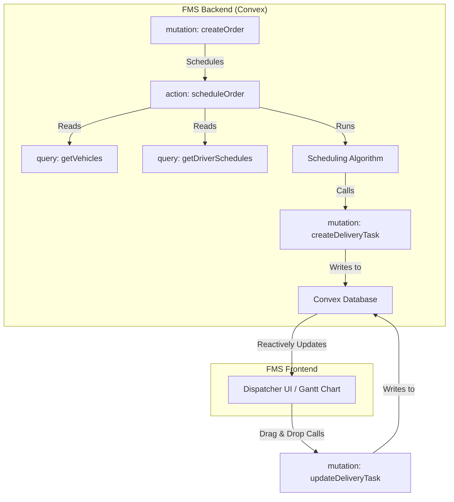

# 14 - Functional Design: Delivery Scheduling

## 1. Introduction

This document details the functional and technical design for the Delivery Scheduling component of the FMS. This component is responsible for the efficient allocation of resources by automatically scheduling delivery tasks based on a variety of constraints and business rules, using the **Convex** backend platform.

## 2. Related Requirements

-   **Requirement 2.2.1:** As a Dispatcher, I want automated scheduling of delivery tasks based on order priority, vehicle capacity, and driver availability.
-   **Requirement 2.2.2:** As a Fleet Manager, I want visibility into scheduling conflicts and utilisation metrics.

## 3. High-Level Design

The Delivery Scheduling logic is implemented as a set of functions within the Convex backend. A Convex `action` is triggered when a new order is ready for scheduling. This action runs an algorithm to find the optimal driver and vehicle, then calls a `mutation` to create the `delivery_task`. The frontend UI subscribes to a `query` for all scheduled tasks, ensuring the Gantt chart view is always up-to-date in real-time.



## 4. Detailed Functional Breakdown

### 4.1. Automated Scheduling Algorithm (Req. 2.2.1)

-   **Trigger:** The process is initiated by a Convex `action` (`scheduleOrder`) which is scheduled to run after a new order is successfully created and validated.
-   **Core Logic:** The `scheduleOrder` action will:
    1.  Query for all active `vehicles` that meet the order's capacity requirements.
    2.  Query for all `driver_shifts` and existing `delivery_tasks` to determine driver availability.
    3.  Apply a configurable algorithm to score and select the best driver/vehicle pair based on priority, availability, and other constraints.
    4.  Call an internal `mutation` (`createDeliveryTask`) to atomically create the new task, linking the order, vehicle, and driver.
-   **Notifications:** The `createDeliveryTask` mutation will also schedule a push notification action to alert the assigned driver.
-   **Rescheduling:** Rescheduling is handled by a dedicated `action` that deletes the old task and re-runs the scheduling logic for the affected order.

### 4.2. Manual Adjustments & Conflict Detection (Req. 2.2.1)

-   **Dispatcher Interface:** The web app features a real-time Gantt chart.
-   **Drag-and-Drop:** Dispatchers can drag and drop tasks to adjust times or reassign them to different drivers.
-   **Conflict Detection:** This action on the UI calls a Convex `mutation` (`updateDeliveryTask`). This mutation contains the validation logic. It will check for conflicts (e.g., double-booking) before committing the change. If the change is invalid, the mutation will throw an error, which is caught by the frontend, and the UI will display an alert and revert the optimistic update.

### 4.3. Fleet Manager Visibility (Req. 2.2.2)

-   **Dashboard Integration:** The Fleet Manager's dashboard will be composed of several components, each subscribing to a specific Convex `query` to get real-time metrics (e.g., `query: getUtilisationRate`, `query: getOvertimeRisks`).
-   **Reporting:** An `httpAction` will be created to generate and return a CSV/PDF export of the schedule data provided by a query.
-   **"What-If" Scenarios:** A simulation feature will call a Convex `action` that runs the scheduling algorithm with hypothetical data without writing any results to the database, returning the projected metrics.

## 5. Acceptance Criteria Checklist

| Requirement | AC# | Description                                                              | Status    |
| :---------- | :-- | :----------------------------------------------------------------------- | :-------- |
| **2.2.1**   | 1   | **Convex action** considers priority, capacity, availability, and pickup times. | `Pending` |
|             | 2   | Gantt chart is reactive and allows validated manual adjustments via mutations. | `Pending` |
|             | 3   | Schedules tasks within 5 mins of ingestion; aims for <10% fleet idle time.| `Pending` |
|             | 4   | **Convex mutation** schedules a push notification action.                | `Pending` |
|             | 5   | Rescheduling is handled by a dedicated **Convex action**.                | `Pending` |
| **2.2.2**   | 1   | Dashboard widgets get real-time data from **Convex queries**.            | `Pending` |
|             | 2   | Allows schedule export via an **httpAction**.                            | `Pending` |
|             | 3   | "What-if" simulation is powered by a read-only **Convex action**.        | `Pending` |

## 6. Open Questions & Considerations

1.  **Algorithm Complexity:** If the scheduling algorithm becomes very long-running, it may exceed Convex's action execution limits. For a highly complex algorithm, the action might need to call out to an external, long-running compute service (e.g., AWS Lambda, Google Cloud Run).
2.  **Transactional Integrity:** All database writes related to a single scheduling decision must be wrapped in a single `mutation` to ensure atomicity.

## 7. Technical Implementation Details (Convex)

### 7.1. Convex Schema

-   **File:** `convex/schema.ts`
-   **Table Definitions:**
    ```typescript
    // convex/schema.ts
    // ... imports
    export default defineSchema({
      // ... orders table
      delivery_tasks: defineTable({
        orderId: v.id("orders"),
        vehicleId: v.id("vehicles"),
        driverId: v.id("users"),
        scheduledPickupTime: v.number(), // Unix timestamp
        scheduledDeliveryTime: v.number(), // Unix timestamp
        status: v.string(), // "scheduled", "in_progress", etc.
      }).index("by_driver", ["driverId"])
        .index("by_vehicle", ["vehicleId"]),

      vehicles: defineTable({
        licensePlate: v.string(),
        maxWeightKg: v.number(),
        maxVolumeM3: v.number(),
        isActive: v.boolean(),
      }).index("by_plate", ["licensePlate"]),

      driver_shifts: defineTable({
        driverId: v.id("users"),
        startTime: v.number(), // Unix timestamp
        endTime: v.number(), // Unix timestamp
      }).index("by_driver", ["driverId"]),
    });
    ```

### 7.2. Convex Functions

-   **Action (Automated Scheduling):** `convex/scheduling.ts`
    ```typescript
    // convex/scheduling.ts
    import { action } from "./_generated/server";
    
    export const scheduleOrder = action({
      args: { orderId: v.id("orders") },
      handler: async (ctx, args) => {
        // 1. Query for the order details
        // 2. Query for available vehicles and drivers
        // 3. Run scheduling algorithm...
        // 4. Call mutation to create the task
        await ctx.runMutation(api.scheduling.createDeliveryTask, {
          orderId: args.orderId,
          // ... best driver/vehicle
        });
      },
    });
    ```

-   **Mutation (Manual Adjustments):** `convex/scheduling.ts`
    ```typescript
    // convex/scheduling.ts
    import { mutation } from "./_generated/server";

    export const updateDeliveryTask = mutation({
      args: { taskId: v.id("delivery_tasks"), updates: v.object({ /* ... */ }) },
      handler: async (ctx, args) => {
        // 1. Get the task and current schedule
        // 2. Validate the proposed updates for conflicts
        // 3. If valid, patch the document
        await ctx.db.patch(args.taskId, args.updates);
        // 4. If invalid, throw an error
      },
    });
    ```

### 7.3. Frontend Implementation (React)

-   **`ScheduleGanttChart` Component:**
    -   **Data Fetching:** Uses the `useQuery` hook to subscribe to all tasks within a given time window. The component will automatically re-render whenever a task is added, updated, or removed.
        ```javascript
        // src/components/ScheduleGanttChart.tsx
        import { useQuery, useMutation } from "convex/react";
        import { api } from "../../convex/_generated/api";

        function ScheduleGanttChart({ timeWindow }) {
          const tasks = useQuery(api.scheduling.getSchedule, { timeWindow });
          const updateTask = useMutation(api.scheduling.updateDeliveryTask);

          const handleTaskMove = async (taskId, newTime, newDriver) => {
            try {
              await updateTask({ taskId, updates: { ... } });
            } catch (error) {
              // Show error toast, revert optimistic UI update
            }
          };
          // ... return Gantt chart JSX, passing tasks and handleTaskMove
        }
        ```
    -   **Interactivity:** Drag-and-drop events in the Gantt library will call the `handleTaskMove` function, which in turn calls the `updateDeliveryTask` mutation.
