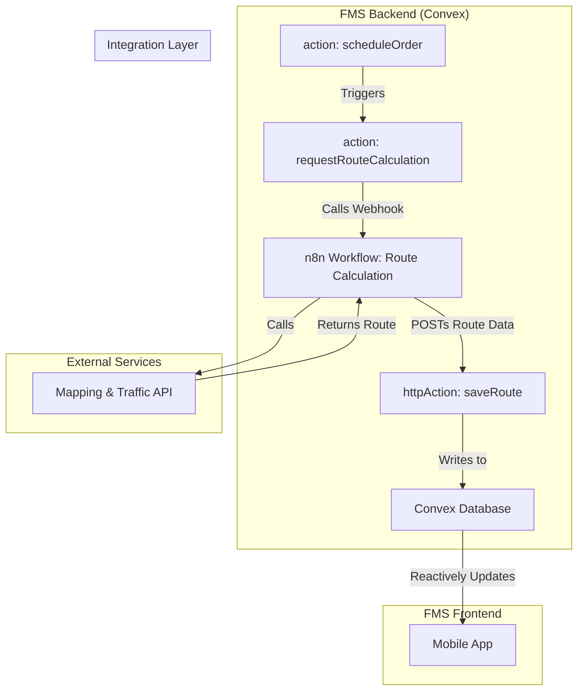

# 15 - Functional Design: Route Optimisation & Routing

## 1. Introduction

This document details the functional and technical design for the Route Optimisation and Routing component of the FMS. This component is responsible for calculating the most efficient multi-stop delivery routes and providing turn-by-turn navigation to drivers, using **Convex** as the backend and **n8n** for external API communication.

## 2. Related Requirements

-   **Requirement 2.3.1:** As a Dispatcher, I want dynamic route optimisation that minimises total distance and time while respecting delivery windows.
-   **Requirement 2.3.2:** As a Driver, I want turn-by-turn navigation with voice guidance integrated into the mobile app.

## 3. High-Level Design

The routing logic is orchestrated by Convex. A Convex `action` gathers the required stops for a trip and triggers an **n8n workflow** via a webhook. The n8n workflow communicates with the external mapping API and pushes the calculated route back into Convex via a secure `httpAction`. The driver's mobile app, subscribed to a `query` for the route data, updates automatically.



## 4. Detailed Functional Breakdown

### 4.1. Dynamic Route Optimisation (Req. 2.3.1) - Orchestrated by n8n

-   **Trigger:** A Convex `action` (`requestRouteCalculation`) is scheduled when a `delivery_task` is created.
-   **Convex `action` Responsibilities:**
    -   Gathers the list of stop coordinates and priorities for the given task.
    -   Calls a secure n8n webhook, passing the stop data as the payload.
-   **n8n Workflow Responsibilities:**
    -   Receives the route request from the Convex action.
    -   Calls the external mapping API (e.g., Google Maps) with the stop data.
    -   Handles API key management and error handling.
    -   Transforms the API response into the FMS route format.
    -   Pushes the processed route data back to a secure Convex `httpAction` (`saveRoute`).
-   **Convex `httpAction` Responsibilities:**
    -   Receives the calculated route from n8n.
    -   Validates the payload.
    -   Calls an internal `mutation` to save the `route` and `route_stops` to the database.

### 4.2. Turn-by-Turn Navigation (Req. 2.3.2) - Mobile App

-   **Route Display:** The mobile app subscribes to a Convex `query` that fetches the route data for its active task. When the route is saved by the `saveRoute` action, the query result updates, and the UI reactively displays the route on a map.
-   **Navigation UI:** The app uses a native mapping component (e.g., Google Maps SDK) to provide turn-by-turn navigation using the fetched route data.
-   **Offline Mode:** Before starting a trip, the app caches the route data in local storage. If connectivity is lost, it uses the cached data for navigation.

## 5. Acceptance Criteria Checklist

| Requirement | AC# | Description                                                              | Status    |
| :---------- | :-- | :----------------------------------------------------------------------- | :-------- |
| **2.3.1**   | 1   | **n8n workflow** computes routes considering multi-stop, traffic, and vehicle data. | `Pending` |
|             | 2   | Optimises for up to 50 stops per route, respecting order priorities.     | `Pending` |
|             | 3   | Generates routes in <10 seconds.                                         | `Pending` |
|             | 4   | **Convex httpAction** saves the route data.                              | `Pending` |
|             | 5   | Reduces total distance by at least 15% compared to manual planning.      | `Pending` |
| **2.3.2**   | 1   | Mobile app reactively displays route from **Convex query**.              | `Pending` |
|             | 2   | Supports offline mode with cached route data.                            | `Pending` |
|             | 3   | Provides customizable, multi-language voice prompts.                     | `Pending` |
|             | 4   | Logs route adherence and flags deviations >5 minutes.                    | `Pending` |

## 6. Open Questions & Considerations

1.  **Mapping API Choice:** The choice of mapping API will determine the exact data structure n8n needs to handle.
2.  **Asynchronous Flow:** The process of requesting a route and receiving it is asynchronous. The UI must handle the state where the route is still being calculated (e.g., by showing a loading spinner).

## 7. Technical Implementation Details (Convex)

### 7.1. Convex Schema

-   **File:** `convex/schema.ts`
-   **Table Definitions:**
    ```typescript
    // convex/schema.ts
    // ... imports
    export default defineSchema({
      // ... other tables
      routes: defineTable({
        deliveryTaskId: v.id("delivery_tasks"),
        encodedPolyline: v.string(),
        totalDistanceMeters: v.number(),
        totalDurationSeconds: v.number(),
      }).index("by_task", ["deliveryTaskId"]),

      route_stops: defineTable({
        routeId: v.id("routes"),
        sequenceOrder: v.number(),
        latitude: v.number(),
        longitude: v.number(),
        estimatedArrivalTime: v.number(), // Unix timestamp
        turnByTurnInstructions: v.string(),
      }).index("by_route", ["routeId"]),
    });
    ```

### 7.2. Convex Functions

-   **Action (Request Route):** `convex/routing.ts`
    ```typescript
    // convex/routing.ts
    import { action } from "./_generated/server";

    export const requestRouteCalculation = action({
      args: { taskId: v.id("delivery_tasks") },
      handler: async (ctx, args) => {
        // 1. Query for task stops
        // 2. Call n8n webhook with the stop data
        await fetch(process.env.N8N_ROUTE_WEBHOOK_URL, {
          method: "POST",
          headers: { "Content-Type": "application/json" },
          body: JSON.stringify({ taskId: args.taskId, stops: [...] }),
        });
      },
    });
    ```

-   **HTTP Action (Save Route):** `convex/routing.ts`
    ```typescript
    // convex/routing.ts
    import { httpAction } from "./_generated/server";

    export const saveRoute = httpAction(async (ctx, request) => {
      // 1. Validate request is from n8n
      // 2. Parse route data from request body
      // 3. Call internal mutation to save the route and stops
      await ctx.runMutation(api.routing.createRoute, { ... });
      return new Response(null, { status: 200 });
    });
    ```

### 7.3. Frontend Implementation (React Native)

-   **`DriverRoute` Component:**
    -   **Data Fetching:** Uses the `useQuery` hook to get the route for the current task. The result will be `null` until the n8n workflow completes and saves the data, at which point the component will automatically re-render.
    ```javascript
    // src/components/DriverRoute.tsx
    import { useQuery } from "convex/react";
    import { api } from "../../convex/_generated/api";

    function DriverRoute({ taskId }) {
      const route = useQuery(api.routing.getRouteForTask, { taskId });

      if (!route) {
        return <LoadingSpinner text="Calculating route..." />;
      }
      
      // ... return MapView with route polyline and navigation UI
    }
    ```

### 7.4. n8n Workflow Details

-   **Workflow: `Calculate Optimized Route`**
    -   **Trigger:** "Webhook" node, which provides a URL for the Convex action to call.
    -   **Steps:**
        1.  **Mapping API Request:** "HTTP Request" node to call the external mapping API with the stop data from the trigger.
        2.  **Transform Data:** "Set" node to format the API response into the structure expected by the `saveRoute` httpAction.
        3.  **Callback to Convex:** "HTTP Request" node to `POST` the transformed data to the `saveRoute` httpAction URL.
    -   **Output:** A call to the `saveRoute` httpAction.
