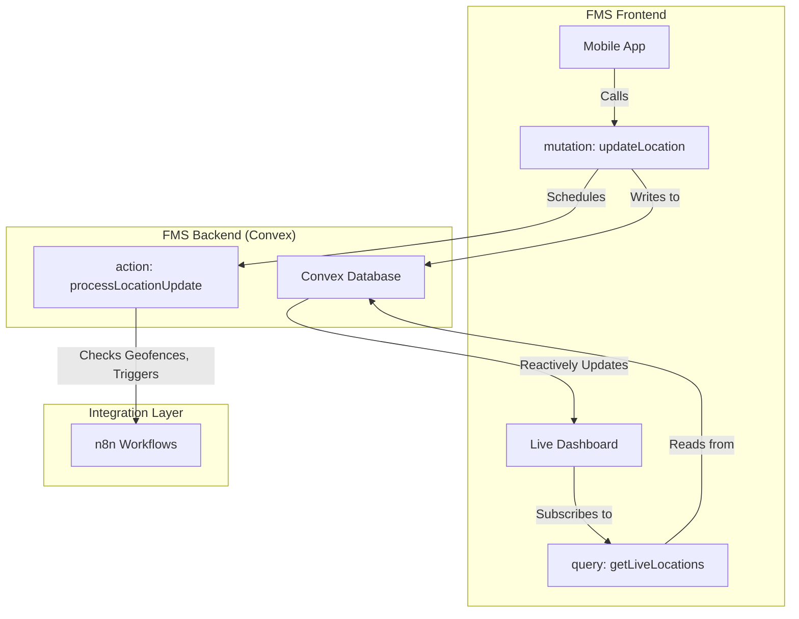

# 16 - Functional Design: Real-Time Tracking & Updates

## 1. Introduction

This document details the functional and technical design for the Real-Time Tracking and Updates component of the FMS. This component is the backbone of the system's live monitoring capabilities, providing real-time visibility into vehicle locations, route adherence, and potential delays, all powered by the **Convex** real-time backend.

## 2. Related Requirements

-   **Requirement 2.4.1:** As a Dispatcher, I want real-time vehicle tracking using GPS.
-   **Requirement 2.4.2:** As a Dispatcher, I want traffic-aware route updates that automatically re-optimise routes.
-   **Requirement 2.4.3:** As a Fleet Manager, I want integration with vehicle sensors for predictive maintenance alerts.

## 3. High-Level Design

The driver's mobile app calls a Convex `mutation` (`updateLocation`) to push a continuous stream of GPS data. This write operation automatically triggers reactive updates on the dispatcher's dashboard, which uses a `query` to subscribe to the latest vehicle locations. All complex side effects, like checking for geofence breaches or triggering re-routing workflows, are handled by Convex `actions` that are scheduled by the initial mutation.



## 4. Detailed Functional Breakdown

### 4.1. Real-Time Vehicle Tracking (Req. 2.4.1)

-   **Data Ingestion:** The driver's mobile app calls the `updateLocation` mutation every 15 seconds with its current GPS coordinates. This mutation is highly optimized for frequent writes.
-   **Processing:** The `updateLocation` mutation writes the latest location to a `vehicle_locations` table and schedules an `action` (`processLocationUpdate`) for asynchronous processing. This action will:
    -   Check for geofence breaches.
    -   Check for route deviations.
    -   Update the vehicle's "last seen" timestamp.
-   **Dashboard Display:** The dashboard's map component subscribes to the `getLiveLocations` query. Convex ensures that as soon as the location data is written, the query result is updated, and the new data is pushed to the dashboard, moving the vehicle's icon on the map in real-time.

### 4.2. Traffic-Aware Route Updates (Req. 2.4.2)

-   **Trigger:** The `processLocationUpdate` action will also be responsible for analyzing potential delays. If a significant delay is predicted, it will trigger another action, `requestReRoute`.
-   **Process:** The `requestReRoute` action calls an n8n webhook, which performs the external API calls and pushes the new route back into Convex via an `httpAction`, as detailed in the Route Optimisation document.

### 4.3. Predictive Maintenance Integration (Req. 2.4.3)

-   This is handled by a separate, scheduled n8n workflow that calls a Convex `httpAction` to create maintenance alerts, as detailed in the Predictive Maintenance document.

## 5. Acceptance Criteria Checklist

| Requirement | AC# | Description                                                              | Status    |
| :---------- | :-- | :----------------------------------------------------------------------- | :-------- |
| **2.4.1**   | 1   | **Convex mutation** ingests GPS pings every 15s; map updates via **query**. | `Pending` |
|             | 2   | **Convex action** calculates metrics like speed and distance.            | `Pending` |
|             | 3   | **Convex action** generates geofence and route deviation alerts.         | `Pending` |
|             | 4   | Dashboard UI flags vehicles if "last seen" timestamp is >2 minutes old.  | `Pending` |
|             | 5   | Convex stores location history.                                          | `Pending` |
| **2.4.2**   | 1   | **Convex action** triggers n8n workflow for re-routing.                  | `Pending` |
|             | 2   | Re-optimisation requires driver approval via a **mutation**.             | `Pending` |
|             | 3   | Updates all subsequent ETAs in the delivery chain.                       | `Pending` |
|             | 4   | Logs the reason for the route update for auditing.                       | `Pending` |
|             | 5   | Re-optimisation completes in <30 seconds.                                | `Pending` |
| **2.4.3**   | 1   | **n8n workflow** ingests vehicle telematics data via **httpAction**.     | `Pending` |
|             | 2   | Predicts failures using a configurable threshold-based rule engine.      | `Pending` |
|             | 3   | Allows scheduling of maintenance, auto-rescheduling affected deliveries. | `Pending` |

## 6. Open Questions & Considerations

1.  **Data Volume & Cost:** High-frequency writes to `vehicle_locations` will impact Convex costs. A strategy to periodically archive this data to a cheaper store (like the analytical PostgreSQL DB) and clean the Convex table will be necessary.
2.  **Geofence Queries:** Efficiently querying for geofence breaches at scale may require spatial indexing, which can be modeled in Convex by using fields for latitude/longitude ranges or geohashes.

## 7. Technical Implementation Details (Convex)

### 7.1. Convex Schema

-   **File:** `convex/schema.ts`
-   **Table Definitions:**
    ```typescript
    // convex/schema.ts
    // ... imports
    export default defineSchema({
      // ... other tables
      vehicle_locations: defineTable({
        vehicleId: v.id("vehicles"),
        driverId: v.id("users"),
        lat: v.number(),
        lon: v.number(),
        speed: v.number(),
        heading: v.number(),
        timestamp: v.number(),
      }).index("by_vehicle", ["vehicleId"]),

      geofences: defineTable({
        name: v.string(),
        // Storing polygon as an array of coordinate pairs
        area: v.array(v.object({ lat: v.number(), lon: v.number() })),
        alertOnEnter: v.boolean(),
        alertOnExit: v.boolean(),
      }),
    });
    ```

### 7.2. Convex Functions

-   **Mutation (for Mobile App):** `convex/tracking.ts`
    ```typescript
    // convex/tracking.ts
    import { mutation } from "./_generated/server";

    export const updateLocation = mutation({
      args: { lat: v.number(), lon: v.number(), speed: v.number(), heading: v.number() },
      handler: async (ctx, args) => {
        const identity = await ctx.auth.getUserIdentity();
        // ... get vehicleId from driver identity
        
        // Write to DB
        await ctx.db.insert("vehicle_locations", {
          // ... vehicleId, driverId, timestamp, etc.
          ...args,
        });
        
        // Asynchronously process for alerts, etc.
        await ctx.scheduler.runAfter(0, api.tracking.processLocationUpdate, { ... });
      },
    });
    ```

-   **Query (for Dashboard):** `convex/tracking.ts`
    ```typescript
    // convex/tracking.ts
    import { query } from "./_generated/server";

    export const getLiveLocations = query({
      handler: async (ctx) => {
        // This query would be more complex, likely getting only the *latest*
        // location for each active vehicle.
        return await ctx.db.query("vehicle_locations").collect();
      },
    });
    ```

### 7.3. Frontend Implementation (React)

-   **`LiveMap` Component:**
    -   **Data Fetching:** The component uses `useQuery` to get a live, real-time feed of vehicle locations.
    ```javascript
    // src/components/LiveMap.tsx
    import { useQuery } from "convex/react";
    import { api } from "../../convex/_generated/api";

    function LiveMap() {
      const locations = useQuery(api.tracking.getLiveLocations);
      
      // ... render map and markers based on the 'locations' data.
      // The map will re-render automatically as 'locations' changes.
    }
    ```

### 7.4. Mobile App Implementation

-   **Location Tracking:** Uses native device APIs for background location tracking.
-   **Data Transmission:**
    -   A background task collects GPS pings.
    -   Every 15 seconds, it calls the `updateLocation` mutation with the latest data point.
    -   Uses the `useMutation` hook from the Convex React Native client.
    ```javascript
    // src/services/LocationTracker.ts
    import { useMutation } from "convex/react";
    import { api } from "../../convex/_generated/api";

    function LocationTracker() {
      const sendLocation = useMutation(api.tracking.updateLocation);

      // ... logic to get GPS data every 15s
      // on new location:
      //   sendLocation({ lat, lon, speed, heading });
    }
    ```
