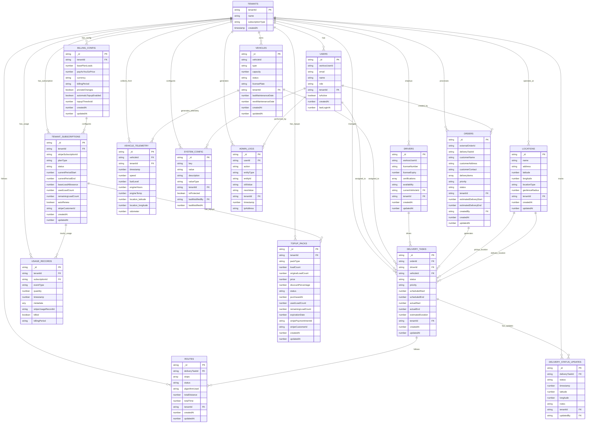
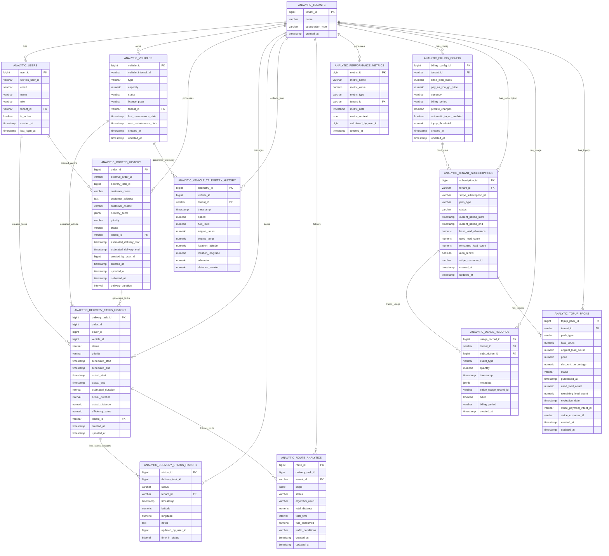

# 90 - Database Schema Design: Convex Application & PostgreSQL Analytics

## 1. Introduction

This document provides a comprehensive overview of the database schemas for the Fleet Management System (FMS). It includes the Convex application database schema for real-time operations and the PostgreSQL analytics database schema for reporting and historical analysis. The document includes Entity Relationship Diagrams (ERD) and detailed table specifications for both systems.

## 2. System Overview

The FMS database architecture consists of two primary data stores:

- **Convex Database:** Operational database for real-time application data, optimized for reactive updates and live queries
- **PostgreSQL Database:** Analytical database for historical data analysis, complex reporting, and business intelligence

Data flows from the Convex operational database to the PostgreSQL analytics database via a scheduled ETL process.

## 3. Convex Application Database Schema

### 3.1. Entity Relationship Diagram

## 3.2. Table Definitions

### 3.2.1. Users Table
- **Purpose:** Stores user account information and role assignments
- **Fields:**
  - `_id`: Convex-generated document ID
  - `workosUserId`: Unique identifier from WorkOS authentication system
  - `email`: User's email address
  - `name`: User's full name (optional)
  - `role`: User role (fleet_manager, dispatcher, driver, warehouse_operator, admin, super_admin, tenant_admin, restricted_user)
  - `tenantId`: Tenant identifier for data isolation
  - `isActive`: Boolean indicating if the account is active
  - `createdAt`: Unix timestamp of account creation
  - `lastLoginAt`: Unix timestamp of last login (optional)

### 3.2.2. Vehicles Table
- **Purpose:** Manages fleet vehicles and their operational status
- **Fields:**
  - `_id`: Convex-generated document ID
  - `vehicleId`: Internal vehicle identifier
  - `type`: Vehicle type (e.g., "small", "medium", "large", "refrigerated")
  - `capacity`: Maximum capacity (in weight, volume, or units)
  - `status`: Current status (active, maintenance, retired)
  - `licensePlate`: Vehicle license plate number
  - `tenantId`: Tenant identifier for data isolation
  - `lastMaintenanceDate`: Unix timestamp of last maintenance (optional)
  - `nextMaintenanceDate`: Unix timestamp for next scheduled maintenance (optional)
  - `createdAt`: Unix timestamp of record creation
  - `updatedAt`: Unix timestamp of last update

### 3.2.3. Drivers Table
- **Purpose:** Stores driver profiles and availability status
- **Fields:**
  - `_id`: Convex-generated document ID
  - `workosUserId`: Reference to WorkOS user ID
  - `licenseNumber`: Driver's license number
  - `licenseExpiry`: Unix timestamp for license expiration
  - `certifications`: Array of certification strings
  - `availability`: Current availability status (available, unavailable, on_duty)
  - `currentVehicleId`: Reference to assigned vehicle ID (optional)
  - `tenantId`: Tenant identifier for data isolation
  - `createdAt`: Unix timestamp of record creation
  - `updatedAt`: Unix timestamp of last update

### 3.2.4. Orders Table
- **Purpose:** Stores delivery orders with customer and scheduling information
- **Fields:**
  - `_id`: Convex-generated document ID
  - `externalOrderId`: Order ID from external ERP system (optional)
  - `deliveryTaskId`: Reference to associated delivery task
  - `customerName`: Customer's name
  - `customerAddress`: Customer's delivery address
  - `customerContact`: Contact information for the customer
  - `deliveryItems`: Array of delivery items with SKU, quantity, and weight
  - `priority`: Delivery priority (low, medium, high)
  - `status`: Order status (pending_scheduling, scheduled, in_transit, delivered, cancelled)
  - `tenantId`: Tenant identifier for data isolation
  - `estimatedDeliveryStart`: Unix timestamp for estimated delivery window start
  - `estimatedDeliveryEnd`: Unix timestamp for estimated delivery window end
  - `createdBy`: Reference to user who created the order
  - `createdAt`: Unix timestamp of record creation
  - `updatedAt`: Unix timestamp of last update

### 3.2.5. Delivery Tasks Table
- **Purpose:** Represents scheduled delivery tasks with routing and assignment information
- **Fields:**
  - `_id`: Convex-generated document ID
  - `orderId`: Reference to associated order
  - `driverId`: Reference to assigned driver
  - `vehicleId`: Reference to assigned vehicle
  - `status`: Task status (pending, assigned, in_progress, completed, failed)
  - `priority`: Task priority
  - `scheduledStart`: Unix timestamp for scheduled start time
  - `scheduledEnd`: Unix timestamp for scheduled end time
  - `actualStart`: Unix timestamp for actual start time (optional)
  - `actualEnd`: Unix timestamp for actual end time (optional)
  - `estimatedDuration`: Estimated duration in seconds
  - `tenantId`: Tenant identifier for data isolation
  - `createdAt`: Unix timestamp of record creation
  - `updatedAt`: Unix timestamp of last update

### 3.2.6. Locations Table
- **Purpose:** Stores locations for warehouses, customers, and other points of interest
- **Fields:**
  - `_id`: Convex-generated document ID
  - `name`: Location name
  - `address`: Full address string
  - `latitude`: Geographic latitude coordinate
  - `longitude`: Geographic longitude coordinate
  - `locationType`: Type of location (warehouse, customer, depot)
  - `geofenceRadius`: Radius for geofence monitoring in meters (optional)
  - `tenantId`: Tenant identifier for data isolation
  - `createdAt`: Unix timestamp of record creation
  - `updatedAt`: Unix timestamp of last update

### 3.2.7. Routes Table
- **Purpose:** Stores calculated routes for delivery tasks with navigation information
- **Fields:**
  - `_id`: Convex-generated document ID
  - `deliveryTaskId`: Reference to associated delivery task
  - `stops`: Array of route stops with coordinates and time windows
  - `status`: Route status (calculated, active, completed, modified)
  - `algorithmUsed`: Name of routing algorithm used (optional)
  - `totalDistance`: Total route distance in meters
  - `totalTime`: Total estimated route time in seconds
  - `tenantId`: Tenant identifier for data isolation
  - `createdAt`: Unix timestamp of record creation
  - `updatedAt`: Unix timestamp of last update

### 3.2.8. Delivery Status Updates Table
- **Purpose:** Tracks real-time status updates for delivery tasks
- **Fields:**
  - `_id`: Convex-generated document ID
  - `deliveryTaskId`: Reference to associated delivery task
  - `status`: Current status (pending, en_route, arrived, delivered, exception)
  - `timestamp`: Unix timestamp of status update
  - `latitude`: Current latitude coordinate (optional)
  - `longitude`: Current longitude coordinate (optional)
  - `notes`: Additional notes about the status update (optional)
  - `tenantId`: Tenant identifier for data isolation
  - `updatedBy`: Reference to user who updated the status (optional)

### 3.2.9. Vehicle Telemetry Table
- **Purpose:** Stores real-time vehicle telematics data for monitoring and maintenance
- **Fields:**
  - `_id`: Convex-generated document ID
  - `vehicleId`: Reference to associated vehicle
  - `tenantId`: Tenant identifier for data isolation
  - `timestamp`: Unix timestamp of telemetry reading
  - `speed`: Current speed in km/h
  - `fuelLevel`: Current fuel level as percentage
  - `engineHours`: Total engine running hours
  - `engineTemp`: Current engine temperature in Celsius
  - `location_latitude`: Current latitude coordinate
  - `location_longitude`: Current longitude coordinate
  - `odometer`: Current odometer reading in kilometers

### 3.2.10. System Configuration Table
- **Purpose:** Stores system-wide configuration parameters and settings
- **Fields:**
  - `_id`: Convex-generated document ID
  - `key`: Configuration parameter key
  - `value`: Configuration parameter value (as string, may be JSON)
  - `description`: Description of the configuration parameter
  - `valueType`: Type of value (string, number, boolean, json)
  - `tenantId`: Tenant identifier for data isolation (null for system-wide configs)
  - `isProtected`: Boolean indicating if requires super user access
  - `lastModifiedBy`: Reference to user who last modified
  - `lastModifiedAt`: Unix timestamp of last modification

### 3.2.11. Admin Logs Table
- **Purpose:** Tracks administrative actions and changes for audit purposes
- **Fields:**
  - `_id`: Convex-generated document ID
  - `userId`: Reference to admin user who performed the action
  - `action`: Description of the action performed
  - `entityType`: Type of entity affected (optional)
  - `entityId`: ID of entity affected (optional)
  - `oldValue`: Previous state before change (as JSON string, optional)
  - `newValue`: New state after change (as JSON string, optional)
  - `tenantId`: Tenant identifier for data isolation
  - `timestamp`: Unix timestamp of the action
  - `ipAddress`: IP address of the admin user (optional)

### 3.2.12. Billing Configuration Table
- **Purpose:** Stores tenant-specific billing configuration parameters
- **Fields:**
  - `_id`: Convex-generated document ID
  - `tenantId`: Tenant identifier for data isolation
  - `basePlanLoads`: Monthly allowance of transport loads (default: 1000)
  - `payAsYouGoPrice`: Price per load for pay-as-you-go usage (default: 1.00)
  - `currency`: Currency code for billing (e.g., "AUD")
  - `billingPeriod`: Subscription period (monthly, yearly)
  - `prorateChanges`: Whether mid-term plan changes are prorated
  - `automaticTopupEnabled`: Whether automatic top-up is enabled
  - `topupThreshold`: Usage threshold to trigger automatic top-up
  - `createdAt`: Unix timestamp of record creation
  - `updatedAt`: Unix timestamp of last update

### 3.2.13. Tenant Subscriptions Table
- **Purpose:** Manages tenant subscription information and status
- **Fields:**
  - `_id`: Convex-generated document ID
  - `tenantId`: Tenant identifier for data isolation
  - `stripeSubscriptionId`: Subscription ID in Stripe
  - `planType`: Subscription type (monthly, yearly)
  - `status`: Subscription status (active, past_due, canceled, unpaid)
  - `currentPeriodStart`: Unix timestamp for current billing period start
  - `currentPeriodEnd`: Unix timestamp for current billing period end
  - `baseLoadAllowance`: Monthly allowance of loads for this subscription
  - `usedLoadCount`: Number of loads consumed in current period
  - `remainingLoadCount`: Number of loads remaining in current period
  - `autoRenew`: Whether subscription automatically renews
  - `stripeCustomerId`: Customer ID in Stripe
  - `createdAt`: Unix timestamp of record creation
  - `updatedAt`: Unix timestamp of last update

### 3.2.14. Usage Records Table
- **Purpose:** Tracks usage events for billing purposes
- **Fields:**
  - `_id`: Convex-generated document ID
  - `tenantId`: Tenant identifier for data isolation
  - `subscriptionId`: Reference to tenant subscription
  - `eventType`: Type of usage event (e.g., "delivery_task_created")
  - `quantity`: Number of units consumed
  - `timestamp`: Unix timestamp of usage event
  - `metadata`: Additional event metadata (optional)
  - `stripeUsageRecordId`: Usage record ID in Stripe (optional)
  - `billed`: Whether usage has been reported to Stripe
  - `billingPeriod`: Billing period identifier (e.g., "2023-10")

### 3.2.15. Top-up Packs Table
- **Purpose:** Manages additional load packs purchased by tenants
- **Fields:**
  - `_id`: Convex-generated document ID
  - `tenantId`: Tenant identifier for data isolation
  - `packType`: Type of pack (1000_loads, 5000_loads)
  - `loadCount`: Current number of loads available in pack (after consumption)
  - `originalLoadCount`: Original number of loads in pack before discounts
  - `price`: Actual price paid for the pack
  - `discountPercentage`: Discount percentage applied (e.g., 10 for 10%)
  - `status`: Pack status (active, used, expired)
  - `purchasedAt`: Unix timestamp when pack was purchased
  - `usedLoadCount`: Number of loads consumed from this pack
  - `remainingLoadCount`: Number of loads remaining in this pack
  - `expirationDate`: Unix timestamp when the pack expires
  - `stripePaymentIntentId`: Payment intent ID in Stripe
  - `stripeCustomerId`: Customer ID in Stripe
  - `createdAt`: Unix timestamp of record creation
  - `updatedAt`: Unix timestamp of last update

## 4. PostgreSQL Analytics Database Schema

### 4.1. Entity Relationship Diagram

### 4.2. Table Definitions

### 4.2.1. Analytic Users Table
- **Purpose:** Historical user data for analytics and reporting
- **Columns:**
  - `user_id`: Primary key, auto-incrementing ID
  - `workos_user_id`: Unique identifier from WorkOS authentication system
  - `email`: User's email address
  - `name`: User's full name
  - `role`: User role (fleet_manager, dispatcher, driver, warehouse_operator, admin, super_admin, tenant_admin, restricted_user)
  - `tenant_id`: Tenant identifier for data isolation
  - `is_active`: Boolean indicating if the account is active
  - `created_at`: Timestamp of account creation
  - `last_login_at`: Timestamp of last login

### 4.2.2. Analytic Vehicles Table
- **Purpose:** Historical vehicle data for analytics and reporting
- **Columns:**
  - `vehicle_id`: Primary key, auto-incrementing ID
  - `vehicle_internal_id`: Internal vehicle identifier
  - `type`: Vehicle type (e.g., "small", "medium", "large", "refrigerated")
  - `capacity`: Maximum capacity (in weight, volume, or units)
  - `status`: Current status (active, maintenance, retired)
  - `license_plate`: Vehicle license plate number
  - `tenant_id`: Tenant identifier for data isolation
  - `last_maintenance_date`: Timestamp of last maintenance
  - `next_maintenance_date`: Timestamp for next scheduled maintenance
  - `created_at`: Timestamp of record creation
  - `updated_at`: Timestamp of last update

### 4.2.3. Analytic Orders History Table
- **Purpose:** Historical order data for analytics and performance analysis
- **Columns:**
  - `order_id`: Primary key, auto-incrementing ID
  - `external_order_id`: Order ID from external ERP system
  - `delivery_task_id`: Reference to associated delivery task
  - `customer_name`: Customer's name
  - `customer_address`: Customer's delivery address
  - `customer_contact`: Contact information for the customer
  - `delivery_items`: JSONB column storing delivery items with SKU, quantity, and weight
  - `priority`: Delivery priority (low, medium, high)
  - `status`: Order status (pending_scheduling, scheduled, in_transit, delivered, cancelled)
  - `tenant_id`: Tenant identifier for data isolation
  - `estimated_delivery_start`: Timestamp for estimated delivery window start
  - `estimated_delivery_end`: Timestamp for estimated delivery window end
  - `created_by_user_id`: Reference to user who created the order
  - `created_at`: Timestamp of record creation
  - `updated_at`: Timestamp of last update
  - `delivered_at`: Timestamp of delivery completion
  - `delivery_duration`: Interval representing actual delivery duration

### 4.2.4. Analytic Delivery Tasks History Table
- **Purpose:** Historical delivery task data for analytics and performance analysis
- **Columns:**
  - `delivery_task_id`: Primary key, auto-incrementing ID
  - `order_id`: Reference to associated order
  - `driver_id`: Reference to assigned driver
  - `vehicle_id`: Reference to assigned vehicle
  - `status`: Task status (pending, assigned, in_progress, completed, failed)
  - `priority`: Task priority
  - `scheduled_start`: Timestamp for scheduled start time
  - `scheduled_end`: Timestamp for scheduled end time
  - `actual_start`: Timestamp for actual start time
  - `actual_end`: Timestamp for actual end time
  - `estimated_duration`: Estimated duration as interval
  - `actual_duration`: Actual duration as interval
  - `actual_distance`: Actual distance traveled in kilometers
  - `efficiency_score`: Calculated efficiency score (0-100)
  - `tenant_id`: Tenant identifier for data isolation
  - `created_at`: Timestamp of record creation
  - `updated_at`: Timestamp of last update

### 4.2.5. Analytic Delivery Status History Table
- **Purpose:** Historical status data for delivery tasks for analytics and tracking
- **Columns:**
  - `status_id`: Primary key, auto-incrementing ID
  - `delivery_task_id`: Reference to associated delivery task
  - `status`: Current status (pending, en_route, arrived, delivered, exception)
  - `tenant_id`: Tenant identifier for data isolation
  - `timestamp`: Timestamp of status update
  - `latitude`: Latitude coordinate at time of update
  - `longitude`: Longitude coordinate at time of update
  - `notes`: Additional notes about the status update
  - `updated_by_user_id`: Reference to user who updated the status
  - `time_in_status`: Interval representing duration in previous status

### 4.2.6. Analytic Vehicle Telemetry History Table
- **Purpose:** Historical vehicle telematics data for analytics and predictive maintenance
- **Columns:**
  - `telemetry_id`: Primary key, auto-incrementing ID
  - `vehicle_id`: Reference to associated vehicle
  - `tenant_id`: Tenant identifier for data isolation
  - `timestamp`: Timestamp of telemetry reading
  - `speed`: Current speed in km/h
  - `fuel_level`: Current fuel level as percentage
  - `engine_hours`: Total engine running hours
  - `engine_temp`: Current engine temperature in Celsius
  - `location_latitude`: Current latitude coordinate
  - `location_longitude`: Current longitude coordinate
  - `odometer`: Current odometer reading in kilometers
  - `distance_traveled`: Distance traveled since last reading in kilometers

### 4.2.7. Analytic Route Analytics Table
- **Purpose:** Analytics-focused route data for performance optimization and reporting
- **Columns:**
  - `route_id`: Primary key, auto-incrementing ID
  - `delivery_task_id`: Reference to associated delivery task
  - `tenant_id`: Tenant identifier for data isolation
  - `stops`: JSONB column storing route stops with coordinates and time windows
  - `status`: Route status (calculated, active, completed, modified)
  - `algorithm_used`: Name of routing algorithm used
  - `total_distance`: Total route distance in kilometers
  - `total_time`: Total estimated route time as interval
  - `fuel_consumed`: Estimated fuel consumption in liters
  - `traffic_conditions`: Traffic conditions during route execution
  - `created_at`: Timestamp of record creation
  - `updated_at`: Timestamp of last update

### 4.2.8. Analytic Performance Metrics Table
- **Purpose:** Aggregated performance metrics for business intelligence and KPIs
- **Columns:**
  - `metric_id`: Primary key, auto-incrementing ID
  - `metric_name`: Name of the performance metric
  - `metric_value`: Numeric value of the metric
  - `metric_type`: Type of metric (percentage, count, time, currency, etc.)
  - `tenant_id`: Tenant identifier for data isolation
  - `metric_date`: Date for which the metric is calculated
  - `metric_context`: JSONB column with context information (fleet, region, vehicle type, etc.)
  - `calculated_by_user_id`: Reference to user or system that calculated the metric
  - `created_at`: Timestamp of metric creation

### 4.2.9. Analytic Billing Configuration Table
- **Purpose:** Historical billing configuration data for analytics and reporting
- **Columns:**
  - `billing_config_id`: Primary key, auto-incrementing ID
  - `tenant_id`: Tenant identifier for data isolation
  - `base_plan_loads`: Monthly allowance of transport loads (default: 1000)
  - `pay_as_you_go_price`: Price per load for pay-as-you-go usage (default: 1.00)
  - `currency`: Currency code for billing (e.g., "AUD")
  - `billing_period`: Subscription period (monthly, yearly)
  - `prorate_changes`: Whether mid-term plan changes are prorated
  - `automatic_topup_enabled`: Whether automatic top-up is enabled
  - `topup_threshold`: Usage threshold to trigger automatic top-up
  - `created_at`: Timestamp of record creation
  - `updated_at`: Timestamp of last update

### 4.2.10. Analytic Tenant Subscriptions Table
- **Purpose:** Historical subscription data for analytics and reporting
- **Columns:**
  - `subscription_id`: Primary key, auto-incrementing ID
  - `tenant_id`: Tenant identifier for data isolation
  - `stripe_subscription_id`: Subscription ID in Stripe
  - `plan_type`: Subscription type (monthly, yearly)
  - `status`: Subscription status (active, past_due, canceled, unpaid)
  - `current_period_start`: Timestamp for current billing period start
  - `current_period_end`: Timestamp for current billing period end
  - `base_load_allowance`: Monthly allowance of loads for this subscription
  - `used_load_count`: Number of loads consumed in current period
  - `remaining_load_count`: Number of loads remaining in current period
  - `auto_renew`: Whether subscription automatically renews
  - `stripe_customer_id`: Customer ID in Stripe
  - `created_at`: Timestamp of record creation
  - `updated_at`: Timestamp of last update

### 4.2.11. Analytic Usage Records Table
- **Purpose:** Historical usage data for analytics and billing reconciliation
- **Columns:**
  - `usage_record_id`: Primary key, auto-incrementing ID
  - `tenant_id`: Tenant identifier for data isolation
  - `subscription_id`: Reference to tenant subscription
  - `event_type`: Type of usage event (e.g., "delivery_task_created")
  - `quantity`: Number of units consumed
  - `timestamp`: Timestamp of usage event
  - `metadata`: Additional event metadata (JSONB)
  - `stripe_usage_record_id`: Usage record ID in Stripe (optional)
  - `billed`: Whether usage has been reported to Stripe
  - `billing_period`: Billing period identifier (e.g., "2023-10")
  - `created_at`: Timestamp of record creation

### 4.2.12. Analytic Top-up Packs Table
- **Purpose:** Historical top-up pack data for analytics and reporting
- **Columns:**
  - `topup_pack_id`: Primary key, auto-incrementing ID
  - `tenant_id`: Tenant identifier for data isolation
  - `pack_type`: Type of pack (1000_loads, 5000_loads)
  - `load_count`: Current number of loads available in pack (after consumption)
  - `original_load_count`: Original number of loads in pack before discounts
  - `price`: Actual price paid for the pack
  - `discount_percentage`: Discount percentage applied (e.g., 10 for 10%)
  - `status`: Pack status (active, used, expired)
  - `purchased_at`: Timestamp when pack was purchased
  - `used_load_count`: Number of loads consumed from this pack
  - `remaining_load_count`: Number of loads remaining in this pack
  - `expiration_date`: Date when the pack expires
  - `stripe_payment_intent_id`: Payment intent ID in Stripe
  - `stripe_customer_id`: Customer ID in Stripe
  - `created_at`: Timestamp of record creation
  - `updated_at`: Timestamp of last update

## 5. Application-Level Access Control

### 5.1. Database Account Management
- **Application Accounts:** The system uses application-level accounts for database access, not database-native user accounts
- **No Database RBAC:** PostgreSQL/Superbase will not manage user roles or access permissions
- **App-Level Security:** All role-based access control is managed at the application level through user roles stored in the Users table
- **Database Credentials:** Database access is controlled through application-level credentials (one or more service accounts)

### 5.2. Authentication Flow
- **WorkOS Integration:** User authentication is handled through WorkOS
- **Session Management:** The application manages user sessions and permissions based on roles
- **Database Access:** Once authenticated, users access data through the application, which uses predefined database credentials
- **Role Enforcement:** Role-based permissions are enforced through application logic in Convex functions

### 5.3. Data Flow and Synchronization
- **Frequency:** Data is synchronized from Convex to PostgreSQL every hour
- **Process:** A scheduled Convex action extracts data from operational tables and transforms it for analytical purposes
- **Tools:** Airbyte or custom ETL script handles the data transfer
- **Access Control:** During ETL, only application service accounts have database access

## 6. Performance Considerations

### 6.1. Convex Database
- **Indexing:** Critical fields are indexed for fast querying
- **Optimization:** Designed for real-time reactive queries
- **Constraints:** Validation occurs at the application level via Convex functions

### 6.2. PostgreSQL Database
- **Indexing:** Comprehensive indexing strategy for analytical queries
- **Partitioning:** Time-based partitioning for large tables
- **Materialized Views:** Pre-computed views for complex analytical queries

## 7. Security and Access

### 7.1. Convex Database
- **Access Control:** Role-based access control enforced through Convex functions at the application level
- **Database Credentials:** Application uses service account credentials for database access
- **User Authentication:** Handled through WorkOS integration with role-based permissions
- **Encryption:** Data encrypted in transit and at rest
- **Audit:** All data access and changes logged at the application level

### 7.2. PostgreSQL Database
- **Access Control:** Access controlled through application service accounts (not individual user accounts)
- **Database Credentials:** Single or limited number of application account credentials
- **User Permissions:** Role-based permissions managed at application level, not database level
- **Encryption:** Data encrypted in transit and at rest
- **Compliance:** Designed to meet data privacy and compliance requirements