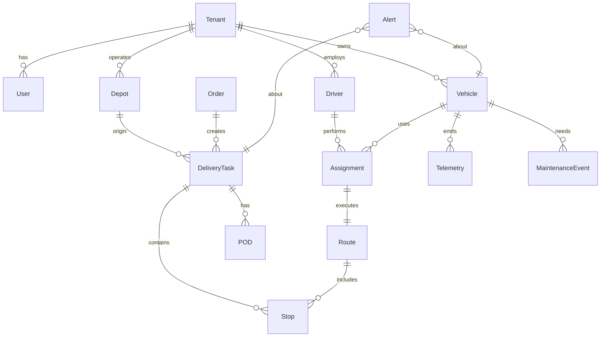

# ERD and Data Model Notes

## Entities (draft)
- Tenant(id, name, created_at)
- User(id, tenant_id FK, email, role, status, created_at)
- Depot(id, tenant_id FK, name, address, tz, open_from, open_to)
- Vehicle(id, tenant_id FK, plate, vin, capacity_weight, capacity_volume, capabilities JSONB, status)
- Driver(id, tenant_id FK, name, contact, license_class, employment_status)
- Shift(id, driver_id FK, starts_at, ends_at, break_rules JSONB)
- Order(id, tenant_id FK, source_system, external_id, priority, customer JSONB, items JSONB, delivery_window_start, delivery_window_end, created_at)
- DeliveryTask(id, order_id FK, depot_id FK, status, priority, notes, created_at)
- Route(id, tenant_id FK, plan_date, objective, cost JSONB, computed_at, version)
- Stop(id, route_id FK, task_id FK, sequence, type[pickup|dropoff], lat, lon, service_seconds, window_start, window_end)
- Assignment(id, route_id FK, vehicle_id FK, driver_id FK, shift_id FK, planned_start, planned_end, state)
- POD(id, task_id FK, type[photo|signature|scan], uri, sha256, captured_at, meta JSONB)
- Telemetry(id, vehicle_id FK, ts, lat, lon, speed, heading, fuel_level, battery, raw JSONB)
- Geofence(id, tenant_id FK, name, polygon GEO, type[depot|customer|custom])
- Alert(id, tenant_id FK, severity, category, subject_ref, message, raised_at, resolved_at, meta JSONB)
- MaintenanceEvent(id, vehicle_id FK, type, due_at_km, due_at_date, status, meta JSONB)

## Notes
- Use PostgreSQL; partition time-series tables (`telemetry`, optionally `pod`) by month.
- Prefer immutable event logs for status transitions; derive current state via views/materialized views.
- All PII fields must be tagged for encryption-at-rest; use KMS-managed keys.
- Introduce `event_outbox` table to implement the outbox pattern for reliable event delivery.

