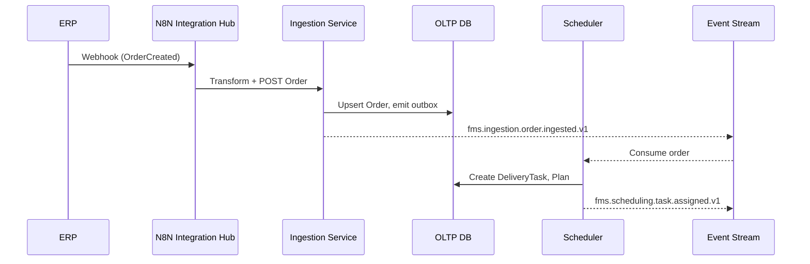
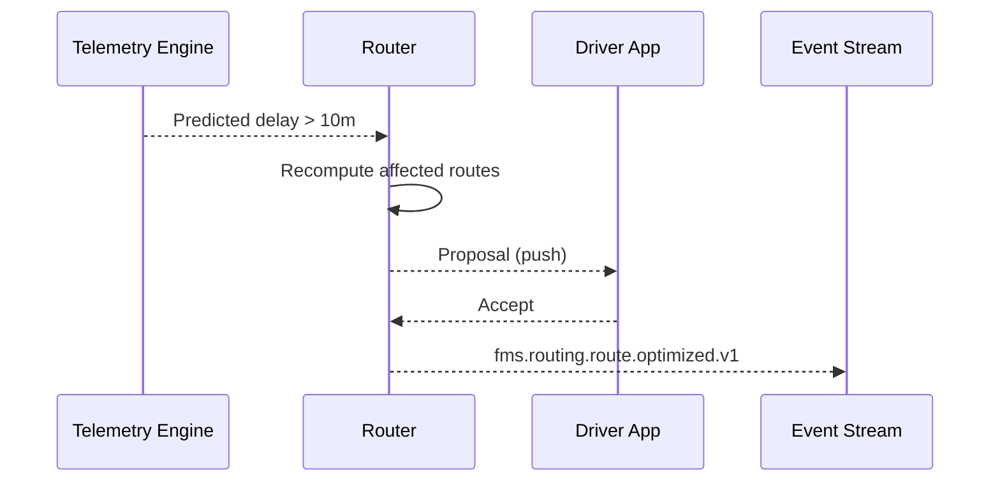
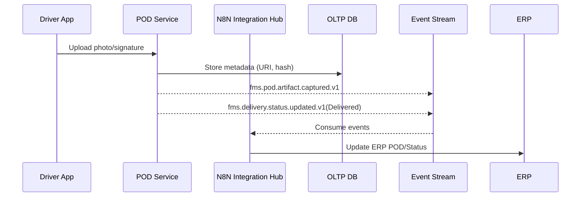

# Sequence Diagrams (Mermaid)

## Order Ingestion → Scheduling (with Integration Hub)

```mermaid
sequenceDiagram
  participant ERP as ERP
  participant INT as N8N Integration Hub
  participant Ingest as Ingestion Service
  participant DB as OLTP DB
  participant Sched as Scheduler
  participant Stream as Event Stream
  ERP->>INT: Webhook (OrderCreated)
  INT->>Ingest: Transform + POST Order
  Ingest->>DB: Upsert Order, emit outbox
  Ingest-->>Stream: fms.ingestion.order.ingested.v1
  Stream-->>Sched: Consume order
  Sched->>DB: Create DeliveryTask, Plan
  Sched-->>Stream: fms.scheduling.task.assigned.v1
```

## Traffic Delay → Re-optimization

```mermaid
sequenceDiagram
  participant Tele as Telemetry Engine
  participant Router as Router
  participant Driver as Driver App
  participant Stream as Event Stream
  Tele-->>Router: Predicted delay > 10m
  Router->>Router: Recompute affected routes
  Router-->>Driver: Proposal (push)
  Driver-->>Router: Accept
  Router-->>Stream: fms.routing.route.optimized.v1
```

## POD Capture → Reconciliation

```mermaid
sequenceDiagram
  participant Driver as Driver App
  participant POD as POD Service
  participant INT as N8N Integration Hub
  participant DB as OLTP DB
  participant Stream as Event Stream
  Driver->>POD: Upload photo/signature
  POD->>DB: Store metadata (URI, hash)
  POD-->>Stream: fms.pod.artifact.captured.v1
  POD-->>Stream: fms.delivery.status.updated.v1(Delivered)
  Stream-->>INT: Consume events
  INT->>ERP: Update ERP POD/Status
```
