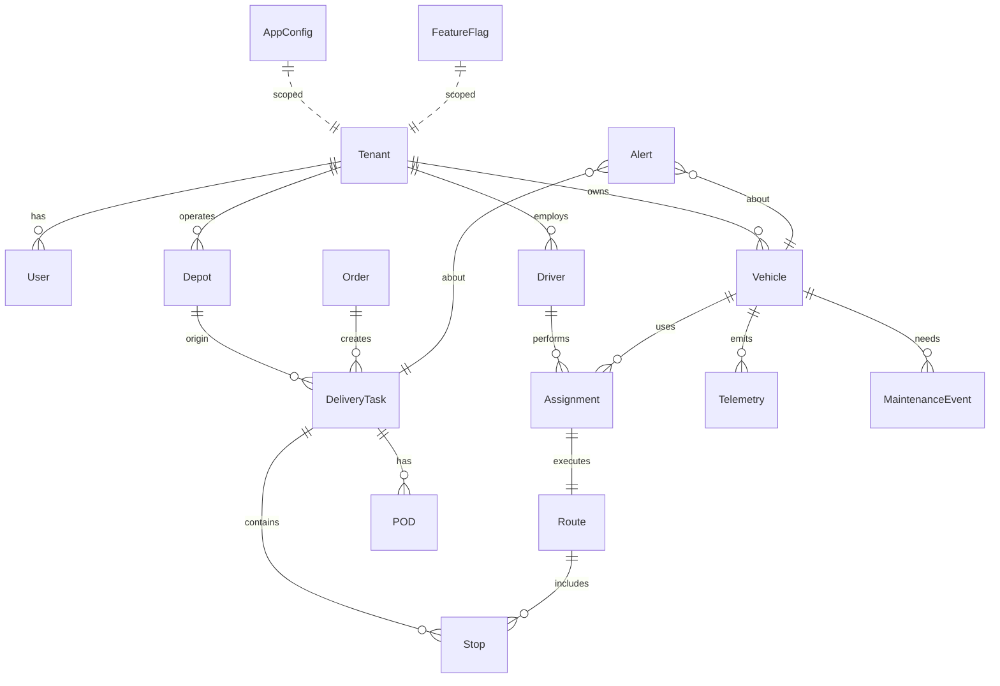

# Data Models and ERD

ERD (Mermaid)

Convex vs Postgres mapping
- Convex (authoritative app state)
  - `orders`, `delivery_tasks`, `routes`, `stops`, `assignments`, `alerts`
  - `users`, `drivers`, `vehicles`, `depots`
  - `config_settings`, `config_history`, `config_change_sets`, `config_change_set_items`, `config_groups`, `config_key_registry`, `feature_flags`, `secrets`
  - Outbox tables: `outbox_events` with `id`, `type`, `payload`, `occurredAt`, `processed` flag
  - Convex actions enforce RBAC and emit outbox entries
- Postgres (reporting/analytics)
  - Star-ish schema for deliveries: `fact_deliveries` + dimensions (`dim_customer`, `dim_vehicle`, `dim_driver`, `dim_time`)
  - `telemetry` (partitioned), `pod_metadata`, `alerts_history`
  - Materialized views for KPIs (on-time rate, utilization)

ID strategy
- Use ULIDs for cross-system identifiers; include `tenantId` on all records.

PII
- Tag fields for encryption and masking; avoid leaking PII into events unless required.

Config entities (Convex)
- ConfigSetting(id, tenantId?, env, group, key, type, value_*, isSecret, version, effectiveFrom, requiresRestart, updatedBy, updatedAt)
- ConfigHistory(id, settingId, prev, next, changedBy, changedAt, reason)
- ConfigChangeSet(id, title, description, status, scheduledFor, createdBy, createdAt)
- ConfigChangeSetItem(id, changeSetId, tenantId?, env, group, key, from, to, validation)
- ConfigGroup(id, group, label, ownerRole, order)
- ConfigKeyRegistry(key, group, label, description, type, default, enum, min, max, regex, jsonSchema, isSecret, scopable, dependsOn, editableBy, rollout, requiresRestart)
- FeatureFlag(id, tenantId?, key, description, enabled, rolloutPercent, conditions, targeting, updatedBy, updatedAt)
- Secret(id, tenantId?, key, ciphertext, version, updatedBy, updatedAt)
