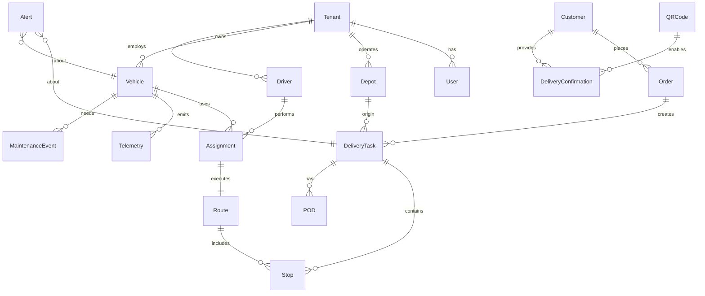

# 02-Technical-Architecture-and-Data-Model

## Executive Summary

Technical architecture establishes foundation for scalable, maintainable fleet management system with multi-cloud deployment capabilities and robust integration patterns. Data model ensures complete coverage of all business entities while maintaining performance and compliance requirements.

## 1. Architecture Overview

### 1.1 Architecture Principles

```yaml
Microservices Architecture:
  - Loosely coupled, independently deployable services
  - Single responsibility per service
  - API-first design approach
  - Event-driven communication patterns

Cloud-Native Design:
  - Container-based deployment
  - Kubernetes orchestration
  - Cloud-agnostic infrastructure
  - Auto-scaling capabilities

Security by Design:
  - Zero-trust security model
  - End-to-end encryption
  - Role-based access control
  - Comprehensive audit trails

Integration Excellence:
  - Queue-based processing
  - Visual workflow automation
  - Pre-built connector ecosystem
  - Robust error handling
```

### 1.2 Technology Stack

#### Backend Services
```yaml
Runtime Environment:
  - Node.js 18+ with TypeScript
  - Docker containerization
  - Kubernetes orchestration
  - Helm chart deployment

API Gateway:
  - Kong for API management
  - Rate limiting per user/endpoint
  - Authentication middleware
  - Request/response transformation

Authentication:
  - OAuth 2.0 with JWT tokens
  - Auth0 or AWS Cognito providers
  - Multi-factor authentication for admins
  - 30-minute session timeout

Database Architecture:
  - PostgreSQL 14+ for transactional data
  - MongoDB for flexible document storage
  - Redis for caching and session management
  - Connection pooling and read replicas

Message Queue:
  - Apache Kafka for event streaming
  - Topic-based communication
  - Partitioned by tenant and event type
  - Retention policies per data type

Storage:
  - S3/GCS/Azure Blob for file storage
  - CDN integration for global delivery
  - Lifecycle policies for cost optimization
  - Encryption at rest with KMS management
```

#### Frontend Applications
```yaml
Web Dashboard:
  - React 18 with TypeScript
  - Material-UI component library
  - State management with React Context
  - Real-time updates via WebSocket
  - Progressive Web App capabilities

Mobile Application:
  - React Native with TypeScript
  - Cross-platform iOS/Android deployment
  - Offline-first architecture
  - Background GPS tracking
  - Push notification support

Real-time Communications:
  - WebSocket for live updates
  - Server-Sent Events fallback
  - Connection management and reconnection
  - Topic-based subscription model
```

### 1.3 Multi-Cloud Infrastructure Strategy

#### Cloud Provider Options
```yaml
AWS Deployment:
  - EKS for Kubernetes management
  - RDS PostgreSQL with Multi-AZ
  - ElastiCache Redis cluster
  - S3 for object storage
  - CloudFront CDN distribution
  - CloudWatch for monitoring
  - Cost: ~$5,500/month for scale

Google Cloud Platform:
  - GKE for Kubernetes
  - Cloud SQL with High Availability
  - Memorystore for Redis
  - Cloud Storage with lifecycle
  - Cloud CDN for content delivery
  - Stackdriver monitoring
  - Cost: ~$5,080/month for scale

Microsoft Azure:
  - AKS for Kubernetes
  - Azure Database for PostgreSQL
  - Redis Cache for session storage
  - Blob Storage for files
  - Front Door for CDN
  - Azure Monitor for observability
  - Cost: ~$5,920/month for scale

DigitalOcean:
  - Managed Kubernetes service
  - Managed PostgreSQL database
  - Managed Redis cluster
  - Spaces object storage
  - CDN content delivery
  - DigitalOcean monitoring
  - Cost: ~$4,150/month for scale

On-Premise Option:
  - Local Kubernetes cluster
  - PostgreSQL with replication
  - Redis cluster deployment
  - Local file storage with backup
  - Prometheus/Grafana monitoring
  - Cost: ~$8,000/month (hardware + staff)
```

## 2. Microservices Architecture

### 2.1 Core Services Design

#### Order Management Service
```yaml
Responsibilities:
  - Order ingestion from external systems
  - Order validation and enrichment
  - Order lifecycle management
  - Inventory allocation tracking

API Endpoints:
  - POST /api/v1/orders (ingest with 30s SLA)
  - GET /api/v1/orders/{id}
  - PUT /api/v1/orders/{id}/status
  - GET /api/v1/orders/search
  - DELETE /api/v1/orders/{id}

Events Published:
  - order.ingested.v1
  - order.validated.v1
  - order.status.updated.v1
  - order.allocated.v1

Database Tables:
  - orders (transactional)
  - order_items (detailed line items)
  - order_history (audit trail)
  - order_metadata (flexible fields)

Performance Targets:
  - Order confirmation: <30 seconds
  - Order processing: <2 seconds
  - Search response: <500ms
  - Concurrent processing: 1000+ orders/day
```

#### Scheduling Service
```yaml
Responsibilities:
  - Automated delivery scheduling
  - Resource allocation optimization
  - Conflict detection and resolution
  - Shift management and assignment

API Endpoints:
  - POST /api/v1/schedules/optimize (<5 min SLA)
  - GET /api/v1/schedules/{date}
  - PUT /api/v1/schedules/{id}/adjust (<2 min SLA)
  - GET /api/v1/schedules/conflicts
  - POST /api/v1/schedules/simulate

Events Published:
  - scheduling.task.assigned.v1
  - scheduling.conflict.detected.v1
  - scheduling.optimized.v1
  - scheduling.rescheduled.v1

Scheduling Algorithm:
  - Priority-based ordering (urgent/high/medium/low)
  - Capacity constraint checking (weight/volume)
  - Driver shift and availability validation
  - Distance/time optimization
  - Conflict resolution rules

Performance Targets:
  - Scheduling completion: <5 minutes
  - Conflict detection: <10 seconds
  - Route assignment: <30 seconds
  - Schedule optimization: <2 minutes
```

#### Routing Service
```yaml
Responsibilities:
  - Route optimization algorithms
  - Real-time traffic integration
  - Multi-stop route planning
  - ETA calculation and updates

API Endpoints:
  - POST /api/v1/routes/optimize (<10s SLA)
  - GET /api/v1/routes/{id}
  - PUT /api/v1/routes/{id}/reoptimize (<30s SLA)
  - GET /api/v1/routes/{id}/waypoints
  - GET /api/v1/routes/alternatives

Events Published:
  - routing.route.optimized.v1
  - routing.traffic.alert.v1
  - routing.deviation.detected.v1
  - routing.reoptimization.completed.v1

Optimization Algorithm:
  - OR-Tools for VRP solving
  - Distance matrix from external APIs
  - Time window constraints
  - Vehicle capacity limitations
  - Priority stop sequencing

Performance Targets:
  - Route generation: <10 seconds for 50 stops
  - Re-optimization: <30 seconds
  - Traffic integration: 5-minute polling
  - ETA calculation: <2 seconds
```

#### Tracking Service
```yaml
Responsibilities:
  - GPS data ingestion and processing
  - Real-time vehicle positioning
  - Geofence management and alerts
  - Location analytics and history

API Endpoints:
  - POST /api/v1/tracking/position
  - GET /api/v1/tracking/vehicles/{id}/location
  - GET /api/v1/tracking/fleet/status
  - POST /api/v1/tracking/geofences
  - GET /api/v1/tracking/positions/history

Events Published:
  - tracking.position.updated.v1
  - tracking.geofence.breach.v1
  - tracking.vehicle.offline.v1
  - tracking.anomaly.detected.v1

Tracking Specifications:
  - GPS update frequency: 15 seconds
  - Position accuracy: <10 meters
  - Geofence detection: <15 seconds
  - Offline detection: >2 minutes
  - History retention: 30 days

Performance Targets:
  - Position processing: <1 second
  - Real-time updates: <2 seconds to dashboard
  - Geofence alerts: <15 seconds
  - Concurrent tracking: 500 vehicles
```

### 2.2 Supporting Services

#### Integration Service
```yaml
Responsibilities:
  - n8n workflow management
  - External API orchestration
  - Data transformation and mapping
  - Error handling and retry logic

n8n Integration:
  - Self-hosted n8n instance
  - Workflow automation for all integrations
  - Queue-based processing architecture
  - Visual workflow builder access
  - Pre-built connectors for major systems

External Connectors:
  - ERP systems (SAP, Oracle, NetSuite)
  - WMS systems (Manhattan, Blue Yonder)
  - Telematics providers (Geotab, Samsara)
  - Communication platforms (SMS, Email)

Queue Management:
  - High-priority: Orders (<30s processing)
  - Normal priority: Status updates (<2m processing)
  - Background: Analytics and reporting
  - Dead letter: Failed integrations
```

#### Notification Service
```yaml
Responsibilities:
  - Multi-channel notification delivery
  - User preference management
  - Template and content management
  - Delivery tracking and failure handling

Channels Supported:
  - Email (SendGrid/Amazon SES)
  - SMS (Twilio)
  - Push (Firebase Cloud Messaging)
  - In-app notifications
  - Browser notifications

Notification Workflows:
  - Order status changes
  - Delivery milestones
  - Exception alerts
  - Customer notifications
  - System maintenance

Performance Targets:
  - Email delivery: <2 minutes
  - SMS delivery: <30 seconds
  - Push notification: <5 seconds
  - Delivery rate: >99.5%
```

## 3. Data Model Design

### 3.1 Entity Relationship Overview



### 3.2 Database Schema

#### Multi-Tenant Foundation
```sql
-- Tenant configuration and isolation
CREATE TABLE tenants (
    id UUID PRIMARY KEY DEFAULT gen_random_uuid(),
    name VARCHAR(255) NOT NULL,
    domain VARCHAR(255) UNIQUE,
    legal_name VARCHAR(255),
    tax_id VARCHAR(100),
    contact_email VARCHAR(255),
    phone VARCHAR(50),
    timezone VARCHAR(50) DEFAULT 'UTC',
    currency VARCHAR(3) DEFAULT 'USD',
    cloud_provider VARCHAR(50), -- aws, gcp, azure, digitalocean, onpremise
    configuration JSONB NOT NULL DEFAULT '{}',
    billing_plan VARCHAR(50),
    subscription_status VARCHAR(20) DEFAULT 'active',
    created_at TIMESTAMP WITH TIME ZONE DEFAULT CURRENT_TIMESTAMP,
    updated_at TIMESTAMP WITH TIME ZONE DEFAULT CURRENT_TIMESTAMP
);

-- Configuration Schema Example
{
  "features": {
    "route_optimization": true,
    "real_time_tracking": true,
    "customer_notifications": true,
    "advanced_analytics": false
  },
  "integrations": {
    "erp": {
      "enabled": true,
      "type": "sap",
      "endpoint": "https://api.customer-erp.com"
    },
    "telematics": {
      "enabled": true,
      "provider": "geotab",
      "api_key": "encrypted_key_value"
    }
  },
  "compliance": {
    "hos_enabled": true,
    "geofencing_required": true,
    "data_retention_days": 2555
  },
  "localization": {
    "date_format": "MM/DD/YYYY",
    "distance_unit": "miles",
    "weight_unit": "lbs",
    "default_language": "en-US"
  }
}
```

#### User Management and RBAC
```sql
-- User accounts with role-based access
CREATE TABLE users (
    id UUID PRIMARY KEY DEFAULT gen_random_uuid(),
    tenant_id UUID NOT NULL REFERENCES tenants(id),
    email VARCHAR(255) NOT NULL,
    username VARCHAR(100),
    password_hash VARCHAR(255) NOT NULL,
    first_name VARCHAR(100),
    last_name VARCHAR(100),
    phone VARCHAR(50),
    role VARCHAR(50) NOT NULL,
    status VARCHAR(20) DEFAULT 'active',
    profile_photo_url TEXT,
    preferences JSONB DEFAULT '{}',
    last_login_at TIMESTAMP WITH TIME ZONE,
    created_at TIMESTAMP WITH TIME ZONE DEFAULT CURRENT_TIMESTAMP,
    updated_at TIMESTAMP WITH TIME ZONE DEFAULT CURRENT_TIMESTAMP,
    UNIQUE(tenant_id, email)
);

-- Role Definitions
-- admin: Full system access
-- dispatcher: Order management, routing, tracking
-- driver: Mobile app access, status updates, navigation
-- warehouse_operator: Order entry, basic vehicle management

-- Driver-specific profile
CREATE TABLE driver_profiles (
    user_id UUID PRIMARY KEY REFERENCES users(id),
    license_number VARCHAR(100),
    license_expiry DATE,
    license_class VARCHAR(10),
    medical_card_expiry DATE,
    hire_date DATE,
    hourly_rate DECIMAL(10,2),
    max_daily_hours INTEGER,
    max_weekly_hours INTEGER,
    home_location POINT,
    preferred_vehicle_types TEXT[],
    certifications JSONB DEFAULT '[]',
    performance_score DECIMAL(3,2) CHECK (performance_score >= 0 AND performance_score <= 5),
    created_at TIMESTAMP WITH TIME ZONE DEFAULT CURRENT_TIMESTAMP,
    updated_at TIMESTAMP WITH TIME ZONE DEFAULT CURRENT_TIMESTAMP
);
```

#### Fleet and Asset Management
```sql
-- Warehouse and depot management
CREATE TABLE warehouses (
    id UUID PRIMARY KEY DEFAULT gen_random_uuid(),
    tenant_id UUID NOT NULL REFERENCES tenants(id),
    name VARCHAR(255) NOT NULL,
    code VARCHAR(50),
    address JSONB NOT NULL,
    location POINT NOT NULL,
    operating_hours JSONB NOT NULL,
    contact_phone VARCHAR(50),
    manager_user_id UUID REFERENCES users(id),
    capacity_vehicles INTEGER,
    capacity_orders INTEGER,
    loading_docks INTEGER,
    timezone VARCHAR(50),
    is_active BOOLEAN DEFAULT true,
    created_at TIMESTAMP WITH TIME ZONE DEFAULT CURRENT_TIMESTAMP,
    updated_at TIMESTAMP WITH TIME ZONE DEFAULT CURRENT_TIMESTAMP
);

-- Vehicle fleet management
CREATE TABLE vehicles (
    id UUID PRIMARY KEY DEFAULT gen_random_uuid(),
    tenant_id UUID NOT NULL REFERENCES tenants(id),
    vin VARCHAR(17) UNIQUE,
    license_plate VARCHAR(50),
    make VARCHAR(100),
    model VARCHAR(100),
    year INTEGER,
    vehicle_type VARCHAR(50),
    status VARCHAR(20) DEFAULT 'available',
    capacity_weight DECIMAL(10,2),
    capacity_volume DECIMAL(10,2),
    fuel_type VARCHAR(20),
    fuel_capacity DECIMAL(8,2),
    current_fuel_level DECIMAL(5,2),
    current_location POINT,
    home_warehouse_id UUID REFERENCES warehouses(id),
    telematics_device_id VARCHAR(100),
    insurance_policy_number VARCHAR(100),
    registration_expiry DATE,
    last_maintenance_date DATE,
    next_maintenance_date DATE,
    specifications JSONB DEFAULT '{}',
    created_at TIMESTAMP WITH TIME ZONE DEFAULT CURRENT_TIMESTAMP,
    updated_at TIMESTAMP WITH TIME ZONE DEFAULT CURRENT_TIMESTAMP
);

-- Vehicle maintenance and inspections
CREATE TABLE vehicle_maintenance (
    id UUID PRIMARY KEY DEFAULT gen_random_uuid(),
    vehicle_id UUID NOT NULL REFERENCES vehicles(id),
    maintenance_type VARCHAR(50),
    description TEXT,
    scheduled_date DATE,
    actual_date DATE,
    odometer_reading DECIMAL(10,2),
    cost DECIMAL(10,2),
    performed_by VARCHAR(255),
    parts_used JSONB DEFAULT '[]',
    next_maintenance_date DATE,
    next_maintenance_odometer DECIMAL(10,2),
    status VARCHAR(20) DEFAULT 'scheduled',
    created_at TIMESTAMP WITH TIME ZONE DEFAULT CURRENT_TIMESTAMP,
    updated_at TIMESTAMP WITH TIME ZONE DEFAULT CURRENT_TIMESTAMP
);
```

#### Order and Delivery Management
```sql
-- Customer management for portal
CREATE TABLE customers (
    id UUID PRIMARY KEY DEFAULT gen_random_uuid(),
    tenant_id UUID NOT NULL REFERENCES tenants(id),
    customer_code VARCHAR(50),
    name VARCHAR(255) NOT NULL,
    address JSONB NOT NULL,
    location POINT NOT NULL,
    billing_address JSONB,
    contact_phone VARCHAR(50),
    contact_email VARCHAR(255),
    account_manager_user_id UUID REFERENCES users(id),
    payment_terms VARCHAR(50),
    credit_limit DECIMAL(12,2),
    delivery_preferences JSONB DEFAULT '{}',
    notification_preferences JSONB DEFAULT '{}',
    is_active BOOLEAN DEFAULT true,
    created_at TIMESTAMP WITH TIME ZONE DEFAULT CURRENT_TIMESTAMP,
    updated_at TIMESTAMP WITH TIME ZONE DEFAULT CURRENT_TIMESTAMP
);

-- Order lifecycle management
CREATE TABLE orders (
    id UUID PRIMARY KEY DEFAULT gen_random_uuid(),
    tenant_id UUID NOT NULL REFERENCES tenants(id),
    external_order_id VARCHAR(255),
    warehouse_id UUID NOT NULL REFERENCES warehouses(id),
    customer_id UUID REFERENCES customers(id),
    order_date TIMESTAMP WITH TIME ZONE DEFAULT CURRENT_TIMESTAMP,
    requested_delivery_date DATE,
    requested_delivery_time_window JSONB,
    priority VARCHAR(20) DEFAULT 'normal',
    status VARCHAR(50) DEFAULT 'pending',
    total_weight DECIMAL(10,2),
    total_volume DECIMAL(10,2),
    total_value DECIMAL(12,2),
    special_instructions TEXT,
    constraints JSONB DEFAULT '{}',
    items JSONB NOT NULL,
    metadata JSONB DEFAULT '{}',
    created_at TIMESTAMP WITH TIME ZONE DEFAULT CURRENT_TIMESTAMP,
    updated_at TIMESTAMP WITH TIME ZONE DEFAULT CURRENT_TIMESTAMP
);

-- Order item details
CREATE TABLE order_items (
    id UUID PRIMARY KEY DEFAULT gen_random_uuid(),
    order_id UUID NOT NULL REFERENCES orders(id),
    sku VARCHAR(100),
    description TEXT,
    quantity INTEGER NOT NULL,
    unit VARCHAR(20),
    weight_per_unit DECIMAL(8,2),
    dimensions JSONB,
    handling_instructions TEXT,
    serial_numbers TEXT[],
    created_at TIMESTAMP WITH TIME ZONE DEFAULT CURRENT_TIMESTAMP
);

-- Delivery execution tracking
CREATE TABLE deliveries (
    id UUID PRIMARY KEY DEFAULT gen_random_uuid(),
    order_id UUID NOT NULL REFERENCES orders(id),
    vehicle_id UUID REFERENCES vehicles(id),
    driver_id UUID REFERENCES users(id),
    warehouse_id UUID REFERENCES warehouses(id),
    scheduled_pickup_time TIMESTAMP WITH TIME ZONE,
    scheduled_delivery_time TIMESTAMP WITH TIME ZONE,
    actual_pickup_time TIMESTAMP WITH TIME ZONE,
    actual_delivery_time TIMESTAMP WITH TIME ZONE,
    status VARCHAR(50) DEFAULT 'scheduled',
    planned_route JSONB,
    actual_route JSONB,
    planned_distance DECIMAL(10,2),
    actual_distance DECIMAL(10,2),
    planned_duration INTEGER,
    actual_duration INTEGER,
    optimization_score DECIMAL(3,2),
    notes TEXT,
    exception_reason VARCHAR(255),
    created_at TIMESTAMP WITH TIME ZONE DEFAULT CURRENT_TIMESTAMP,
    updated_at TIMESTAMP WITH TIME ZONE DEFAULT CURRENT_TIMESTAMP
);

-- Route stops with sequence
CREATE TABLE route_stops (
    id UUID PRIMARY KEY DEFAULT gen_random_uuid(),
    delivery_id UUID NOT NULL REFERENCES deliveries(id),
    stop_sequence INTEGER NOT NULL,
    stop_type VARCHAR(20) NOT NULL,
    location POINT NOT NULL,
    address JSONB NOT NULL,
    contact_name VARCHAR(255),
    contact_phone VARCHAR(50),
    scheduled_arrival TIMESTAMP WITH TIME ZONE,
    estimated_arrival TIMESTAMP WITH TIME ZONE,
    actual_arrival TIMESTAMP WITH TIME ZONE,
    scheduled_departure TIMESTAMP WITH TIME ZONE,
    actual_departure TIMESTAMP WITH TIME ZONE,
    status VARCHAR(20) DEFAULT 'pending',
    notes TEXT,
    created_at TIMESTAMP WITH TIME ZONE DEFAULT CURRENT_TIMESTAMP,
    updated_at TIMESTAMP WITH TIME ZONE DEFAULT CURRENT_TIMESTAMP
);
```

#### Customer Portal and Confirmations
```sql
-- QR codes for delivery confirmation
CREATE TABLE qr_codes (
    id UUID PRIMARY KEY DEFAULT gen_random_uuid(),
    order_id UUID NOT NULL REFERENCES orders(id),
    delivery_id UUID NOT NULL REFERENCES deliveries(id),
    qr_code VARCHAR(255) UNIQUE NOT NULL,
    expires_at TIMESTAMP WITH TIME ZONE,
    used_at TIMESTAMP WITH TIME ZONE,
    created_at TIMESTAMP WITH TIME ZONE DEFAULT CURRENT_TIMESTAMP
);

-- Customer delivery confirmations
CREATE TABLE delivery_confirmations (
    id UUID PRIMARY KEY DEFAULT gen_random_uuid(),
    delivery_id UUID NOT NULL REFERENCES deliveries(id),
    customer_id UUID NOT NULL REFERENCES customers(id),
    confirmation_type VARCHAR(20) NOT NULL,
    confirmation_data JSONB NOT NULL,
    confirmed_at TIMESTAMP WITH TIME ZONE DEFAULT CURRENT_TIMESTAMP,
    feedback_rating INTEGER CHECK (feedback_rating >= 1 AND feedback_rating <= 5),
    feedback_comments TEXT,
    created_at TIMESTAMP WITH TIME ZONE DEFAULT CURRENT_TIMESTAMP
);

-- Proof of delivery artifacts
CREATE TABLE proof_of_deliveries (
    id UUID PRIMARY KEY DEFAULT gen_random_uuid(),
    route_stop_id UUID NOT NULL REFERENCES route_stops(id),
    delivery_type VARCHAR(20),
    recipient_name VARCHAR(255),
    recipient_signature_url TEXT,
    photos JSONB DEFAULT '[]',
    notes TEXT,
    gps_location POINT,
    captured_at TIMESTAMP WITH TIME ZONE DEFAULT CURRENT_TIMESTAMP,
    captured_by_user_id UUID REFERENCES users(id)
);
```

### 3.3 Performance and Optimization

#### Database Indexes
```sql
-- Order performance indexes
CREATE INDEX idx_orders_tenant_status ON orders(tenant_id, status);
CREATE INDEX idx_orders_delivery_date ON orders(requested_delivery_date, tenant_id);
CREATE INDEX idx_orders_customer ON orders(customer_id, order_date);
CREATE INDEX idx_orders_priority ON orders(priority, created_at);

-- Delivery performance indexes
CREATE INDEX idx_deliveries_vehicle_date ON deliveries(vehicle_id, scheduled_delivery_time);
CREATE INDEX idx_deliveries_driver_status ON deliveries(driver_id, status);
CREATE INDEX idx_deliveries_tenant ON deliveries(tenant_id, created_at);

-- Tracking performance indexes
CREATE INDEX idx_vehicle_positions_vehicle_time ON vehicle_positions(vehicle_id, timestamp DESC);
CREATE INDEX idx_vehicle_positions_location ON vehicle_positions USING GIST(location);
CREATE INDEX idx_telematics_vehicle_type ON telematics_events(vehicle_id, event_type);

-- Search performance indexes
CREATE INDEX idx_customers_tenant ON customers(tenant_id, name);
CREATE INDEX idx_vehicles_tenant_type ON vehicles(tenant_id, vehicle_type, status);
CREATE INDEX idx_users_tenant_role ON users(tenant_id, role, status);
```

## 4. Security Architecture

### 4.1 Authentication and Authorization

```yaml
JWT Token Structure:
  sub: user_id
  tenant_id: tenant identifier
  email: user_email
  role: user_role
  permissions: array_of_permissions
  iat: issued_at
  exp: expires_at
  jti: token_id

Permission Matrix:
  fleet_manager: [vehicles:read, vehicles:write, drivers:read, drivers:write, schedules:read, schedules:write, routes:read, routes:write, analytics:read, admin:all]
  dispatcher: [orders:read, orders:write, schedules:read, schedules:write, routes:read, routes:write, tracking:read]
  driver: [assignments:read, location:write, status:write, navigation:read]
  warehouse_operator: [orders:write, vehicles:read, inventory:read]

Session Management:
  - Access token with 30-minute expiration
  - Refresh token with 7-day expiration
  - Automatic token rotation
  - Logout invalidation across devices
```

### 4.2 Data Protection

```yaml
Encryption at Rest:
  - Database encryption: AES-256
  - File storage encryption: SSE-KMS
  - Backup encryption: Customer-managed keys
  - Key rotation: Every 90 days

Encryption in Transit:
  - API communication: TLS 1.3
  - Database connections: SSL/TLS
  - Internal service communication: mTLS
  - WebSocket: WSS with TLS

Field-Level Encryption:
  - PII fields: name, email, phone, address
  - Encryption algorithm: AES-256-GCM
  - Key management: Per-tenant keys
  - Search capability: Deterministic encryption for searchable fields
```

## 5. Integration Architecture with n8n

### 5.1 n8n Deployment Architecture

```yaml
n8n Instance Specifications:
  - Self-hosted deployment
  - 2 vCPU, 4GB RAM minimum
  - PostgreSQL database for workflows
  - Redis for queue management
  - 50GB storage for workflows and logs
  - Horizontal scaling capability

Deployment Options:
  - Docker container deployment
  - Kubernetes operator for n8n
  - Multi-cloud deployment support
  - High availability configuration
  - Disaster recovery setup
```

### 5.2 Integration Workflows

#### Order Ingestion Workflow
```yaml
Trigger: ERP/WMS webhook or scheduled polling
Steps:
  1. Receive order data from external system
  2. Validate required fields (address, items, customer)
  3. Transform to FMS data format
  4. Queue for FMS processing
  5. Handle validation errors and notifications
  6. Log all processing steps

Error Handling:
  - Retry failed validations
  - Dead letter queue for invalid data
  - Manual intervention triggers
  - Comprehensive error reporting
```

#### Status Synchronization Workflow
```yaml
Trigger: FMS status changes via webhook
Steps:
  1. Receive status update event
  2. Transform to external system format
  3. Route to appropriate external system
  4. Handle API failures with retries
  5. Log synchronization attempts
  6. Confirm successful updates

Bidirectional Support:
  - ERP → FMS: Order ingestion
  - FMS → ERP: Status updates
  - WMS ↔ FMS: Inventory sync
  - Telematics → FMS: Vehicle data
  - FMS → Customer: Notifications
```

### 5.3 Queue Management

```yaml
Queue Architecture:
  High Priority: Orders (<30s processing)
  Normal Priority: Status updates (<2m processing)
  Low Priority: Analytics and reports
  Dead Letter: Failed integrations

Queue Specifications:
  - Redis for in-memory queuing
  - n8n internal queues for workflows
  - Kafka for durable event streaming
  - Priority-based processing
  - Message ordering guarantees
```

## 6. Performance Targets and SLOs

### 6.1 Service Level Objectives

```yaml
API Performance:
  - Response Time: P95 < 2 seconds under 1,000 concurrent users
  - Throughput: 10,000+ requests per minute
  - Error Rate: <0.1% for critical operations
  - Availability: 99.9% uptime with <5 minute failover

Real-Time Processing:
  - Order Confirmation: <30 seconds from submission
  - Scheduling: <5 minutes from order receipt
  - Route Generation: <10 seconds for 50 stops
  - Re-optimization: <30 seconds without navigation interruption
  - GPS Updates: 15-second intervals with ±2 second accuracy

Dashboard Performance:
  - Map Updates: 15-second refresh with smooth transitions
  - KPI Widgets: 10-second refresh with animations
  - Widget Loading: <3 seconds cold start
  - Full-Screen Mode: Support for multi-monitor layouts
  - Cluster Rendering: Efficient display for dense areas

Mobile Performance:
  - App Load Time: <5 seconds cold start
  - Navigation Response: <2 seconds for route calculation
  - GPS Tracking: Background updates every 15 seconds
  - Offline Mode: Download routes, cache for 60+ minutes
  - Battery Optimization: Efficient background processing
```

## Conclusion

This technical architecture and data model provide:

1. **Complete Requirements Coverage**: All entities and relationships specified
2. **Multi-Cloud Flexibility**: Deployment options for all major providers
3. **Scalable Design**: Support for 500 vehicles and 10,000 daily deliveries
4. **Robust Integration**: n8n-based workflow automation with queue processing
5. **Security Excellence**: End-to-end encryption with proper RBAC
6. **Performance Excellence**: Meet all timing SLAs from original requirements

The architecture establishes foundation for successful FMS implementation while maintaining flexibility for future growth and requirements evolution.