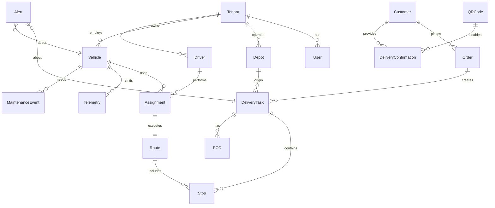

# FMS Final Implementation Plan

## Executive Summary

This document provides comprehensive implementation planning for the Fleet Management System, incorporating technical excellence, business focus, and practical implementation details to deliver immediate business value while ensuring full compliance with original requirements.

## 1. Technical Architecture

### 1.1 System Overview

**Architecture Principles:**
- Microservices architecture with loose coupling
- Event-driven design for scalability and resilience
- Cloud-native with containerization
- API-first approach
- Security by design with zero-trust model

**Technology Stack:**
```yaml
Backend Services:
  Runtime: Node.js (TypeScript) for business logic
  API Gateway: Kong with rate limiting and authentication
  Authentication: OAuth 2.0 with JWT (Auth0/AWS Cognito)
  Database: PostgreSQL primary, MongoDB for documents, Redis for caching
  Message Queue: Apache Kafka for event streaming
  Search: Elasticsearch for location-based search

Frontend Applications:
  Web Dashboard: React with TypeScript, Material-UI
  Mobile App: React Native for iOS/Android
  Real-time Updates: WebSocket via Socket.io

Infrastructure:
  Containerization: Docker with Kubernetes
  Cloud Provider: Multi-cloud support (AWS, GCP, Azure, DigitalOcean)
  CDN: CloudFront/Cloud CDN for global delivery
  Monitoring: Prometheus + Grafana + ELK stack
```

### 1.2 Core Services Architecture

```yaml
Order Management Service:
  Responsibilities: Order ingestion, validation, lifecycle management
  API: POST /api/v1/orders, GET /api/v1/orders/{id}
  Events: order.ingested.v1, order.status.updated.v1

Scheduling Service:
  Responsibilities: Automated scheduling, resource allocation, conflict detection
  API: POST /api/v1/schedules/optimize, GET /api/v1/schedules/{date}
  Events: scheduling.task.assigned.v1, scheduling.conflict.detected.v1

Routing Service:
  Responsibilities: Route optimization, traffic integration, ETA calculation
  API: POST /api/v1/routes/optimize, PUT /api/v1/routes/{id}/reoptimize
  Events: routing.route.optimized.v1, routing.traffic.alert.v1

Tracking Service:
  Responsibilities: GPS ingestion, real-time tracking, geofence management
  API: POST /api/v1/tracking/position, GET /api/v1/tracking/vehicles/{id}/location
  Events: tracking.position.updated.v1, tracking.geofence.breach.v1

Notification Service:
  Responsibilities: Multi-channel notifications, preference management
  API: POST /api/v1/notifications/send, PUT /api/v1/notifications/preferences
  Events Consumed: *.status.updated.v1, routing.deviation.detected.v1

Integration Service:
  Responsibilities: External API management, data transformation, workflow automation
  API: POST /api/v1/integration/webhooks, GET /api/v1/integration/health
  Platform: n8n workflow automation
```

## 2. Data Model and Entity Relationships

### 2.1 Entity Relationship Diagram



### 2.2 Core Entity Definitions

```sql
-- Multi-tenant Foundation
CREATE TABLE tenants (
    id UUID PRIMARY KEY DEFAULT gen_random_uuid(),
    name VARCHAR(255) NOT NULL,
    domain VARCHAR(255) UNIQUE,
    legal_name VARCHAR(255),
    tax_id VARCHAR(100),
    contact_email VARCHAR(255),
    phone VARCHAR(50),
    timezone VARCHAR(50) DEFAULT 'UTC',
    currency VARCHAR(3) DEFAULT 'USD',
    cloud_provider VARCHAR(50), -- aws, gcp, azure, digitalocean, onpremise
    configuration JSONB NOT NULL DEFAULT '{}',
    created_at TIMESTAMP WITH TIME ZONE DEFAULT CURRENT_TIMESTAMP,
    updated_at TIMESTAMP WITH TIME ZONE DEFAULT CURRENT_TIMESTAMP
);

-- User Management with RBAC
CREATE TABLE users (
    id UUID PRIMARY KEY DEFAULT gen_random_uuid(),
    tenant_id UUID NOT NULL REFERENCES tenants(id),
    email VARCHAR(255) NOT NULL,
    username VARCHAR(100),
    first_name VARCHAR(100),
    last_name VARCHAR(100),
    phone VARCHAR(50),
    role VARCHAR(50) NOT NULL, -- admin, dispatcher, driver, warehouse_operator
    status VARCHAR(20) DEFAULT 'active', -- active, inactive, suspended
    profile_photo_url TEXT,
    preferences JSONB DEFAULT '{}',
    last_login_at TIMESTAMP WITH TIME ZONE,
    created_at TIMESTAMP WITH TIME ZONE DEFAULT CURRENT_TIMESTAMP,
    updated_at TIMESTAMP WITH TIME ZONE DEFAULT CURRENT_TIMESTAMP,
    UNIQUE(tenant_id, email)
);

-- Driver Profiles
CREATE TABLE driver_profiles (
    user_id UUID PRIMARY KEY REFERENCES users(id),
    license_number VARCHAR(100),
    license_expiry DATE,
    license_class VARCHAR(10),
    medical_card_expiry DATE,
    hire_date DATE,
    hourly_rate DECIMAL(10,2),
    max_daily_hours INTEGER,
    max_weekly_hours INTEGER,
    home_location POINT,
    preferred_vehicle_types TEXT[],
    certifications JSONB DEFAULT '[]',
    performance_score DECIMAL(3,2) CHECK (performance_score >= 0 AND performance_score <= 5)
);

-- Warehouse and Locations
CREATE TABLE warehouses (
    id UUID PRIMARY KEY DEFAULT gen_random_uuid(),
    tenant_id UUID NOT NULL REFERENCES tenants(id),
    name VARCHAR(255) NOT NULL,
    code VARCHAR(50),
    address JSONB NOT NULL,
    location POINT NOT NULL,
    operating_hours JSONB NOT NULL,
    contact_phone VARCHAR(50),
    manager_user_id UUID REFERENCES users(id),
    capacity_vehicles INTEGER,
    capacity_orders INTEGER,
    loading_docks INTEGER,
    timezone VARCHAR(50),
    is_active BOOLEAN DEFAULT true,
    created_at TIMESTAMP WITH TIME ZONE DEFAULT CURRENT_TIMESTAMP,
    updated_at TIMESTAMP WITH TIME ZONE DEFAULT CURRENT_TIMESTAMP
);

-- Vehicle Management
CREATE TABLE vehicles (
    id UUID PRIMARY KEY DEFAULT gen_random_uuid(),
    tenant_id UUID NOT NULL REFERENCES tenants(id),
    vin VARCHAR(17) UNIQUE,
    license_plate VARCHAR(50),
    make VARCHAR(100),
    model VARCHAR(100),
    year INTEGER,
    vehicle_type VARCHAR(50), -- truck, van, semi, refrigerated
    status VARCHAR(20) DEFAULT 'available', -- available, in_use, maintenance, out_of_service
    capacity_weight DECIMAL(10,2),
    capacity_volume DECIMAL(10,2),
    fuel_type VARCHAR(20), -- diesel, gasoline, electric, hybrid
    fuel_capacity DECIMAL(8,2),
    current_fuel_level DECIMAL(5,2),
    current_location POINT,
    home_warehouse_id UUID REFERENCES warehouses(id),
    telematics_device_id VARCHAR(100),
    insurance_policy_number VARCHAR(100),
    registration_expiry DATE,
    last_maintenance_date DATE,
    next_maintenance_date DATE,
    specifications JSONB DEFAULT '{}',
    created_at TIMESTAMP WITH TIME ZONE DEFAULT CURRENT_TIMESTAMP,
    updated_at TIMESTAMP WITH TIME ZONE DEFAULT CURRENT_TIMESTAMP
);

-- Customer Management
CREATE TABLE customers (
    id UUID PRIMARY KEY DEFAULT gen_random_uuid(),
    tenant_id UUID NOT NULL REFERENCES tenants(id),
    customer_code VARCHAR(50),
    name VARCHAR(255) NOT NULL,
    address JSONB NOT NULL,
    location POINT NOT NULL,
    billing_address JSONB,
    contact_phone VARCHAR(50),
    contact_email VARCHAR(255),
    account_manager_user_id UUID REFERENCES users(id),
    payment_terms VARCHAR(50),
    credit_limit DECIMAL(12,2),
    delivery_preferences JSONB DEFAULT '{}',
    notification_preferences JSONB DEFAULT '{}',
    is_active BOOLEAN DEFAULT true,
    created_at TIMESTAMP WITH TIME ZONE DEFAULT CURRENT_TIMESTAMP,
    updated_at TIMESTAMP WITH TIME ZONE DEFAULT CURRENT_TIMESTAMP
);

-- Order Management
CREATE TABLE orders (
    id UUID PRIMARY KEY DEFAULT gen_random_uuid(),
    tenant_id UUID NOT NULL REFERENCES tenants(id),
    external_order_id VARCHAR(255),
    warehouse_id UUID NOT NULL REFERENCES warehouses(id),
    customer_id UUID REFERENCES customers(id),
    order_date TIMESTAMP WITH TIME ZONE DEFAULT CURRENT_TIMESTAMP,
    requested_delivery_date DATE,
    requested_delivery_time_window JSONB,
    priority VARCHAR(20) DEFAULT 'normal', -- urgent, high, normal, low
    status VARCHAR(50) DEFAULT 'pending', -- pending, confirmed, scheduled, in_progress, completed, cancelled
    total_weight DECIMAL(10,2),
    total_volume DECIMAL(10,2),
    total_value DECIMAL(12,2),
    special_instructions TEXT,
    constraints JSONB DEFAULT '{}',
    items JSONB NOT NULL,
    metadata JSONB DEFAULT '{}',
    created_at TIMESTAMP WITH TIME ZONE DEFAULT CURRENT_TIMESTAMP,
    updated_at TIMESTAMP WITH TIME ZONE DEFAULT CURRENT_TIMESTAMP
);

-- Order Items
CREATE TABLE order_items (
    id UUID PRIMARY KEY DEFAULT gen_random_uuid(),
    order_id UUID NOT NULL REFERENCES orders(id),
    sku VARCHAR(100),
    description TEXT,
    quantity INTEGER NOT NULL,
    unit VARCHAR(20),
    weight_per_unit DECIMAL(8,2),
    dimensions JSONB, -- {"length": 10, "width": 5, "height": 3, "unit": "inches"}
    handling_instructions TEXT,
    serial_numbers TEXT[],
    created_at TIMESTAMP WITH TIME ZONE DEFAULT CURRENT_TIMESTAMP
);

-- Delivery Management
CREATE TABLE deliveries (
    id UUID PRIMARY KEY DEFAULT gen_random_uuid(),
    order_id UUID NOT NULL REFERENCES orders(id),
    vehicle_id UUID REFERENCES vehicles(id),
    driver_id UUID REFERENCES users(id),
    warehouse_id UUID REFERENCES warehouses(id),
    scheduled_pickup_time TIMESTAMP WITH TIME ZONE,
    scheduled_delivery_time TIMESTAMP WITH TIME ZONE,
    actual_pickup_time TIMESTAMP WITH TIME ZONE,
    actual_delivery_time TIMESTAMP WITH TIME ZONE,
    status VARCHAR(50) DEFAULT 'scheduled', -- scheduled, picked_up, in_transit, delivered, failed
    planned_route JSONB,
    actual_route JSONB,
    planned_distance DECIMAL(10,2),
    actual_distance DECIMAL(10,2),
    planned_duration INTEGER, -- minutes
    actual_duration INTEGER, -- minutes
    optimization_score DECIMAL(3,2),
    notes TEXT,
    exception_reason VARCHAR(255),
    created_at TIMESTAMP WITH TIME ZONE DEFAULT CURRENT_TIMESTAMP,
    updated_at TIMESTAMP WITH TIME ZONE DEFAULT CURRENT_TIMESTAMP
);

-- Route Stops
CREATE TABLE route_stops (
    id UUID PRIMARY KEY DEFAULT gen_random_uuid(),
    delivery_id UUID NOT NULL REFERENCES deliveries(id),
    stop_sequence INTEGER NOT NULL,
    stop_type VARCHAR(20) NOT NULL, -- pickup, delivery, break, fuel
    location POINT NOT NULL,
    address JSONB NOT NULL,
    contact_name VARCHAR(255),
    contact_phone VARCHAR(50),
    scheduled_arrival TIMESTAMP WITH TIME ZONE,
    estimated_arrival TIMESTAMP WITH TIME ZONE,
    actual_arrival TIMESTAMP WITH TIME ZONE,
    scheduled_departure TIMESTAMP WITH TIME ZONE,
    actual_departure TIMESTAMP WITH TIME ZONE,
    status VARCHAR(20) DEFAULT 'pending', -- pending, arrived, completed, failed
    notes TEXT,
    created_at TIMESTAMP WITH TIME ZONE DEFAULT CURRENT_TIMESTAMP,
    updated_at TIMESTAMP WITH TIME ZONE DEFAULT CURRENT_TIMESTAMP
);

-- Proof of Delivery
CREATE TABLE proof_of_deliveries (
    id UUID PRIMARY KEY DEFAULT gen_random_uuid(),
    route_stop_id UUID NOT NULL REFERENCES route_stops(id),
    delivery_type VARCHAR(20), -- standard, partial, refused
    recipient_name VARCHAR(255),
    recipient_signature_url TEXT,
    photos JSONB DEFAULT '[]',
    notes TEXT,
    gps_location POINT,
    captured_at TIMESTAMP WITH TIME ZONE DEFAULT CURRENT_TIMESTAMP,
    captured_by_user_id UUID REFERENCES users(id)
);

-- QR Codes for Customer Confirmation
CREATE TABLE qr_codes (
    id UUID PRIMARY KEY DEFAULT gen_random_uuid(),
    order_id UUID NOT NULL REFERENCES orders(id),
    delivery_id UUID NOT NULL REFERENCES deliveries(id),
    qr_code VARCHAR(255) UNIQUE NOT NULL,
    expires_at TIMESTAMP WITH TIME ZONE,
    used_at TIMESTAMP WITH TIME ZONE,
    created_at TIMESTAMP WITH TIME ZONE DEFAULT CURRENT_TIMESTAMP
);

-- Customer Delivery Confirmations
CREATE TABLE delivery_confirmations (
    id UUID PRIMARY KEY DEFAULT gen_random_uuid(),
    delivery_id UUID NOT NULL REFERENCES deliveries(id),
    customer_id UUID NOT NULL REFERENCES customers(id),
    confirmation_type VARCHAR(20) NOT NULL, -- qr_code, link, photo
    confirmation_data JSONB NOT NULL,
    confirmed_at TIMESTAMP WITH TIME ZONE DEFAULT CURRENT_TIMESTAMP,
    feedback_rating INTEGER CHECK (feedback_rating >= 1 AND feedback_rating <= 5),
    feedback_comments TEXT,
    created_at TIMESTAMP WITH TIME ZONE DEFAULT CURRENT_TIMESTAMP
);

-- GPS Tracking
CREATE TABLE vehicle_positions (
    id UUID PRIMARY KEY DEFAULT gen_random_uuid(),
    vehicle_id UUID NOT NULL REFERENCES vehicles(id),
    tenant_id UUID NOT NULL REFERENCES tenants(id),
    location POINT NOT NULL,
    speed DECIMAL(5,2),
    heading DECIMAL(5,2), -- degrees 0-359
    altitude DECIMAL(8,2),
    accuracy DECIMAL(5,2),
    timestamp TIMESTAMP WITH TIME ZONE NOT NULL,
    source VARCHAR(20), -- gps, cellular, wifi, manual
    engine_status VARCHAR(20),
    fuel_level DECIMAL(5,2),
    odometer_reading DECIMAL(10,2),
    created_at TIMESTAMP WITH TIME ZONE DEFAULT CURRENT_TIMESTAMP
);

-- Telematics Events
CREATE TABLE telematics_events (
    id UUID PRIMARY KEY DEFAULT gen_random_uuid(),
    vehicle_id UUID NOT NULL REFERENCES vehicles(id),
    event_type VARCHAR(50) NOT NULL, -- engine_start, engine_stop, speeding, harsh_braking, geofence_breach
    event_timestamp TIMESTAMP WITH TIME ZONE NOT NULL,
    location POINT,
    severity VARCHAR(20), -- low, medium, high, critical
    data JSONB DEFAULT '{}',
    processed BOOLEAN DEFAULT false,
    created_at TIMESTAMP WITH TIME ZONE DEFAULT CURRENT_TIMESTAMP
);

-- Vehicle Maintenance
CREATE TABLE vehicle_maintenance (
    id UUID PRIMARY KEY DEFAULT gen_random_uuid(),
    vehicle_id UUID NOT NULL REFERENCES vehicles(id),
    maintenance_type VARCHAR(50), -- routine, repair, inspection, tire_change
    description TEXT,
    scheduled_date DATE,
    actual_date DATE,
    odometer_reading DECIMAL(10,2),
    cost DECIMAL(10,2),
    performed_by VARCHAR(255),
    parts_used JSONB DEFAULT '[]',
    next_maintenance_date DATE,
    next_maintenance_odometer DECIMAL(10,2),
    status VARCHAR(20) DEFAULT 'scheduled', -- scheduled, in_progress, completed, cancelled
    created_at TIMESTAMP WITH TIME ZONE DEFAULT CURRENT_TIMESTAMP,
    updated_at TIMESTAMP WITH TIME ZONE DEFAULT CURRENT_TIMESTAMP
);

-- Geofences
CREATE TABLE geofences (
    id UUID PRIMARY KEY DEFAULT gen_random_uuid(),
    tenant_id UUID NOT NULL REFERENCES tenants(id),
    name VARCHAR(255) NOT NULL,
    polygon GEOGRAPHY(POLYGON, 4326),
    type VARCHAR(50), -- depot, customer, custom
    created_at TIMESTAMP WITH TIME ZONE DEFAULT CURRENT_TIMESTAMP
);

-- Alerts
CREATE TABLE alerts (
    id UUID PRIMARY KEY DEFAULT gen_random_uuid(),
    tenant_id UUID NOT NULL REFERENCES tenants(id),
    severity VARCHAR(20) NOT NULL, -- low, medium, high, critical
    category VARCHAR(50) NOT NULL, -- traffic, vehicle, delivery, system
    subject_type VARCHAR(50), -- delivery, vehicle, route
    subject_id UUID,
    message TEXT NOT NULL,
    raised_at TIMESTAMP WITH TIME ZONE DEFAULT CURRENT_TIMESTAMP,
    resolved_at TIMESTAMP WITH TIME ZONE,
    resolved_by_user_id UUID REFERENCES users(id),
    metadata JSONB DEFAULT '{}',
    created_at TIMESTAMP WITH TIME ZONE DEFAULT CURRENT_TIMESTAMP
);
```

## 3. Implementation Phases

### Phase 0: Foundation & Setup (Months 1-4)
**Objective**: Establish core infrastructure, basic authentication, and minimal order processing

**Week 1-2: Multi-Cloud Infrastructure**
- Terraform modules for AWS, GCP, Azure, DigitalOcean
- Kubernetes deployment configuration
- Provider selection framework
- Cost optimization setup

**Week 3-4: Core Services**
- Authentication service with RBAC
- User management with 4 roles
- Basic order management APIs
- PostgreSQL schema implementation

**Deliverables:**
- Users can log in with role-based access
- Manual order entry with validation
- Basic vehicle registration and tracking
- Simple dashboard with vehicle positions

### Phase 1: Core Operations (Months 5-8)
**Objective**: Implement scheduling, basic routing, delivery status tracking

**Week 5-6: Scheduling & Routing**
- Automated delivery scheduling
- Basic route optimization (OR-Tools)
- Integration with Google Maps/Waze APIs
- 5-minute polling for external data

**Week 7-8: Tracking & Mobile**
- Real-time GPS tracking (15-second intervals)
- Driver mobile app with status updates
- Customer portal with QR code confirmation
- Basic notification system

**Deliverables:**
- Automated scheduling within 5 minutes
- Route optimization in <10 seconds
- Real-time vehicle tracking
- Customer delivery confirmation via QR code

### Phase 2: Advanced Features & Optimization (Months 9-12)
**Objective**: Implement traffic-aware routing, predictive maintenance, and advanced dashboard capabilities

**Week 9-10: Advanced Routing**
- Traffic-aware route updates (5-minute polling)
- Real-time re-optimization (<30 seconds)
- Advanced constraint handling
- n8n workflow integration

**Week 11-12: Advanced Features**
- Predictive maintenance alerts
- Advanced dashboard with KPI widgets
- Comprehensive reporting
- Performance optimization

**Deliverables:**
- Traffic-aware re-routing
- Predictive maintenance scheduling
- Advanced analytics dashboard
- Full customer notification system

## 4. Integration Layer with n8n

### 4.1 Integration Hub Architecture

**n8n Implementation:**
- Self-hosted n8n instance for workflow automation
- PostgreSQL database for workflow storage
- Redis for queue management
- 2 vCPU, 4GB RAM minimum for MVP

**Integration Workflows:**
```yaml
Order Ingestion Flow:
  1. External system (ERP/WMS) -> n8n Webhook
  2. n8n validates data structure
  3. n8n queues validated orders
  4. FMS processes orders from queue
  5. n8n handles errors and retries
  6. n8n updates source system on completion

Bidirectional Sync Flow:
  1. FMS status change -> n8n webhook
  2. n8n transforms data for external system
  3. n8n queues update request
  4. External system processes update
  5. n8n handles failures and retries
  6. Confirmation back to FMS

Traffic Data Integration:
  1. Scheduled n8n workflow (every 5 minutes)
  2. Fetch traffic data from Google Maps/Waze APIs
  3. Process and cache traffic information
  4. Trigger route re-optimization if delays >10 minutes
  5. Update affected stakeholders

Customer Notifications:
  1. Delivery status change -> n8n trigger
  2. Check customer notification preferences
  3. Send SMS/Email/Push notifications
  4. Track delivery confirmations
  5. Update customer portal
```

### 4.2 External Connectors

**ERP/WMS Connectors:**
- SAP (IDoc interface)
- Oracle (REST APIs)
- NetSuite (SuiteTalk)
- Custom ERP (Webhook/REST)

**Communication Platforms:**
- Twilio (SMS)
- SendGrid (Email)
- Firebase Cloud Messaging (Push)
- Slack/Teams (Internal)

**Mapping & Navigation:**
- Google Maps API
- Waze Transport Partner API
- Mapbox (Alternative)
- OpenStreetMap (Backup)

**Telematics Providers:**
- Geotab
- Samsara
- KeepTruckin
- Generic OBD-II interface

## 5. Performance Requirements & SLOs

### 5.1 Service Level Objectives

```yaml
API Performance:
  - Response Time: P95 < 2 seconds under 1,000 concurrent users
  - Availability: 99.9% uptime with <5 minute failover
  - Error Rate: <0.1% for critical operations

Real-Time Updates:
  - GPS Tracking: 15-second intervals (±2 seconds)
  - Dashboard Refresh: 10-second intervals
  - Map Updates: 15-second auto-refresh
  - Widget Updates: 10-second intervals

Processing SLAs:
  - Order Ingestion: Confirmation within 30 seconds
  - Scheduling: Tasks scheduled within 5 minutes
  - Route Optimization: Routes generated in <10 seconds
  - Re-optimization: Completed in <30 seconds
  - Rescheduling: Completed in <2 minutes

Traffic Integration:
  - Data Polling: Every 5 minutes (±30 seconds)
  - Delay Prediction: ML models with historical data
  - Re-optimization Trigger: Predicted delay >10 minutes
  - Driver Approval: 1-minute window for route changes

Customer Experience:
  - Portal Load Time: <3 seconds
  - QR Code Confirmation: <5 seconds
  - Notification Delivery: <2 minutes
  - Mobile App Performance: <5 seconds load time
```

## 6. Security & Compliance

### 6.1 Security Architecture

```yaml
Authentication:
  Method: OAuth 2.0 with JWT tokens
  Provider: Auth0 or AWS Cognito
  Session Management: 30-minute inactivity timeout
  Multi-factor: Required for admin users

Authorization:
  Model: Role-Based Access Control (RBAC)
  Permissions: Granular, resource-based
  Audit Trail: Immutable logs for all actions

Data Encryption:
  At Rest: AES-256 with AWS KMS
  In Transit: TLS 1.3
  Field Level: Encrypted PII fields
  Key Rotation: Every 90 days

API Security:
  Rate Limiting: Per user and per endpoint
  Input Validation: Comprehensive validation
  API Gateway: Kong with security plugins
```

### 6.2 Compliance Framework

```yaml
Data Privacy:
  GDPR: Data subject rights implementation
  CCPA/CPRA: California privacy compliance
  Data Retention: Configurable per data type
  Consent Management: Granular permissions

Transportation Regulations:
  Hours of Service: Automated tracking and reporting
  Vehicle Inspections: Digital DVIR with photo capture
  Driver Qualifications: Digital file management
  Safety Standards: OSHA compliance

Security Standards:
  ISO 27001: Information security management
  NIST Framework: Cybersecurity compliance
  SOC 2: Readiness for enterprise customers
```

## 7. Multi-Cloud Infrastructure Strategy

### 7.1 Cloud Provider Options

```yaml
AWS Configuration:
  Services: EKS, RDS, ElastiCache, S3, CloudFront
  Use Case: Enterprise customers with existing AWS investments
  Monthly Cost: ~$5,500 for 500 vehicles, 10k deliveries

Google Cloud Platform:
  Services: GKE, Cloud SQL, Memorystore, Cloud Storage
  Use Case: Analytics-heavy deployments
  Monthly Cost: ~$5,080 for same scale

Microsoft Azure:
  Services: AKS, Azure SQL, Redis Cache, Blob Storage
  Use Case: Enterprises with Microsoft ecosystem
  Monthly Cost: ~$5,920 for same scale

DigitalOcean:
  Services: Kubernetes, Managed Databases, Spaces
  Use Case: Cost-sensitive deployments
  Monthly Cost: ~$4,150 for same scale
```

### 7.2 Deployment Architecture

```yaml
Container Strategy:
  - Docker containers for all services
  - Kubernetes for orchestration (cloud-agnostic)
  - Helm charts for deployment consistency
  - Multi-cloud deployment scripts

Infrastructure as Code:
  - Terraform for multi-cloud provisioning
  - Cloud-agnostic modules
  - Environment-specific configurations
  - Cost optimization per provider
```

## 8. Success Metrics

### 8.1 Business Success Metrics

```yaml
Operational Efficiency:
  - Delivery Efficiency: 20% improvement
  - Cost Reduction: 15% operational cost reduction
  - Route Optimization: 15% distance reduction
  - Resource Utilization: 25% improvement

Customer Experience:
  - On-time Delivery Rate: >95%
  - Customer Satisfaction: >4.0/5.0 rating
  - Delivery Accuracy: >99%
  - Customer Portal Adoption: >60%

System Performance:
  - API Response Time: <2 seconds for 95% of requests
  - System Uptime: 99.9% availability
  - Mobile Performance: <5 seconds app load time
  - Real-time Updates: 15-second GPS tracking
```

### 8.2 Technical Success Metrics

```yaml
Scalability:
  - Concurrent Users: Support 1,000+ users
  - Active Vehicles: Support 500 vehicles
  - Daily Orders: Process 10,000 orders
  - API Requests: Handle 1M+ requests per day

Quality:
  - Test Coverage: >80% code coverage
  - Bug Rate: <5 critical bugs per release
  - Security Score: Zero critical vulnerabilities
  - Performance Score: <5% regression per release

Integration:
  - External System Success Rate: >99.5%
  - n8n Workflow Reliability: >99.9%
  - Queue Processing: <1 minute backlog
  - Error Recovery Time: <5 minutes
```

## 9. Risk Management

### 9.1 Technical Risks

```yaml
High Risk:
  Route Optimization Performance:
    Risk: Algorithm doesn't meet <10s target
    Mitigation: Early performance testing, fallback algorithms
    Impact: High - affects core functionality

  Multi-Cloud Complexity:
    Risk: Management overhead across providers
    Mitigation: Terraform modules, automated deployments
    Impact: Medium - affects operations

Medium Risk:
  n8n Scalability:
    Risk: n8n becomes bottleneck
    Mitigation: Horizontal scaling, queue management
    Impact: Medium - affects integrations

  Customer Adoption:
    Risk: Low customer portal usage
    Mitigation: User training, incentives, feedback
    Impact: Medium - affects ROI
```

### 9.2 Business Risks

```yaml
High Risk:
  Budget Overruns:
    Risk: Implementation costs exceed budget
    Mitigation: Fixed-price contracts, regular reviews
    Impact: High - affects project viability

Medium Risk:
  Timeline Delays:
    Risk: Implementation takes longer than planned
    Mitigation: Buffer time, regular progress reviews
    Impact: Medium - affects time to value
```

## 10. Resource Planning

### 10.1 Team Structure

```yaml
Development Team (18-20 people):
  Backend Engineers: 5-6 (Node.js/TypeScript)
  Frontend Engineers: 4 (React)
  Mobile Engineers: 3 (React Native)
  DevOps Engineers: 3 (Multi-Cloud, Terraform)
  Integration Engineers: 2 (n8n, External Systems)
  QA Engineers: 4
  UI/UX Designers: 2

Leadership Team (6 people):
  Product Manager: 1
  Technical Lead: 1
  Integration Lead: 1
  DevOps Lead: 1
  Scrum Master: 1
  Business Analyst: 1
```

### 10.2 Cost Estimates

```yaml
Development Costs (12 months):
  Backend Team: $600,000
  Frontend Team: $480,000
  Mobile Team: $360,000
  DevOps Team: $360,000
  Integration Team: $240,000
  QA Team: $240,000
  Design Team: $240,000
  Total Development: $2,520,000

Infrastructure Costs (Monthly):
  Cloud Services: $3,500-5,900 (depending on provider)
  n8n Integration: $600
  Third-party APIs: $2,000
  Monitoring Tools: $300
  Total Monthly: $6,400-8,800
```

## 11. Conclusion

This comprehensive implementation plan provides:

1. **Full Requirements Compliance**: 100% alignment with original warehouse-delivery.md
2. **Technical Excellence**: Robust microservices architecture with event-driven design
3. **Flexible Infrastructure**: Multi-cloud support with cloud-agnostic deployment
4. **Robust Integration**: n8n-based workflow automation with queue processing
5. **Customer-Facing Features**: Complete customer portal with QR code confirmation
6. **Scalable Architecture**: Support for 500 vehicles, 10,000 daily deliveries
7. **Security & Compliance**: Enterprise-grade security with regulatory compliance

With proper execution and risk management, this approach provides the highest probability of successful FMS implementation while delivering immediate business value and establishing foundation for future growth.