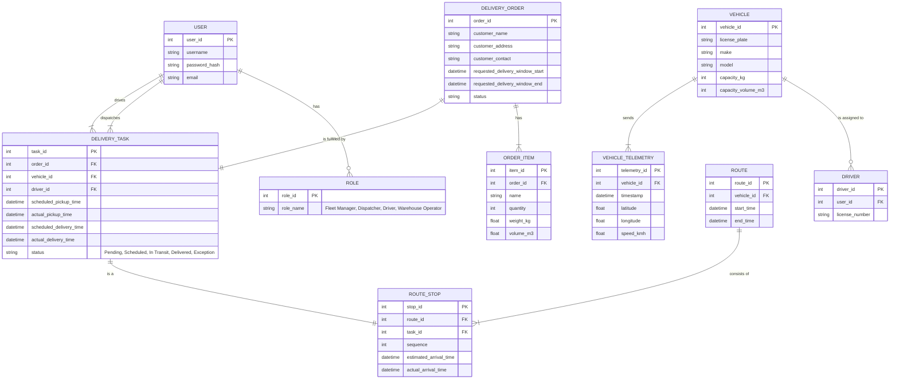

# ERD and Event Schemas

This document contains an initial Entity-Relationship Diagram (ERD) and a set of event schemas for the Fleet Management System.

## Entity-Relationship Diagram (ERD)

The following ERD is in Mermaid syntax and describes the core entities of the FMS.



## Event Schemas

These are example schemas for key events that would be published within the FMS, likely via a message broker like RabbitMQ or Kafka.

### `OrderCreated`

Published when a new order is ingested into the system.

```json
{
  "type": "OrderCreated",
  "version": "1.0",
  "timestamp": "2025-11-10T10:00:00Z",
  "data": {
    "orderId": "ORD-12345",
    "customerDetails": {
      "name": "John Doe",
      "address": "123 Main St, Anytown, USA",
      "contact": "555-1234"
    },
    "items": [
      {
        "sku": "SKU-A",
        "quantity": 10,
        "weight_kg": 5,
        "volume_m3": 0.1
      }
    ],
    "priority": "medium",
    "requestedDeliveryWindow": {
      "start": "2025-11-11T09:00:00Z",
      "end": "2025-11-11T17:00:00Z"
    }
  }
}
```

### `DeliveryTaskScheduled`

Published when an order is assigned to a vehicle and driver with a schedule.

```json
{
  "type": "DeliveryTaskScheduled",
  "version": "1.0",
  "timestamp": "2025-11-10T10:05:00Z",
  "data": {
    "taskId": "TASK-54321",
    "orderId": "ORD-12345",
    "vehicleId": "VEH-001",
    "driverId": "DRV-789",
    "scheduledPickupTime": "2025-11-11T08:00:00Z",
    "scheduledDeliveryTime": "2025-11-11T11:30:00Z"
  }
}
```

### `RouteOptimized`

Published when a new optimized route is generated.

```json
{
  "type": "RouteOptimized",
  "version": "1.0",
  "timestamp": "2025-11-10T10:06:00Z",
  "data": {
    "routeId": "ROUTE-987",
    "vehicleId": "VEH-001",
    "startTime": "2025-11-11T08:00:00Z",
    "stops": [
      {
        "stopId": 1,
        "taskId": "TASK-54321",
        "estimatedArrivalTime": "2025-11-11T09:15:00Z"
      },
      {
        "stopId": 2,
        "taskId": "TASK-54322",
        "estimatedArrivalTime": "2025-11-11T10:45:00Z"
      }
    ],
    "totalDistanceMeters": 25000,
    "totalDurationSeconds": 7200
  }
}
```

### `VehiclePositionUpdated`

Published frequently by the driver's mobile app or vehicle's GPS unit.

```json
{
  "type": "VehiclePositionUpdated",
  "version": "1.0",
  "timestamp": "2025-11-11T09:05:15Z",
  "data": {
    "vehicleId": "VEH-001",
    "latitude": 34.0522,
    "longitude": -118.2437,
    "speed_kmh": 60,
    "heading": 90
  }
}
```

### `DeliveryStatusChanged`

Published when the status of a delivery task changes.

```json
{
  "type": "DeliveryStatusChanged",
  "version": "1.0",
  "timestamp": "2025-11-11T09:15:30Z",
  "data": {
    "taskId": "TASK-54321",
    "newStatus": "Arrived",
    "location": {
      "latitude": 34.0522,
      "longitude": -118.2437
    },
    "proof": {
      "type": "photo",
      "url": "https://fms.example.com/proof/photo-123.jpg"
    }
  }
}
```
