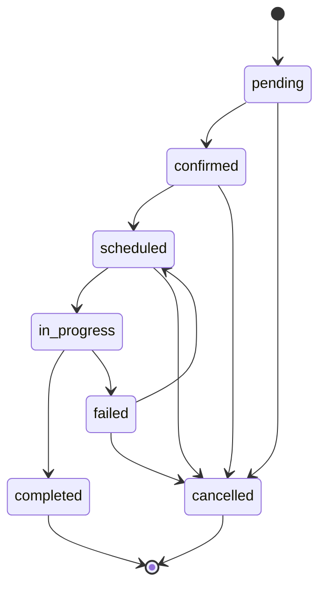
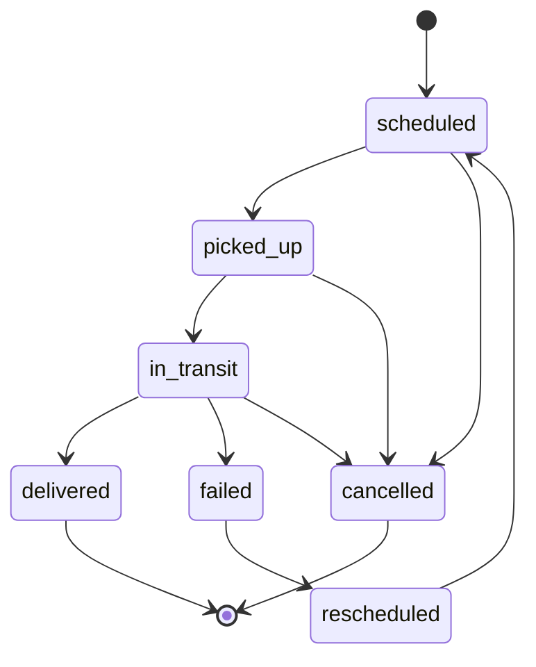

# FMS Data Model and Entity Relationships

## 1. Core Entity Relationships

### 1.1 Entity Relationship Diagram

```
[Tenant] 1..* --[1] [User]
[Tenant] 1..* --[1..*] [Warehouse]
[Tenant] 1..* --[1..*] [Vehicle]
[Tenant] 1..* --[1..*] [Customer]

[Warehouse] 1 --[1..*] [Order]
[Customer] 1..* --[1..*] [Order]

[Order] 1 --[1..*] [OrderItem]
[Order] 1 --[1] [Delivery]

[Delivery] 1 --[1] [Vehicle]
[Delivery] 1 --[1] [Driver]
[Delivery] 1 --[1..*] [RouteStop]

[RouteStop] 1 --[0..1] [ProofOfDelivery]

[Driver] 1 --[0..*] [DriverQualification]
[Vehicle] 1 --[0..*] [VehicleMaintenance]
[Vehicle] 1 --[0..*] [VehicleInspection]
```

## 2. Detailed Entity Definitions

### 2.1 Tenant (Multi-Tenancy Root)
```sql
CREATE TABLE tenants (
    id UUID PRIMARY KEY DEFAULT gen_random_uuid(),
    name VARCHAR(255) NOT NULL,
    domain VARCHAR(255) UNIQUE,
    legal_name VARCHAR(255),
    tax_id VARCHAR(100),
    contact_email VARCHAR(255),
    phone VARCHAR(50),
    timezone VARCHAR(50) DEFAULT 'UTC',
    currency VARCHAR(3) DEFAULT 'USD',
    configuration JSONB NOT NULL DEFAULT '{}',
    billing_plan VARCHAR(50),
    subscription_status VARCHAR(20) DEFAULT 'active',
    created_at TIMESTAMP WITH TIME ZONE DEFAULT CURRENT_TIMESTAMP,
    updated_at TIMESTAMP WITH TIME ZONE DEFAULT CURRENT_TIMESTAMP,
    deleted_at TIMESTAMP WITH TIME ZONE
);

-- Configuration Schema
{
  "features": {
    "route_optimization": true,
    "real_time_tracking": true,
    "customer_notifications": true,
    "advanced_analytics": false
  },
  "integrations": {
    "erp": {
      "enabled": true,
      "type": "sap",
      "endpoint": "https://api.customer-erp.com"
    },
    "payment": {
      "provider": "stripe",
      "webhook_secret": "whsec_..."
    }
  },
  "compliance": {
    "hos_enabled": true,
    "geofencing_required": true,
    "data_retention_days": 2555
  },
  "localization": {
    "date_format": "MM/DD/YYYY",
    "distance_unit": "miles",
    "weight_unit": "lbs",
    "default_language": "en-US"
  }
}
```

### 2.2 User Management
```sql
CREATE TABLE users (
    id UUID PRIMARY KEY DEFAULT gen_random_uuid(),
    tenant_id UUID NOT NULL REFERENCES tenants(id),
    email VARCHAR(255) NOT NULL,
    username VARCHAR(100),
    first_name VARCHAR(100),
    last_name VARCHAR(100),
    phone VARCHAR(50),
    role VARCHAR(50) NOT NULL, -- admin, dispatcher, driver, warehouse_operator
    status VARCHAR(20) DEFAULT 'active', -- active, inactive, suspended
    profile_photo_url TEXT,
    preferences JSONB DEFAULT '{}',
    last_login_at TIMESTAMP WITH TIME ZONE,
    created_at TIMESTAMP WITH TIME ZONE DEFAULT CURRENT_TIMESTAMP,
    updated_at TIMESTAMP WITH TIME ZONE DEFAULT CURRENT_TIMESTAMP,
    UNIQUE(tenant_id, email)
);

CREATE TABLE driver_profiles (
    user_id UUID PRIMARY KEY REFERENCES users(id),
    license_number VARCHAR(100),
    license_expiry DATE,
    license_class VARCHAR(10),
    medical_card_expiry DATE,
    hire_date DATE,
    hourly_rate DECIMAL(10,2),
    max_daily_hours INTEGER,
    max_weekly_hours INTEGER,
    home_location POINT,
    preferred_vehicle_types TEXT[],
    certifications JSONB DEFAULT '[]',
    performance_score DECIMAL(3,2) CHECK (performance_score >= 0 AND performance_score <= 5)
);
```

### 2.3 Warehouse and Locations
```sql
CREATE TABLE warehouses (
    id UUID PRIMARY KEY DEFAULT gen_random_uuid(),
    tenant_id UUID NOT NULL REFERENCES tenants(id),
    name VARCHAR(255) NOT NULL,
    code VARCHAR(50),
    address JSONB NOT NULL,
    location POINT NOT NULL,
    operating_hours JSONB NOT NULL,
    contact_phone VARCHAR(50),
    manager_user_id UUID REFERENCES users(id),
    capacity_vehicles INTEGER,
    capacity_orders INTEGER,
    loading_docks INTEGER,
    timezone VARCHAR(50),
    is_active BOOLEAN DEFAULT true,
    created_at TIMESTAMP WITH TIME ZONE DEFAULT CURRENT_TIMESTAMP,
    updated_at TIMESTAMP WITH TIME ZONE DEFAULT CURRENT_TIMESTAMP
);

-- Address Schema
{
  "street": "123 Main St",
  "city": "Chicago",
  "state": "IL",
  "zip_code": "60601",
  "country": "USA",
  "coordinates": {
    "latitude": 41.8781,
    "longitude": -87.6298
  }
}

-- Operating Hours Schema
{
  "monday": {"open": "08:00", "close": "18:00"},
  "tuesday": {"open": "08:00", "close": "18:00"},
  "wednesday": {"open": "08:00", "close": "18:00"},
  "thursday": {"open": "08:00", "close": "18:00"},
  "friday": {"open": "08:00", "close": "18:00"},
  "saturday": {"open": "closed", "close": "closed"},
  "sunday": {"open": "closed", "close": "closed"}
}
```

### 2.4 Vehicle Management
```sql
CREATE TABLE vehicles (
    id UUID PRIMARY KEY DEFAULT gen_random_uuid(),
    tenant_id UUID NOT NULL REFERENCES tenants(id),
    vin VARCHAR(17) UNIQUE,
    license_plate VARCHAR(50),
    make VARCHAR(100),
    model VARCHAR(100),
    year INTEGER,
    vehicle_type VARCHAR(50), -- truck, van, semi, refrigerated
    status VARCHAR(20) DEFAULT 'available', -- available, in_use, maintenance, out_of_service
    capacity_weight DECIMAL(10,2),
    capacity_volume DECIMAL(10,2),
    fuel_type VARCHAR(20), -- diesel, gasoline, electric, hybrid
    fuel_capacity DECIMAL(8,2),
    current_fuel_level DECIMAL(5,2),
    current_location POINT,
    home_warehouse_id UUID REFERENCES warehouses(id),
    telematics_device_id VARCHAR(100),
    insurance_policy_number VARCHAR(100),
    registration_expiry DATE,
    last_maintenance_date DATE,
    next_maintenance_date DATE,
    specifications JSONB DEFAULT '{}',
    created_at TIMESTAMP WITH TIME ZONE DEFAULT CURRENT_TIMESTAMP,
    updated_at TIMESTAMP WITH TIME ZONE DEFAULT CURRENT_TIMESTAMP
);
```

### 2.5 Customer Management
```sql
CREATE TABLE customers (
    id UUID PRIMARY KEY DEFAULT gen_random_uuid(),
    tenant_id UUID NOT NULL REFERENCES tenants(id),
    customer_code VARCHAR(50),
    name VARCHAR(255) NOT NULL,
    address JSONB NOT NULL,
    location POINT NOT NULL,
    billing_address JSONB,
    contact_phone VARCHAR(50),
    contact_email VARCHAR(255),
    account_manager_user_id UUID REFERENCES users(id),
    payment_terms VARCHAR(50),
    credit_limit DECIMAL(12,2),
    delivery_preferences JSONB DEFAULT '{}',
    is_active BOOLEAN DEFAULT true,
    created_at TIMESTAMP WITH TIME ZONE DEFAULT CURRENT_TIMESTAMP,
    updated_at TIMESTAMP WITH TIME ZONE DEFAULT CURRENT_TIMESTAMP
);
```

### 2.6 Order Management
```sql
CREATE TABLE orders (
    id UUID PRIMARY KEY DEFAULT gen_random_uuid(),
    tenant_id UUID NOT NULL REFERENCES tenants(id),
    external_order_id VARCHAR(255),
    warehouse_id UUID NOT NULL REFERENCES warehouses(id),
    customer_id UUID REFERENCES customers(id),
    order_date TIMESTAMP WITH TIME ZONE DEFAULT CURRENT_TIMESTAMP,
    requested_delivery_date DATE,
    requested_delivery_time_window JSONB,
    priority VARCHAR(20) DEFAULT 'normal', -- urgent, high, normal, low
    status VARCHAR(50) DEFAULT 'pending', -- pending, confirmed, scheduled, in_progress, completed, cancelled
    total_weight DECIMAL(10,2),
    total_volume DECIMAL(10,2),
    total_value DECIMAL(12,2),
    special_instructions TEXT,
    constraints JSONB DEFAULT '{}',
    metadata JSONB DEFAULT '{}',
    created_at TIMESTAMP WITH TIME ZONE DEFAULT CURRENT_TIMESTAMP,
    updated_at TIMESTAMP WITH TIME ZONE DEFAULT CURRENT_TIMESTAMP
);

-- Time Window Schema
{
  "start": "14:00",
  "end": "16:00",
  "flexible": false
}

-- Constraints Schema
{
  "temperature_control": {
    "required": true,
    "min_temp": 35,
    "max_temp": 45
  },
  "hazardous_materials": false,
  "insurance_required": true,
  "equipment_needed": ["pallet_jack", "lift_gate"]
}

CREATE TABLE order_items (
    id UUID PRIMARY KEY DEFAULT gen_random_uuid(),
    order_id UUID NOT NULL REFERENCES orders(id),
    sku VARCHAR(100),
    description TEXT,
    quantity INTEGER NOT NULL,
    unit VARCHAR(20),
    weight_per_unit DECIMAL(8,2),
    dimensions JSONB, -- {"length": 10, "width": 5, "height": 3, "unit": "inches"}
    handling_instructions TEXT,
    serial_numbers TEXT[],
    created_at TIMESTAMP WITH TIME ZONE DEFAULT CURRENT_TIMESTAMP
);
```

### 2.7 Delivery Management
```sql
CREATE TABLE deliveries (
    id UUID PRIMARY KEY DEFAULT gen_random_uuid(),
    order_id UUID NOT NULL REFERENCES orders(id),
    vehicle_id UUID NOT NULL REFERENCES vehicles(id),
    driver_id UUID REFERENCES users(id),
    warehouse_id UUID REFERENCES warehouses(id),
    scheduled_pickup_time TIMESTAMP WITH TIME ZONE,
    scheduled_delivery_time TIMESTAMP WITH TIME ZONE,
    actual_pickup_time TIMESTAMP WITH TIME ZONE,
    actual_delivery_time TIMESTAMP WITH TIME ZONE,
    status VARCHAR(50) DEFAULT 'scheduled', -- scheduled, picked_up, in_transit, delivered, failed
    planned_route JSONB,
    actual_route JSONB,
    planned_distance DECIMAL(10,2),
    actual_distance DECIMAL(10,2),
    planned_duration INTEGER, -- minutes
    actual_duration INTEGER, -- minutes
    optimization_score DECIMAL(3,2),
    notes TEXT,
    exception_reason VARCHAR(255),
    created_at TIMESTAMP WITH TIME ZONE DEFAULT CURRENT_TIMESTAMP,
    updated_at TIMESTAMP WITH TIME ZONE DEFAULT CURRENT_TIMESTAMP
);

CREATE TABLE route_stops (
    id UUID PRIMARY KEY DEFAULT gen_random_uuid(),
    delivery_id UUID NOT NULL REFERENCES deliveries(id),
    stop_sequence INTEGER NOT NULL,
    stop_type VARCHAR(20) NOT NULL, -- pickup, delivery, break, fuel
    location POINT NOT NULL,
    address JSONB NOT NULL,
    contact_name VARCHAR(255),
    contact_phone VARCHAR(50),
    scheduled_arrival TIMESTAMP WITH TIME ZONE,
    estimated_arrival TIMESTAMP WITH TIME ZONE,
    actual_arrival TIMESTAMP WITH TIME ZONE,
    scheduled_departure TIMESTAMP WITH TIME ZONE,
    actual_departure TIMESTAMP WITH TIME ZONE,
    status VARCHAR(20) DEFAULT 'pending', -- pending, arrived, completed, failed
    notes TEXT,
    created_at TIMESTAMP WITH TIME ZONE DEFAULT CURRENT_TIMESTAMP,
    updated_at TIMESTAMP WITH TIME ZONE DEFAULT CURRENT_TIMESTAMP
);
```

### 2.8 Proof of Delivery
```sql
CREATE TABLE proof_of_deliveries (
    id UUID PRIMARY KEY DEFAULT gen_random_uuid(),
    route_stop_id UUID NOT NULL REFERENCES route_stops(id),
    delivery_type VARCHAR(20), -- standard, partial, refused
    recipient_name VARCHAR(255),
    recipient_signature_url TEXT,
    photos JSONB DEFAULT '[]',
    notes TEXT,
    gps_location POINT,
    captured_at TIMESTAMP WITH TIME ZONE DEFAULT CURRENT_TIMESTAMP,
    captured_by_user_id UUID REFERENCES users(id)
);

CREATE TABLE pod_items (
    id UUID PRIMARY KEY DEFAULT gen_random_uuid(),
    pod_id UUID NOT NULL REFERENCES proof_of_deliveries(id),
    order_item_id UUID REFERENCES order_items(id),
    quantity_delivered INTEGER,
    quantity_refused INTEGER,
    reason_code VARCHAR(50),
    notes TEXT
);
```

### 2.9 Tracking and Telematics
```sql
CREATE TABLE vehicle_positions (
    id UUID PRIMARY KEY DEFAULT gen_random_uuid(),
    vehicle_id UUID NOT NULL REFERENCES vehicles(id),
    tenant_id UUID NOT NULL REFERENCES tenants(id),
    location POINT NOT NULL,
    speed DECIMAL(5,2),
    heading DECIMAL(5,2), -- degrees 0-359
    altitude DECIMAL(8,2),
    accuracy DECIMAL(5,2),
    timestamp TIMESTAMP WITH TIME ZONE NOT NULL,
    source VARCHAR(20), -- gps, cellular, wifi, manual
    engine_status VARCHAR(20),
    fuel_level DECIMAL(5,2),
    odometer_reading DECIMAL(10,2),
    created_at TIMESTAMP WITH TIME ZONE DEFAULT CURRENT_TIMESTAMP
);

CREATE TABLE telematics_events (
    id UUID PRIMARY KEY DEFAULT gen_random_uuid(),
    vehicle_id UUID NOT NULL REFERENCES vehicles(id),
    event_type VARCHAR(50) NOT NULL, -- engine_start, engine_stop, speeding, harsh_braking, geofence_breach
    event_timestamp TIMESTAMP WITH TIME ZONE NOT NULL,
    location POINT,
    severity VARCHAR(20), -- low, medium, high, critical
    data JSONB DEFAULT '{}',
    processed BOOLEAN DEFAULT false,
    created_at TIMESTAMP WITH TIME ZONE DEFAULT CURRENT_TIMESTAMP
);
```

### 2.10 Maintenance and Inspections
```sql
CREATE TABLE vehicle_maintenance (
    id UUID PRIMARY KEY DEFAULT gen_random_uuid(),
    vehicle_id UUID NOT NULL REFERENCES vehicles(id),
    maintenance_type VARCHAR(50), -- routine, repair, inspection, tire_change
    description TEXT,
    scheduled_date DATE,
    actual_date DATE,
    odometer_reading DECIMAL(10,2),
    cost DECIMAL(10,2),
    performed_by VARCHAR(255),
    parts_used JSONB DEFAULT '[]',
    next_maintenance_date DATE,
    next_maintenance_odometer DECIMAL(10,2),
    status VARCHAR(20) DEFAULT 'scheduled', -- scheduled, in_progress, completed, cancelled
    created_at TIMESTAMP WITH TIME ZONE DEFAULT CURRENT_TIMESTAMP,
    updated_at TIMESTAMP WITH TIME ZONE DEFAULT CURRENT_TIMESTAMP
);

CREATE TABLE vehicle_inspections (
    id UUID PRIMARY KEY DEFAULT gen_random_uuid(),
    vehicle_id UUID NOT NULL REFERENCES vehicles(id),
    inspection_type VARCHAR(50), -- pre_trip, post_trip, monthly, annual
    inspector_user_id UUID REFERENCES users(id),
    inspection_date TIMESTAMP WITH TIME ZONE DEFAULT CURRENT_TIMESTAMP,
    odometer_reading DECIMAL(10,2),
    passed BOOLEAN,
    defects JSONB DEFAULT '[]',
    photos JSONB DEFAULT '[]',
    notes TEXT,
    next_inspection_date DATE,
    created_at TIMESTAMP WITH TIME ZONE DEFAULT CURRENT_TIMESTAMP
);
```

## 3. State Management

### 3.1 Order State Machine


### 3.2 Delivery State Machine


## 4. Indexes and Performance Optimization

### 4.1 Critical Indexes
```sql
-- Order Performance
CREATE INDEX idx_orders_tenant_status ON orders(tenant_id, status);
CREATE INDEX idx_orders_delivery_date ON orders(requested_delivery_date, tenant_id);
CREATE INDEX idx_orders_customer ON orders(customer_id, order_date);

-- Delivery Performance
CREATE INDEX idx_deliveries_vehicle_date ON deliveries(vehicle_id, scheduled_delivery_time);
CREATE INDEX idx_deliveries_driver_status ON deliveries(driver_id, status);
CREATE INDEX idx_deliveries_tenant ON deliveries(tenant_id, created_at);

-- Tracking Performance
CREATE INDEX idx_vehicle_positions_vehicle_time ON vehicle_positions(vehicle_id, timestamp DESC);
CREATE INDEX idx_vehicle_positions_location ON vehicle_positions USING GIST(location);
CREATE INDEX idx_telematics_vehicle_type ON telematics_events(vehicle_id, event_type);

-- Search Performance
CREATE INDEX idx_customers_tenant ON customers(tenant_id, name);
CREATE INDEX idx_vehicles_tenant_type ON vehicles(tenant_id, vehicle_type, status);
CREATE INDEX idx_users_tenant_role ON users(tenant_id, role, status);
```

## 5. Data Retention and Archival

### 5.1 Retention Policies
```sql
-- Archival Strategy
CREATE TABLE archived_orders (LIKE orders INCLUDING ALL);
CREATE TABLE archived_deliveries (LIKE deliveries INCLUDING ALL);
CREATE TABLE archived_vehicle_positions (LIKE vehicle_positions INCLUDING ALL);

-- Archival Procedure
CREATE OR REPLACE FUNCTION archive_old_data()
RETURNS void AS $$
BEGIN
    -- Archive orders older than 7 years
    INSERT INTO archived_orders
    SELECT * FROM orders 
    WHERE updated_at < CURRENT_DATE - INTERVAL '7 years';
    
    DELETE FROM orders 
    WHERE updated_at < CURRENT_DATE - INTERVAL '7 years';
    
    -- Archive vehicle positions older than 30 days
    INSERT INTO archived_vehicle_positions
    SELECT * FROM vehicle_positions 
    WHERE timestamp < CURRENT_TIMESTAMP - INTERVAL '30 days';
    
    DELETE FROM vehicle_positions 
    WHERE timestamp < CURRENT_TIMESTAMP - INTERVAL '30 days';
END;
$$ LANGUAGE plpgsql;

-- Schedule archiving to run weekly
SELECT cron.schedule('archive-old-data', '0 2 * * 0', 'SELECT archive_old_data();');
```