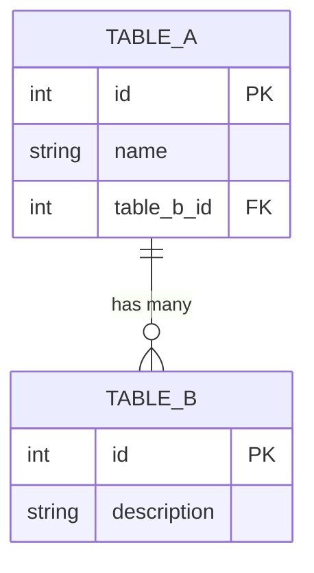

# Create Schema Diagrams

Phase 4 of the OKF deployment workflow. If the project has a database schema (SQL, SpacetimeDB, Prisma, etc.), create mermaid ER diagram concepts to document the data model.

## Step 1: Read Schema Source

Identify and read the schema source files to determine all tables, columns, primary keys, foreign keys, and relationships. Also read any existing schema reference docs in `docs/` or `docs/design/`.

## Step 2: Group Tables by Domain

Group tables into logical domains. For example:
- **Planning:** planning_tables, route_tables, schedule_tables
- **Orders:** order_tables, fulfillment_tables
- **Users:** user_tables, auth_tables, profile_tables
- **Inventory:** inventory_tables, stock_tables

## Step 3: Create Domain Concepts

For each domain, create a concept file in `knowledge/domain/` with:

- Type: `Domain`
- A mermaid `erDiagram` code block showing all tables in that domain with key columns (PK, FK, business-critical fields)
- Relationship lines within the domain
- Table descriptions
- Cross-domain relationship notes (mention but do not draw cross-domain lines)

## Mermaid erDiagram Syntax

### Relationship Line Types

| Syntax | Meaning |
|--------|---------|
| `\|\|--o{` | One to many |
| `\|\|--\|\|` | One to one |
| `}o--o{` | Many to many |

### Column Annotations

- `PK` - Primary key
- `FK` - Foreign key
- Other columns listed by name and type

## Step 4: Create Architecture Index Concept

Create an architecture concept that indexes all domain diagrams with a high-level domain relationship graph. This provides a top-level view of how domains relate to each other.

## Step 5: Update Indexes and Log

- Update `knowledge/domain/index.md` with the new domain concept rows.
- Update `knowledge/architecture/index.md` with the schema index concept.
- Update the root `index.md` with accurate counts.
- Update `knowledge/log.md` with a schema diagram entry.

## Viewer Rendering

The OKF viewer detects mermaid `erDiagram` code blocks in concept bodies and renders them inline using mermaid.js. The viewer scans for `<pre><code>` blocks whose content starts with `erDiagram`, replaces them with mermaid divs, and calls `mermaid.run()`. See [Viewer Architecture](../architecture/viewer-architecture.md).

## Best Practices

- Show only key columns (PK, FK, business-critical fields), not every column.
- Keep diagram readability high; too many tables in one diagram becomes unreadable.
- Use cross-domain notes to mention relationships that span domains without drawing them.
- Include table descriptions as comments or text below the diagram.
