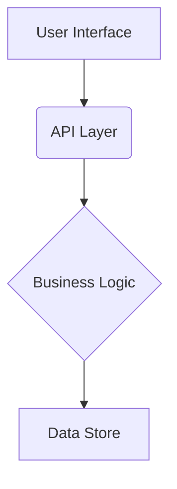

# 01 - Architecture Overview

## 1. Introduction

Provide a brief overview of the project, its purpose, and the problem it solves.

## 2. High-Level Architecture

Insert a high-level diagram of the system architecture (e.g., using Mermaid or an embedded image). This should show the main components and their interactions.

## 3. Components

### 3.1. Component A (e.g., User Interface)

- **Description:** Describe the component's responsibilities.
- **Technologies:** List the technologies used (e.g., React, Vue, etc.).

### 3.2. Component B (e.g., API Layer)

- **Description:** Describe the component's responsibilities.
- **Technologies:** List the technologies used (e.g., Node.js, Python, etc.).

## 4. Data Flow

Describe how data flows through the system. For example, how a user request is processed from the UI to the database and back.

## 5. Design Principles

List the key design principles and patterns used in the architecture (e.g., microservices, serverless, SOLID principles, etc.).
