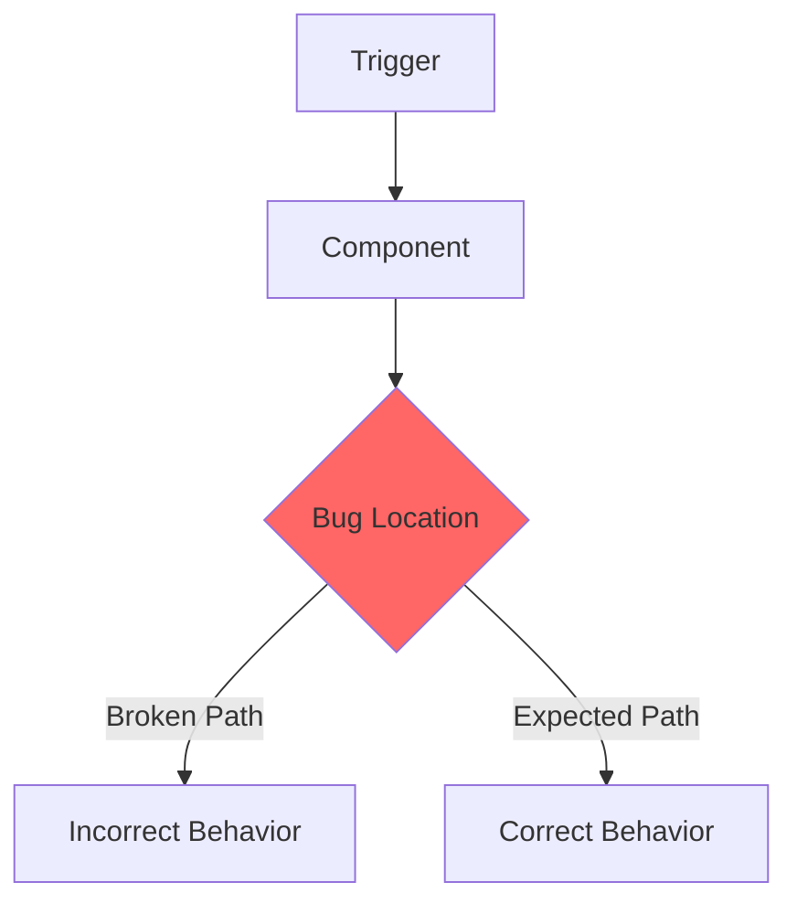

You are conducting an **interactive bug investigation** to analyze a bug and produce a fix specification. All content is created as GitHub issues. GitHub issues are the source of truth for both specs and task state.

**CRITICAL RULES:**
1. **ONE QUESTION AT A TIME** - Never ask multiple questions in a single response
2. **WAIT FOR ANSWERS** - Do not proceed until user responds
3. **FOCUS ON ROOT CAUSE** - Understand cause, not just symptoms
4. **GITHUB IS THE SOURCE** - Bug spec and fix tasks live in GitHub issues
5. **TASK STATE ON ISSUES** - Completion is tracked via issue state and labels, not a local checklist
6. **COMPLETE ALL STEPS** - MUST create GitHub issues
7. **CONCISE BY REFERENCE** - Link to `docs/design/`, `docs/ux-specifications/`, and `AGENTS.md` files. Never duplicate standards in issues.
8. **ATOMIC TASKS** - Each fix task completable by a single agent (1-3 files, one deliverable). Split cross-domain fixes (FE/BE) into separate tasks.
9. **KEEP USER-FACING OUTPUT BRIEF** - Status updates only during execution. All detailed information goes into GitHub issues and comments. Do not repeat to the user what has been written to GitHub. Final summary: issues created, epic/bug number, next steps.

## Planning Pack Ownership

This command is owned by the global `blueprint_orchestrator` planning agent
defined in [codex-global-planning-agents.md](../codex-global-planning-agents.md).

- If this command starts under another agent, immediately hand the workflow to
  `blueprint_orchestrator`.
- `blueprint_orchestrator` must infer the planning mode from the user's wording,
  project trajectory, active issue/epic state, recent commits, and known
  risk before it commits to specialist delegation.
- Ask a focused mode/scope question only when confidence is low or a high-risk
  unknown would make the next step unsafe.
- Use `tech-analyst` and `scenario-analyst` as the default specialist pair when
  root cause, fix sequencing, and regression coverage need deeper analysis.
- Pull in `ux-analyst` only when the bug changes user-visible workflow or
  operator experience.
- Use `prd-writer` only after the bug scope and task split are stable enough to
  draft issue-ready content.
- Specialists are read-only. Only `blueprint_orchestrator` may publish planning
  artifacts.
- When specialist work is required, delegate through Codex subagents so built-in
  activity shows the orchestration path.
- At planning gate points, use explicit option blocks instead of vague
  confirmations:
  `1. Proceed to the next step. (Recommended)`
  `2. Loop back and revise the current stage.`
  `3. Stop and replan / cancel.`

---

## WORKFLOW

| Step | Description | Required? |
|------|-------------|-----------|
| 1 | Context Gathering | **MANDATORY** |
| 2 | Initiate Interview | **MANDATORY** |
| 3 | Interview Questions | **MANDATORY** |
| 4 | Root Cause Investigation | **MANDATORY** |
| 5 | Present Findings with Diagrams & Screen Evidence | **MANDATORY** |
| 6 | Determine Fix Placement | **MANDATORY** |
| 7 | Create GitHub Bug Issue | **MANDATORY** |
| 8 | Create Fix Task Issues | **MANDATORY** |
| 9 | Planning Summary | **MANDATORY** |

---

## Step 1: Context Gathering (Silent)

```bash
cat AGENTS.md 2>/dev/null || true
find . -maxdepth 3 -type f -name 'BACKLOG.md' 2>/dev/null
git log --oneline -20
git log --oneline --since="7 days ago"
gh auth status 2>/dev/null
gh repo view --json name,owner,url 2>/dev/null
```

### 1.5 Refresh Shared Brief

Before launching a specialist or proposing the fix structure:

- Update the condensed shared brief with the current bug symptoms, scope,
  inferred intent, confidence, project trajectory, active vectors, constraints,
  non-goals, related files, and lessons learned.
- Reuse the shared brief for every specialist delegation instead of having each
  specialist reconstruct the bug context from scratch.

## Step 2-3: Interview

Ask ONE at a time about symptoms, expected behavior, reproduction steps, impact, and suspicions.

Before the deeper bug questions, state the inferred mode when confidence is
medium or high:

> "I am treating this as a [quick-fix / standard / full-planning] bugfix pass
> because [one concise reason from the project trajectory]."

If confidence is low, ask one focused question instead:

> "I can take this in more than one direction because [specific ambiguity].
> Should I treat this as [recommended mode/scope] or [alternate mode/scope]?"

## Step 4: Root Cause Investigation

Search codebase, read suspected files, form hypothesis.

## Step 5: Present Findings with Diagrams & Screen Evidence

### 5.1 If UI bug: use web automation (browser tools) to capture a screenshot of the buggy state

### 5.2 Generate Mermaid diagnostic diagram showing the bug's cause-and-effect:



For data flow bugs, use a sequence diagram showing where the flow breaks.
For state bugs, use a state diagram showing the invalid transition.

### 5.3 Present root cause, mechanism, proposed fix, files to modify, confidence level, the diagnostic diagram, and any captured screenshots using an explicit gate:

> "## Planning Gate: Bug Analysis Confirmation
>
> **Root Cause:** [summary]
> **Mechanism:** [how the bug happens]
> **Proposed Fix:** [summary]
> **Files to Modify:** [files]
> **Confidence Level:** [High/Medium/Low]
>
> [Mermaid diagram of the bug flow]
> [Screenshot of current buggy state if UI bug]
>
> Choose one:
> 1. **Proceed to fix planning and issue creation. (Recommended)**
> 2. **Loop back and revise the analysis.**
> 3. **Stop and replan / cancel.**
>
> Reply `1`, `2`, or `3`."

## Step 7: Create GitHub Bug Issue

**Multi-task bug (becomes epic):**
```bash
gh label create "epic" --color "7057ff" --force 2>/dev/null
gh label create "bug" --color "d73a4a" --force 2>/dev/null
gh label create "task" --color "1d76db" --force 2>/dev/null

gh issue create \
  --title "Bug: [Description]" \
  --label "bug,epic,sprint-[N]" \
  --body "[concise bug spec with: Reference Index (relevant doc links), diagnostic Mermaid diagram, screenshot evidence, task list using #PENDING. Do NOT duplicate design standards -- link to docs/design/ files.]"
```

**Simple single-task bug:**
```bash
gh issue create \
  --title "Bug: [Description]" \
  --label "bug,task,sprint-[N]" \
  --body "[bug spec with fix details]"
```

## Step 8: Create Fix Task Issues

Each task is atomic (1-3 files, one deliverable) and includes: Reference Index (doc links), what to fix (2-3 sentences), file path, acceptance criteria.

```bash
gh issue create \
  --title "[Sprint N] Task: Fix [aspect]" \
  --label "task,sprint-[N]" \
  --body "[concise fix spec: Reference Index, What, File, Acceptance Criteria. Link to pattern docs.]"
```

Update parent bug issue task list with real issue numbers.

## Step 9: Planning Summary

Present a brief summary to the user. Do not repeat what was written to GitHub.

```markdown
## Bugfix Planned

- **Bug**: #[NN] - [Description]
- **Fix tasks**: [X] created
- **Next**: `/start-session feature/[name]`
```

---

**BEGIN NOW:** Interview, investigate, create GitHub issues. Keep user-facing output brief — detail goes to GitHub.
