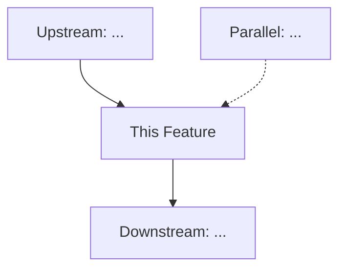
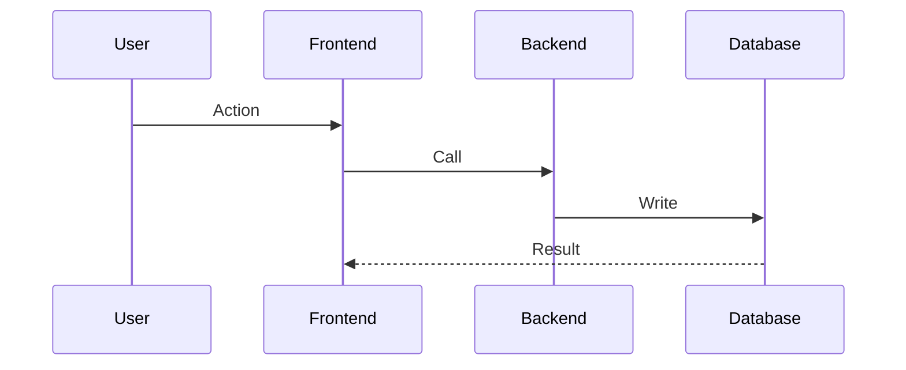
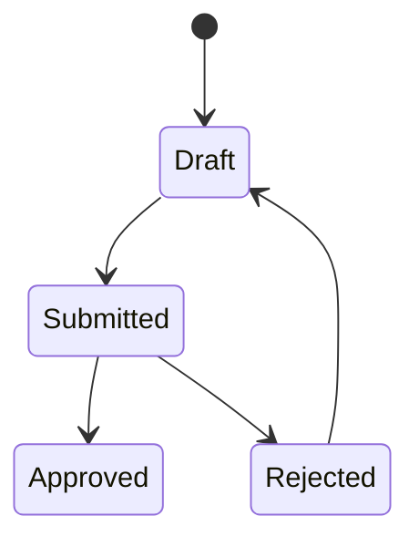
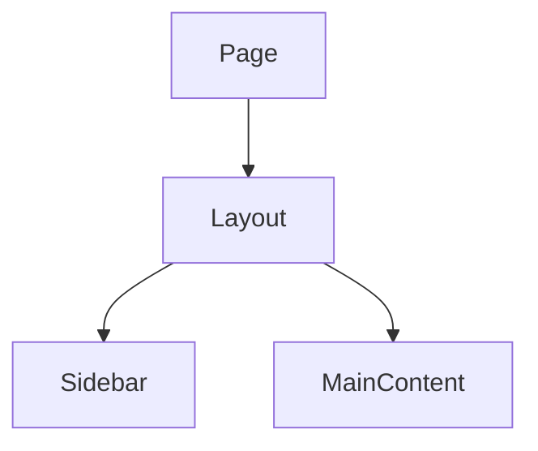
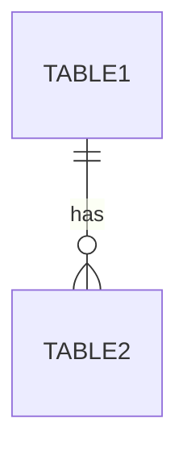

You are conducting an **interactive planning session** to scope a new feature. This process will interview the user, analyze the codebase, and produce GitHub issues containing all specification content. The local implementation checklist references issue numbers and serves as the final sign-off authority.

**CRITICAL RULES:**
1. **ONE QUESTION AT A TIME** - Never ask multiple questions in a single response
2. **WAIT FOR ANSWERS** - Do not proceed until the user responds
3. **INTERVIEW MODE** - This is a conversation, not a checklist dump
4. **GITHUB IS THE SHARD** - Issue bodies contain all spec content (no local shard .md files)
5. **CHECKLIST IS FINAL AUTHORITY** - Local checklist is the last sign-off on completion
6. **COMPLETE ALL MANDATORY STEPS** - You MUST complete Steps 1-4 (interview), then Steps 6-10 (GitHub issues + checklist). Do NOT stop after the interview.
7. **CONCISE BY REFERENCE** - Link to existing docs (design, UX, patterns), NEVER duplicate their content in issue bodies
8. **ATOMIC TASKS** - Each task must be completable by a single agent in one session (1-3 files, one deliverable)

## Planning Pack Ownership

This command is owned by the global `blueprint_orchestrator` planning agent
defined in [codex-global-planning-agents.md](../codex-global-planning-agents.md).

- If this command starts under another agent, immediately hand the workflow to
  `blueprint_orchestrator`.
- `blueprint_orchestrator` must ask whether the user wants a `quick-fix` pass or
  the full planning flow before it commits to specialist delegation.
- `blueprint_orchestrator` may delegate conditionally to `req-analyst`,
  `ux-analyst`, `scenario-analyst`, `tech-analyst`, and `prd-writer`.
- Every delegation must start from the latest condensed shared brief and require
  the fixed payload described in the planning-agent contract.
- Specialists are read-only. Only `blueprint_orchestrator` may publish planning
  issues or update the checklist.
- When specialist work is needed, delegate through Codex subagents instead of
  emulating specialist analysis inline so built-in activity reflects the run.
- At planning gate points, use explicit option blocks instead of vague
  confirmations:
  `1. Proceed to the next step. (Recommended)`
  `2. Loop back and revise the current stage.`
  `3. Stop and replan / cancel.`

## Documentation Reference Strategy

Issue bodies MUST start with a **Reference Index** linking to relevant project docs.
Do NOT copy design standards, patterns, or UX specs into issues. Link to them.

Check `docs/design/`, `docs/ux-specifications/`, `docs/user-guide/`, and per-module `AGENTS.md` files for existing standards. If a needed standard doesn't exist, flag it as a "Standards Gap" in the epic -- the implementing agent must create the doc before implementing.

## Atomic Task Sizing

Tasks must be small enough for a single agent to complete independently:
- **1-3 files, single concern** = good task size
- **4+ files or mixed FE/BE** = split into separate tasks
- **New component + hook + API** = 3 separate tasks
- Each task has ONE clear deliverable, its own acceptance criteria, and explicit dependencies
- Task bodies are concise: what, where, link to pattern doc, acceptance criteria. No long prose.

---

## MANDATORY WORKFLOW OVERVIEW

| Step | Description | Required? |
|------|-------------|-----------|
| 1 | Context Gathering | **MANDATORY** |
| 2 | Initiate Interview | **MANDATORY** |
| 3 | Interview Questions | **MANDATORY** |
| 4 | Confirm Understanding | **MANDATORY** |
| 5 | Workflow Impact, Diagrams & Screen Capture | **MANDATORY** |
| 5b | Deep Analysis (kingmode) | OPTIONAL - only if complex |
| 6 | Determine Sprint Placement | **MANDATORY** |
| 7 | Create GitHub Epic Issue | **MANDATORY** |
| 8 | Create Task and Sub-task Issues | **MANDATORY** |
| 9 | Update Implementation Checklist | **MANDATORY** |
| 10 | Planning Summary | **MANDATORY** |

**DO NOT STOP after Step 4.** After user confirms understanding, you MUST proceed to Step 5 (workflow impact analysis, diagrams, screen capture), then create GitHub issues (Steps 7-8) and update the checklist (Step 9).

---

## Step 1: Context Gathering

**ACTION REQUIRED:** Before engaging the user, silently gather context about the project.

### 1.1 Review Project Documentation

Read these files if they exist (do not report errors if missing):

```bash
cat AGENTS.md 2>/dev/null || true
cat CLAUDE.md 2>/dev/null
cat README.md 2>/dev/null
```

### 1.2 Check Implementation Status

```bash
cat features/00-IMPLEMENTATION-CHECKLIST.md 2>/dev/null
```

### 1.3 Review Recent Git Activity

```bash
git log --oneline -15
git status
git branch --show-current
```

### 1.4 Identify Tech Stack

```bash
cat package.json 2>/dev/null | head -50
cat pyproject.toml 2>/dev/null | head -30
ls -la src/ 2>/dev/null || ls -la app/ 2>/dev/null || ls -la lib/ 2>/dev/null
```

### 1.5 Verify GitHub Access

```bash
gh auth status 2>/dev/null
gh repo view --json name,owner,url 2>/dev/null || echo "NO_GITHUB_REPO"
gh label list --limit 100 2>/dev/null
```

**If gh not authenticated:**
> "GitHub CLI is not authenticated. Run `gh auth login` first, then re-run `/plan-feature`."

**Store this context internally. Do not output it to the user yet.**

### 1.6 Refresh Shared Brief

Before asking the next question or launching a specialist:

- Update the condensed shared brief with the current command, scope,
  constraints, non-goals, references, and lessons learned.
- Reuse the shared brief for every specialist delegation instead of rebuilding
  project context from scratch.

---

## Step 2: Initiate Interview

**ACTION REQUIRED:** Begin the interview. If the user provided an initial prompt, acknowledge it and start clarifying. If not, ask the opening question.

### 2.1 Opening (if no initial prompt provided)

> "Let's plan your new feature. To create a solid implementation spec, I'll ask you some questions one at a time.
>
> **What feature would you like to build?**
>
> Please describe it in your own words - it can be rough, we'll refine it together."

### 2.2 Opening (if initial prompt WAS provided)

> "I see you want to build: [summarize their prompt in 1-2 sentences]
>
> Let me ask some clarifying questions to fully scope this out.
>
> **Before I start, do you want a quick-fix pass or the full planning flow?**"

---

## Step 3: Interview Questions

**INTERVIEW PROTOCOL:**
- Ask ONE question, wait for response
- Acknowledge their answer briefly before the next question
- Adapt questions based on their responses
- Skip questions that have already been answered
- Keep a running mental model of the feature

### 3.1 WHAT - Feature Definition

Ask these (one at a time, as needed):

1. "What problem does this feature solve for users?"
2. "Can you describe the user journey? What does the user do step-by-step?"
3. "What should the user see/experience when this feature is complete?"
4. "Are there any existing features this interacts with or extends?"

### 3.2 WHY - Business Context

Ask these (one at a time, as needed):

1. "Why is this feature needed now? What's driving this?"
2. "Who is the primary user of this feature?"

### 3.3 HOW - Technical Scope

Ask these (one at a time, as needed):

1. "Do you have preferences for how this should be implemented technically?"
2. "Are there any technical constraints I should know about? (APIs, libraries, patterns)"
3. "Should this follow any existing patterns in the codebase?"

### 3.4 WORKFLOW IMPACTS (MANDATORY)

Ask these (one at a time, as needed):

1. "What existing workflows feed INTO this feature? (upstream -- e.g., what triggers it, where does data come from)"
2. "What workflows does this feature feed INTO? (downstream -- e.g., what consumes its output, what happens next)"
3. "Are there any workflows that run in parallel or could be affected indirectly?"

### 3.5 SCOPE - MVP Definition

Ask these (one at a time, as needed):

1. "What's the minimum version of this feature that would be useful? (MVP)"
2. "What could we defer to a future iteration?"

### 3.6 ACCEPTANCE - Success Criteria

Ask this to conclude:

1. "How will we know this feature is complete? What would you test?"

### 3.7 SCREEN CONTEXT (if UI feature)

- "Is there an existing screen or page this modifies or extends?"
- If yes: use web automation (browser tools) to capture a screenshot of the current state for reference

---

## Step 4: Interview Completion Check

**After gathering sufficient information, confirm understanding with an explicit gate:**

> "## Planning Gate: Summary Confirmation
>
> **Feature:** [Name/Title]
>
> **Problem:** [What problem it solves]
>
> **User Journey:**
> 1. [Step 1]
> 2. [Step 2]
> 3. [etc.]
>
> **MVP Scope:**
> - [Core requirement 1]
> - [Core requirement 2]
>
> **Deferred/Future:**
> - [Nice-to-have 1]
>
> **Technical Notes:**
> - [Any constraints or preferences mentioned]
>
> Choose one:
> 1. **Proceed to workflow analysis and issue creation. (Recommended)**
> 2. **Loop back and revise this summary.**
> 3. **Stop and replan / cancel.**
>
> Reply `1`, `2`, or `3`."

**IMPORTANT: Once user confirms, you MUST proceed to Step 5 (workflow impact & diagrams). Do NOT stop here.**

---

## Step 5: Workflow Impact Analysis, Diagrams & Screen Capture (MANDATORY)

This step produces visual documentation that gets embedded in the GitHub epic issue body.

### 5.1 Upstream/Downstream Workflow Impact Analysis

Identify ALL workflows that interact with this feature:

```bash
# Search for related workflows, components, and data flows
rg -l "[related-keyword]" src/ convex/
rg "import.*from.*[related-module]" src/ --type ts -l
```

Document:
- **Upstream Workflows** -- what feeds data or triggers into this feature
- **Downstream Workflows** -- what consumes this feature's output
- **Parallel/Indirect Impacts** -- shared state, resources, side effects

### 5.2 Mermaid Diagrams (MANDATORY)

Generate Mermaid diagrams appropriate to the feature. Include at minimum ONE of these in the epic body:

**Workflow/process features -- Flowchart:**


**Data flow features -- Sequence Diagram:**


**State management -- State Diagram:**


**Component hierarchy:**


**Schema/data -- ER Diagram:**


Use MULTIPLE diagram types if the feature spans data flow, UI, and state transitions.

### 5.3 Screen Capture / UI Reference (if UI feature)

**If modifying an existing screen:**
1. Use web automation (browser tools) to navigate to the page and take a screenshot
2. Embed in the epic issue body or upload to GitHub

**If a new screen with no existing page:**
1. Create an ASCII wireframe of the proposed layout:

```
+--------------------------------------------------+
|  Header Bar                         [Actions v]   |
+----------+---------------------------------------+
|          |                                        |
| Sidebar  |  Main Content Area                     |
|          |                                        |
| - Nav 1  |  +----------------------------------+  |
| - Nav 2  |  |  Data Table / Card Grid           |  |
| - Nav 3  |  |  Row 1  [col1] [col2] [col3]    |  |
|          |  +----------------------------------+  |
|          |                                        |
|          |  +----------------------------------+  |
|          |  |  Inspector / Detail Panel          |  |
|          |  +----------------------------------+  |
+----------+---------------------------------------+
|  Status Bar                                       |
+--------------------------------------------------+
```

**For complex UI changes**, capture BOTH current state (screenshot) and proposed state (ASCII wireframe).

---

## Step 5b: Deep Analysis (OPTIONAL)

Only trigger if the feature is complex (3+ components, integrations, or architectural decisions):

> "This feature has some complexity. Let me do a deeper analysis before creating the spec..."

**Activate `/kingmode` analysis.** If the feature is simple, skip to Step 6.

---

## Step 6: Determine Sprint Placement (MANDATORY)

### 6.1 Read Current Checklist

```bash
cat features/00-IMPLEMENTATION-CHECKLIST.md 2>/dev/null
```

### 6.2 Analyze State

Check for existing incomplete sprints (`- [ ]` items) and determine next sprint number.

### 6.3 Handle Existing Incomplete Sprints

**If there ARE incomplete sprints:**

> "I see there are incomplete items in existing sprints:
>
> **[Sprint X: Name]**
> - [ ] #[issue] - [Incomplete item 1]
>
> For this new feature, would you like to:
> 1. **Create a new sprint** - Add as Sprint [N+1]
> 2. **Add to existing sprint** - Incorporate into Sprint X
>
> Reply 1 or 2."

---

## Step 7: Create GitHub Epic Issue (MANDATORY)

**ACTION REQUIRED:** Create the epic issue in GitHub. The epic body IS the specification.

### 7.1 Ensure Required Labels Exist

```bash
gh label create "epic" --description "Epic-level feature issue" --color "7057ff" --force 2>/dev/null
gh label create "phase" --description "Phase/sprint-level issue" --color "0e8a16" --force 2>/dev/null
gh label create "task" --description "Implementable task issue" --color "1d76db" --force 2>/dev/null
gh label create "sub-task" --description "Sub-task of a task" --color "c5def5" --force 2>/dev/null
```

### 7.2 Create the Epic

The epic body contains the full technical specification. This replaces the local shard file:

```bash
gh issue create \
  --title "Epic: [Feature Name]" \
  --label "epic,sprint-[N]" \
  --body "## [Feature Name] - Technical Specification

**Sprint**: Sprint [N] | **Created**: [DATE] | **Priority**: [High/Medium/Low]

---

### Reference Index
- **Design System**: [DESIGN_ANALYSIS.md](docs/design/DESIGN_ANALYSIS.md)
- **UI Patterns**: [UI-PATTERNS.md](docs/design/UI-PATTERNS.md)
- **[Relevant Pattern]**: [docs/design/[PATTERN].md](docs/design/[PATTERN].md)

> Agents: read linked docs for design standards. Do not duplicate their content here.

### Standards Gap
[If feature needs a pattern that doesn't exist, list it. Agent must create the standard doc first.]

---

## 1. Overview

**Problem**: [1-2 sentences]
**Solution**: [1-2 sentences]
**User Story**: As a [user type], I want to [action], so that [benefit].

---

## 2. User Journey

1. [Step 1]
2. [Step 2]

**Error flows**: [Brief or 'None']

---

## 3. Workflow Impact

| Direction | Workflow | Impact |
|-----------|----------|--------|
| Upstream | [What feeds in] | [How] |
| Downstream | [What consumes] | [How] |

\`\`\`mermaid
flowchart TD
    A[Upstream] --> B[This Feature]
    B --> C[Downstream]
\`\`\`

---

## 4. Technical Requirements

| Component | Type | Location |
|-----------|------|----------|
| [Name] | [type] | \`src/...\` |

**Data/State**: [Brief] | **Dependencies**: [Brief]

\`\`\`mermaid
sequenceDiagram
    participant U as User
    participant FE as Frontend
    participant API as Backend
    U->>FE: Action
    FE->>API: Call
    API-->>FE: Result
\`\`\`

---

## 5. UI Reference

[Screenshot or ASCII wireframe]

---

## 6. Task Breakdown

### Phase 1: [Name]
- [ ] #PENDING - [Task 1]
- [ ] #PENDING - [Task 2]

### Phase 2: [Name]
- [ ] #PENDING - [Task 3]
- [ ] #PENDING - [Task 4]

---

## 7. Acceptance Criteria
- [ ] [Criterion 1]
- [ ] [Criterion 2]

## 8. Out of Scope
- [Deferred items]

---

*Generated by /plan-feature on [DATE]*
"
```

**Capture the epic issue number.**

---

## Step 8: Create Task and Sub-task Issues (MANDATORY)

### 8.1 Issue Hierarchy

```
Epic Issue (#E)           -- label: epic
  ├── Task Issue (#T1)    -- label: task
  │     ├── Sub-task (#S1) -- label: sub-task
  │     └── Sub-task (#S2) -- label: sub-task
  ├── Task Issue (#T2)
  └── Task Issue (#T3)
```

### 8.2 Task Issue Quality Standard

**Each task must be atomic**: completable by a single agent in one session (1-3 files, one deliverable).
Keep bodies concise -- link to docs for standards, don't duplicate. Include:

- Reference Index (2-3 relevant doc links)
- What to build (2-3 sentences)
- Exact file paths
- Acceptance criteria (checkboxes)
- Dependencies on other tasks (if any)
- Acceptance criteria
- Verification steps

### 8.3 Create Task Issues

For each task:

```bash
gh issue create \
  --title "[Sprint N] Task: [Task Name]" \
  --label "task,sprint-[N]" \
  --body "## Task: [Task Name]

**Epic**: #[EPIC] | **Sprint**: Sprint [N] | **Depends on**: [#TASK or 'None']

### Reference Index
- **Pattern**: [docs/design/[RELEVANT-PATTERN].md](docs/design/[RELEVANT-PATTERN].md)
- **Follow**: \`src/components/[existing]/[Component].tsx\`
- **AGENTS.md**: [src/components/AGENTS.md](src/components/AGENTS.md)

> Agent: read linked docs for design standards and coding patterns before implementing.

### What
[2-3 sentences: what to build/modify and why]

### Files
- \`src/[path]/[File].tsx\` - [Create/Modify: brief]
- \`src/[path]/[File].ts\` - [Create/Modify: brief]

### Interface (if new)
\`\`\`typescript
interface [Props] { /* key props only */ }
\`\`\`

### Acceptance Criteria
- [ ] [Criterion 1]
- [ ] [Criterion 2]

### Tests
- \`[path/to/test]\` -- [test case 1], [test case 2]

### Sub-tasks
- [ ] #PENDING - [Sub-task if needed]

---
*Part of Epic #[EPIC]*
"
```

### 8.4 Create Sub-task Issues (3rd level, if needed)

```bash
gh issue create \
  --title "[Sprint N] Sub-task: [Sub-task Name]" \
  --label "sub-task,sprint-[N]" \
  --body "## Sub-task: [Sub-task Name]

**Task**: #[TASK] | **Epic**: #[EPIC]

### What
[1-2 sentences]

### File
\`[exact/file/path]\`

### Done When
- [ ] [Verification criterion]

---
*Part of #[TASK]*
"
```

### 8.5 Update Parent Issue Checklists

After all issues are created, update epic and task bodies to replace `#PENDING` with actual issue numbers:

```bash
gh issue edit [EPIC] --body "[updated body with real issue numbers]"
gh issue edit [TASK] --body "[updated body with real sub-task numbers]"
```

---

## Step 9: Update Implementation Checklist (MANDATORY)

The local checklist references GitHub issue numbers and is the final sign-off authority.

### 9.1 Ensure directory exists

```bash
mkdir -p features
```

### 9.2 Edit the checklist

Add to `features/00-IMPLEMENTATION-CHECKLIST.md`:

```markdown
---

## Sprint [N]: [Feature Name]
**Goal**: [One-line goal]
**Epic**: #[EPIC_NUMBER]

### Phase 1: [Phase Name]
- [ ] #[TASK_1] - [Task 1 name]
- [ ] #[TASK_2] - [Task 2 name]

### Phase 2: [Phase Name]
- [ ] #[TASK_3] - [Task 3 name]
- [ ] #[TASK_4] - [Task 4 name]
```

**If checklist doesn't exist**, create it:

```markdown
# Implementation Checklist

Track implementation progress. Each item references a GitHub issue.
Check off items here as the final sign-off that work is complete.

---

## Sprint 1: [Feature Name]
**Goal**: [Goal]
**Epic**: #[EPIC_NUMBER]

### Phase 1: [Phase Name]
- [ ] #[TASK_1] - [Task 1 name]
```

### 9.3 Verify the edit

Read the file to confirm changes applied correctly.

---

## Step 10: Planning Summary (MANDATORY)

```markdown
## Feature Planning Complete

### GitHub Issues Created
- **Epic**: #[EPIC] - [Feature Name]
- **Tasks**: [X] task issues
- **Sub-tasks**: [Y] sub-task issues

### Issue Numbers
| Issue | Type | Title |
|-------|------|-------|
| #[E] | Epic | [Feature Name] |
| #[T1] | Task | [Task 1] |
| #[T2] | Task | [Task 2] |
| #[S1] | Sub-task | [Sub-task 1] |

### Checklist Updated
- `features/00-IMPLEMENTATION-CHECKLIST.md` - Sprint [N] added with issue references

### Next Steps
To begin implementation:
```
/start-session feature/[feature-name]
```

Or continue existing work:
```
/next-phase
```
```

---

## Handling Edge Cases

### User cancels mid-interview
> "Planning cancelled. No issues created. Run `/plan-feature` again when ready."

### gh not authenticated
> "GitHub CLI not authenticated. Run `gh auth login` first."

### No GitHub repo
> "This directory isn't connected to a GitHub repository. Run `gh repo view` to verify."

### Checklist doesn't exist
Create it with new sprint as Sprint 1.

### Features directory doesn't exist
```bash
mkdir -p features
```

### Labels don't exist
Created automatically in Step 7.1.

---

**BEGIN NOW:**
1. Start with Step 1 - Context Gathering (silently)
2. Proceed to Steps 2-4 - Interview the user
3. **THEN YOU MUST** proceed to Steps 7-8 to create GitHub issues
4. Update the checklist in Step 9
5. Present the summary in Step 10

**The planning session is NOT complete until GitHub issues exist and the checklist references them.**
